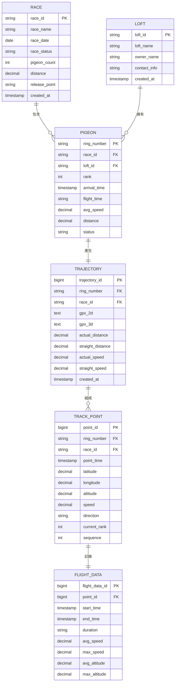

# 數據模型與實體關係

**專案**：鴿子競賽 GPS 追蹤系統
**最後更新**：2025-11-18
**版本**：1.0

---

## 📖 目的

本文檔定義鴿子競賽 GPS 追蹤系統的數據模型和實體關係，包括：
- 核心實體定義（Race, Pigeon, Loft, TrackPoint等）
- 實體間的關係（一對一、一對多、多對多）
- 數據結構（TypeScript interfaces）
- 數據驗證規則
- 數據異常檢測策略

此文檔為：
- 測試數據驗證提供標準
- API 響應驗證提供參考
- 數據一致性檢查提供規則
- 異常數據檢測提供閾值

---

## 🗂️ 核心實體概覽

### 實體關係圖（ER Diagram）



---

## 📋 實體定義

### 1. Race（賽事）

**描述**：代表一場鴿子競賽活動

**TypeScript Interface**：
```typescript
interface Race {
  raceID: string;               // 賽事唯一識別碼（主鍵）
  raceName: string;             // 賽事名稱
  raceDate: string;             // 賽事日期 (YYYY-MM-DD)
  raceStatus: string;           // 賽事狀態: "進行中" | "已結束" | "未開始"
  pigeonCount: number;          // 參賽鴿數
  distance: number;             // 比賽距離 (km)
  releasePoint: string;         // 放飛地點
  startTime?: string;           // 放飛時間 (YYYY-MM-DD HH:mm:ss)
  endTime?: string;             // 比賽結束時間
  organizer?: string;           // 主辦單位
  createdAt?: string;           // 創建時間
}
```

**示例數據**：
```json
{
  "raceID": "R202411140001",
  "raceName": "2024秋季綜合賽",
  "raceDate": "2024-11-14",
  "raceStatus": "已結束",
  "pigeonCount": 1523,
  "distance": 507.99,
  "releasePoint": "江西省贛州市",
  "startTime": "2024-11-14 07:06:00",
  "organizer": "某鴿會"
}
```

**驗證規則**：
```typescript
const RACE_VALIDATION_RULES = {
  raceID: {
    pattern: /^R\d{12}$/,        // R + 12位數字
    required: true
  },
  raceName: {
    minLength: 1,
    maxLength: 255,
    required: true
  },
  pigeonCount: {
    min: 1,
    max: 10000,
    required: true
  },
  distance: {
    min: 1,                       // 最短1公里
    max: 1000,                    // 最長1000公里
    required: true
  }
};
```

---

### 2. Loft（鴿舍）

**描述**：代表一個鴿舍（飼養鴿子的組織或個人）

**TypeScript Interface**：
```typescript
interface Loft {
  loftID: string;               // 鴿舍唯一識別碼（主鍵）
  loftName: string;             // 鴿舍名稱
  ownerName?: string;           // 鴿主姓名
  contactInfo?: string;         // 聯繫方式
  address?: string;             // 地址
  establishedDate?: string;     // 成立日期
  totalPigeons?: number;        // 鴿舍內鴿子總數
  createdAt?: string;           // 創建時間
}
```

**示例數據**：
```json
{
  "loftID": "L001",
  "loftName": "冠軍鴿舍",
  "ownerName": "張三",
  "contactInfo": "13800138000",
  "totalPigeons": 50
}
```

**驗證規則**：
```typescript
const LOFT_VALIDATION_RULES = {
  loftID: {
    pattern: /^L\d{3,6}$/,        // L + 3-6位數字
    required: true
  },
  loftName: {
    minLength: 1,
    maxLength: 255,
    required: true
  }
};
```

---

### 3. Pigeon（鴿子）

**描述**：代表參賽的單只鴿子

**TypeScript Interface**：
```typescript
interface Pigeon {
  ringNumber: string;           // 公環號（主鍵）
  raceID: string;               // 所屬賽事ID（外鍵）
  loftID: string;               // 所屬鴿舍ID（外鍵）
  loftName?: string;            // 鴿舍名稱（冗餘字段）
  rank: number;                 // 名次
  arrivalTime: string;          // 歸巢時間 (YYYY-MM-DD HH:mm:ss)
  flightTime: string;           // 飛行時間 (HH:mm:ss)
  avgSpeed: number;             // 平均分速 (m/min)
  distance: number;             // 飛行距離 (km)
  status: string;               // 狀態: "已歸巢" | "飛行中" | "失蹤"
  bloodline?: string;           // 血統
  age?: number;                 // 年齡
}
```

**示例數據**：
```json
{
  "ringNumber": "2025-26-0053539",
  "raceID": "R202411140001",
  "loftID": "L001",
  "loftName": "冠軍鴿舍",
  "rank": 1,
  "arrivalTime": "2024-11-14 13:44:12",
  "flightTime": "06:38:12",
  "avgSpeed": 1295,
  "distance": 507.99,
  "status": "已歸巢"
}
```

**驗證規則**：
```typescript
const PIGEON_VALIDATION_RULES = {
  ringNumber: {
    pattern: /^\d{4}-\d{2}-\d{7}$/,  // YYYY-NN-NNNNNNN 格式
    required: true
  },
  rank: {
    min: 1,
    max: 10000,
    required: true
  },
  avgSpeed: {
    min: 800,                    // m/min（最慢）
    max: 2000,                   // m/min（最快）
    typical: [1200, 1500],       // 典型範圍
    required: true
  },
  distance: {
    min: 1,
    max: 1000,                   // km
    required: true
  }
};
```

---

### 4. Trajectory（軌跡）

**描述**：代表一只鴿子在一場比賽中的完整飛行軌跡

**TypeScript Interface**：
```typescript
interface Trajectory {
  trajectoryID?: number;        // 軌跡ID（主鍵，自增）
  ringNumber: string;           // 鴿子環號（外鍵）
  raceID: string;               // 賽事ID（外鍵）
  gpx2d?: string;               // 2D軌跡數據（GPX格式）
  gpx3d?: string;               // 3D軌跡數據（GPX格式）
  actualDistance: number;       // 實際飛行距離 (km)
  straightDistance: number;     // 直線距離 (km)
  actualSpeed: number;          // 實際速度 (m/min)
  straightSpeed: number;        // 直線速度 (m/min)
  summary: TrajectorySummary;   // 軌跡摘要
  createdAt?: string;           // 創建時間
}

interface TrajectorySummary {
  startTime: string;            // 起點時間
  endTime: string;              // 終點時間
  duration: string;             // 持續時間 (HH:mm:ss)
  avgSpeed: number;             // 平均分速 (m/min)
  maxSpeed: number;             // 最高分速 (m/min)
  avgAltitude: number;          // 平均高度 (m)
  maxAltitude: number;          // 最大高度 (m)
}
```

**示例數據**：
```json
{
  "trajectoryID": 12345,
  "ringNumber": "2025-26-0053539",
  "raceID": "R202411140001",
  "gpx2d": "<?xml version=\"1.0\"?>\n<gpx>...</gpx>",
  "gpx3d": "<?xml version=\"1.0\"?>\n<gpx>...</gpx>",
  "actualDistance": 519.62,
  "straightDistance": 507.99,
  "actualSpeed": 1305.83,
  "straightSpeed": 1295.00,
  "summary": {
    "startTime": "2024-11-14 07:06:00",
    "endTime": "2024-11-14 13:44:12",
    "duration": "06:38:12",
    "avgSpeed": 1295,
    "maxSpeed": 1560,
    "avgAltitude": 159,
    "maxAltitude": 296
  }
}
```

**驗證規則**：
```typescript
const TRAJECTORY_VALIDATION_RULES = {
  actualDistance: {
    min: 1,
    max: 1000,                   // km
    required: true
  },
  straightDistance: {
    min: 1,
    max: 800,                    // 通常 < actualDistance
    required: true
  },
  // 邏輯驗證
  distanceConsistency: {
    rule: (actual, straight) => actual >= straight,
    message: "實際距離應大於等於直線距離"
  },
  summary: {
    avgSpeed: { min: 800, max: 2000 },
    maxSpeed: { min: 1000, max: 2500 },
    avgAltitude: { min: 0, max: 3000 },
    maxAltitude: { min: 0, max: 5000 }
  }
};
```

**已知異常數據**：
```typescript
// 從 MVP 測試中發現的異常數據示例
const ANOMALY_EXAMPLE = {
  actualDistance: 46168.05,     // ❌ 異常：46,168 km（應 < 1000）
  actualSpeed: 106529.36,       // ❌ 異常：106,529 m/min（應 < 2500）
  avgAltitude: 128.99,          // ✓ 正常
  maxAltitude: 201.64           // ✓ 正常
};
```

---

### 5. TrackPoint（軌跡點）

**描述**：代表軌跡上的單個數據點

**TypeScript Interface**：
```typescript
interface TrackPoint {
  pointID?: number;             // 軌跡點ID（主鍵，自增）
  ringNumber: string;           // 鴿子環號（外鍵）
  raceID: string;               // 賽事ID（外鍵）
  pointTime: string;            // 記錄時間 (YYYY-MM-DD HH:mm:ss)
  latitude: number;             // 緯度 (度)
  longitude: number;            // 經度 (度)
  altitude: number;             // 海拔高度 (m)
  speed: number;                // 當時速度 (m/min)
  direction: string;            // 飛行方向 ("北" | "東北" | "東" ...)
  currentRank: number;          // 當前名次
  sequence: number;             // 序號（第幾個軌跡點）
}
```

**示例數據**：
```json
{
  "pointID": 123456,
  "ringNumber": "2025-26-0053539",
  "raceID": "R202411140001",
  "pointTime": "2024-11-14 07:06:00",
  "latitude": 25.8123,
  "longitude": 114.9456,
  "altitude": 150,
  "speed": 1200,
  "direction": "西南",
  "currentRank": 1,
  "sequence": 1
}
```

**驗證規則**：
```typescript
const TRACK_POINT_VALIDATION_RULES = {
  latitude: {
    min: -90,
    max: 90,
    typical: [20, 40],           // 中國境內緯度範圍
    required: true
  },
  longitude: {
    min: -180,
    max: 180,
    typical: [105, 125],         // 中國境內經度範圍
    required: true
  },
  altitude: {
    min: 0,                      // 海平面
    max: 5000,                   // 理論最高飛行高度
    typical: [0, 500],           // 典型飛行高度
    required: true
  },
  speed: {
    min: 0,
    max: 2500,                   // m/min
    typical: [1000, 1600],
    required: true
  },
  direction: {
    values: ["北", "東北", "東", "東南", "南", "西南", "西", "西北"],
    required: true
  }
};
```

---

### 6. FlightData（飛行數據）

**描述**：軌跡點相關的詳細飛行數據

**TypeScript Interface**：
```typescript
interface FlightData {
  flightDataID?: number;        // 飛行數據ID（主鍵）
  pointID: number;              // 軌跡點ID（外鍵）
  startTime: string;            // 起點時間
  endTime: string;              // 終點時間
  duration: string;             // 持續時間
  avgSpeed: number;             // 平均速度 (m/min)
  maxSpeed: number;             // 最高速度 (m/min)
  avgAltitude: number;          // 平均高度 (m)
  maxAltitude: number;          // 最大高度 (m)
  temperature?: number;         // 溫度 (°C)
  windSpeed?: number;           // 風速 (m/s)
  windDirection?: string;       // 風向
}
```

---

## 🔗 實體關係詳細說明

### 關係1: Race 與 Pigeon（一對多）

**關係類型**：一場賽事包含多只鴿子

**SQL 表示**：
```sql
FOREIGN KEY (race_id) REFERENCES races(race_id)
```

**TypeScript 查詢示例**：
```typescript
// 獲取某場賽事的所有鴿子
async function getPigeonsByRace(raceID: string): Promise<Pigeon[]> {
  const response = await apiClient.post('/ugetTrackInfoByRank', { raceID });
  return response.data;
}
```

**數據完整性**：
- 刪除賽事時，應級聯刪除所有關聯鴿子數據
- 鴿子必須屬於一個有效的賽事

---

### 關係2: Loft 與 Pigeon（一對多）

**關係類型**：一個鴿舍擁有多只鴿子

**SQL 表示**：
```sql
FOREIGN KEY (loft_id) REFERENCES lofts(loft_id)
```

**TypeScript 查詢示例**：
```typescript
// 獲取某個鴿舍的所有鴿子
async function getPigeonsByLoft(loftID: string): Promise<Pigeon[]> {
  // 實際實現可能需要調用特定API或篩選
  const allPigeons = await getAllPigeons();
  return allPigeons.filter(p => p.loftID === loftID);
}
```

**數據完整性**：
- 鴿子必須屬於一個有效的鴿舍
- 鴿舍刪除時應處理其下所有鴿子

---

### 關係3: Pigeon 與 Trajectory（一對一）

**關係類型**：一只鴿子在一場比賽中產生一條軌跡

**SQL 表示**：
```sql
UNIQUE KEY (ring_number, race_id)
```

**TypeScript 查詢示例**：
```typescript
// 獲取特定鴿子在特定賽事的軌跡
async function getTrajectory(raceID: string, ringNumber: string): Promise<Trajectory> {
  const response = await apiClient.get('/ugetPigeonAllJsonInfo', {
    raceID,
    ringNumber
  });
  return response.data;
}
```

**數據完整性**：
- 同一只鴿子在同一場賽事只能有一條軌跡
- 軌跡必須關聯到有效的鴿子和賽事

---

### 關係4: Trajectory 與 TrackPoint（一對多）

**關係類型**：一條軌跡由多個軌跡點組成

**SQL 表示**：
```sql
FOREIGN KEY (ring_number, race_id) REFERENCES trajectories(ring_number, race_id)
```

**TypeScript 示例**：
```typescript
interface Trajectory {
  // ...其他字段
  trackPoints: TrackPoint[];    // 包含所有軌跡點
}

// 軌跡點數量
const pointCount = trajectory.trackPoints.length;
// 典型值: 15-20個（靜態模式）或 100+個（完整記錄）
```

**數據完整性**：
- 軌跡至少包含2個軌跡點（起點和終點）
- 軌跡點按時間順序排列
- 序號（sequence）應連續

---

### 關係5: TrackPoint 與 FlightData（一對一）

**關係類型**：每個軌跡點對應一份飛行數據

**SQL 表示**：
```sql
FOREIGN KEY (point_id) REFERENCES track_points(point_id)
```

---

## ✅ 數據驗證框架

### 驗證規則總表

```typescript
const VALIDATION_RULES = {
  // 速度驗證（m/min）
  speed: {
    avgSpeed: {
      min: 800,
      max: 2000,
      typical: [1200, 1500],
      unit: "m/min"
    },
    maxSpeed: {
      min: 1000,
      max: 2500,
      typical: [1500, 2000],
      unit: "m/min"
    },
    actualSpeed: {
      min: 800,
      max: 2000,
      unit: "m/min"
    }
  },

  // 高度驗證（meters）
  altitude: {
    avgAltitude: {
      min: 0,
      max: 3000,
      typical: [100, 500],
      unit: "meters"
    },
    maxAltitude: {
      min: 0,
      max: 5000,
      typical: [500, 1000],
      unit: "meters"
    }
  },

  // 距離驗證（km）
  distance: {
    actualDistance: {
      min: 1,
      max: 1000,
      typical: [50, 300],
      unit: "km"
    },
    straightDistance: {
      min: 1,
      max: 800,
      typical: [50, 300],
      unit: "km"
    }
  },

  // 座標驗證
  coordinates: {
    latitude: {
      min: -90,
      max: 90,
      typical: [20, 40],         // 中國境內
      unit: "degrees"
    },
    longitude: {
      min: -180,
      max: 180,
      typical: [105, 125],       // 中國境內
      unit: "degrees"
    }
  }
};
```

### 驗證函數實現

```typescript
interface ValidationResult {
  isValid: boolean;
  errors: ValidationError[];
  warnings: ValidationWarning[];
}

interface ValidationError {
  field: string;
  value: any;
  rule: string;
  message: string;
}

interface ValidationWarning {
  field: string;
  value: any;
  message: string;
}

/**
 * 驗證飛行數據
 */
function validateFlightData(data: Trajectory): ValidationResult {
  const errors: ValidationError[] = [];
  const warnings: ValidationWarning[] = [];

  // 1. 必填字段檢查
  if (!data.ringNumber) {
    errors.push({
      field: 'ringNumber',
      value: data.ringNumber,
      rule: 'required',
      message: '環號不能為空'
    });
  }

  // 2. 速度範圍驗證
  if (data.summary.avgSpeed < VALIDATION_RULES.speed.avgSpeed.min ||
      data.summary.avgSpeed > VALIDATION_RULES.speed.avgSpeed.max) {
    errors.push({
      field: 'avgSpeed',
      value: data.summary.avgSpeed,
      rule: 'range',
      message: `平均速度超出範圍 [${VALIDATION_RULES.speed.avgSpeed.min}, ${VALIDATION_RULES.speed.avgSpeed.max}]`
    });
  }

  // 3. 典型值警告
  if (data.summary.avgSpeed < VALIDATION_RULES.speed.avgSpeed.typical[0] ||
      data.summary.avgSpeed > VALIDATION_RULES.speed.avgSpeed.typical[1]) {
    warnings.push({
      field: 'avgSpeed',
      value: data.summary.avgSpeed,
      message: `平均速度不在典型範圍 [${VALIDATION_RULES.speed.avgSpeed.typical[0]}, ${VALIDATION_RULES.speed.avgSpeed.typical[1]}]`
    });
  }

  // 4. 距離一致性檢查
  if (data.actualDistance < data.straightDistance) {
    errors.push({
      field: 'distance',
      value: { actual: data.actualDistance, straight: data.straightDistance },
      rule: 'consistency',
      message: '實際距離應大於等於直線距離'
    });
  }

  // 5. 高度驗證
  if (data.summary.maxAltitude > VALIDATION_RULES.altitude.maxAltitude.max) {
    errors.push({
      field: 'maxAltitude',
      value: data.summary.maxAltitude,
      rule: 'range',
      message: `最大高度超出範圍 [0, ${VALIDATION_RULES.altitude.maxAltitude.max}]`
    });
  }

  return {
    isValid: errors.length === 0,
    errors,
    warnings
  };
}

/**
 * 檢測異常數據
 */
function detectAnomaly(data: Trajectory): string | null {
  // 檢查是否有嚴重異常（遠超最大閾值）
  if (data.actualDistance > VALIDATION_RULES.distance.actualDistance.max * 10) {
    return `異常距離: ${data.actualDistance} km（正常範圍 < ${VALIDATION_RULES.distance.actualDistance.max} km）`;
  }

  if (data.actualSpeed > VALIDATION_RULES.speed.actualSpeed.max * 10) {
    return `異常速度: ${data.actualSpeed} m/min（正常範圍 < ${VALIDATION_RULES.speed.actualSpeed.max} m/min）`;
  }

  if (data.summary.maxAltitude > VALIDATION_RULES.altitude.maxAltitude.max * 2) {
    return `異常高度: ${data.summary.maxAltitude} m（正常範圍 < ${VALIDATION_RULES.altitude.maxAltitude.max} m）`;
  }

  return null;  // 無異常
}
```

### 測試中的驗證示例

```typescript
test('TC-02-002: 驗證飛行數據正確性', async ({ page }) => {
  // 獲取軌跡數據
  const response = await page.waitForResponse(/ugetPigeonAllJsonInfo/);
  const trajectoryData = await response.json();

  // 執行驗證
  const validation = validateFlightData(trajectoryData.data);

  // 檢查驗證結果
  expect(validation.isValid).toBe(true);
  expect(validation.errors.length).toBe(0);

  // 檢查異常
  const anomaly = detectAnomaly(trajectoryData.data);
  if (anomaly) {
    console.warn(`⚠️ 數據異常: ${anomaly}`);
  }

  // 輸出警告（不影響測試通過）
  validation.warnings.forEach(warning => {
    console.warn(`⚠️ ${warning.field}: ${warning.message}`);
  });
});
```

---

## 🐛 已知數據問題

### 問題 #1：異常大的距離和速度值

**發現來源**：MVP 測試（2025-11-17）

**異常數據示例**：
```json
{
  "actual_distance": 46168.05,    // ❌ 46,168 km（應 < 1000）
  "actual_speed": 106529.36,      // ❌ 106,529 m/min（應 < 2000）
  "avg_altitude": 128.99,         // ✓ 正常
  "max_altitude": 201.64          // ✓ 正常
}
```

**可能原因**：
1. 單位錯誤（如距離使用了米而非公里）
2. 數據計算錯誤
3. 數據庫中的髒數據

**影響**：
- 影響數據可視化的準確性
- 可能導致測試失敗

**處理建議**：
```typescript
// 在測試中檢測並標記
const anomaly = detectAnomaly(data);
if (anomaly) {
  console.error(`數據異常: ${anomaly}`);
  // 記錄到測試報告
  test.info().annotations.push({
    type: 'anomaly',
    description: anomaly
  });
}
```

### 問題 #2：gpx2d 字段未定義

**發現來源**：MVP 測試

**問題描述**：API 響應中 `gpx2d` 字段為 `undefined`

**數據示例**：
```json
{
  "gpx2d": undefined,              // ❌ 未定義
  "gpx3d": "<?xml version...",     // ✓ 正常
  "summary": { ... }               // ✓ 正常
}
```

**影響**：
- 導致 2D 地圖無法渲染
- AMap 初始化失敗

**解決方案**：參見 [Known Issues #1](../test-plan/KNOWN_ISSUES_SOLUTIONS.md#問題-1-2d軌跡初次加載失敗)

---

## 📊 數據統計和分析

### 典型數據範圍總結

| 數據類型 | 字段 | 最小值 | 最大值 | 典型範圍 | 單位 |
|---------|------|--------|--------|----------|------|
| 速度 | avgSpeed | 800 | 2000 | 1200-1500 | m/min |
| 速度 | maxSpeed | 1000 | 2500 | 1500-2000 | m/min |
| 高度 | avgAltitude | 0 | 3000 | 100-500 | m |
| 高度 | maxAltitude | 0 | 5000 | 500-1000 | m |
| 距離 | actualDistance | 1 | 1000 | 50-300 | km |
| 距離 | straightDistance | 1 | 800 | 50-300 | km |
| 座標 | latitude | -90 | 90 | 20-40 | 度 |
| 座標 | longitude | -180 | 180 | 105-125 | 度 |

### 數據質量指標

**高質量數據**：
- 所有必填字段完整
- 數值在合理範圍內
- 實際距離 ≥ 直線距離
- 最大速度 ≥ 平均速度
- 最大高度 ≥ 平均高度

**質量檢查函數**：
```typescript
function calculateDataQuality(data: Trajectory): number {
  let score = 100;

  // 扣分項
  const validation = validateFlightData(data);
  score -= validation.errors.length * 20;      // 每個錯誤扣20分
  score -= validation.warnings.length * 5;     // 每個警告扣5分

  // 異常檢測
  if (detectAnomaly(data)) {
    score -= 30;  // 異常數據扣30分
  }

  return Math.max(0, score);
}
```

---

## 🔗 相關文檔

### 架構相關
- [System Architecture](../technical-architecture/SYSTEM_ARCHITECTURE.md) - 系統架構總覽
- [Dependency Graph](../technical-architecture/DEPENDENCY_GRAPH.md) - 技術依賴圖

### API 相關
- [API Endpoints](../api-reference/API_ENDPOINTS.md) - API 響應數據結構

### 測試相關
- [Testing Strategies](../guides/testing-strategies.md) - 數據驗證策略
- [Known Issues Solutions](../test-plan/KNOWN_ISSUES_SOLUTIONS.md) - 數據相關問題

---

**文檔維護者**：專案團隊
**審核狀態**：初版
**下次審核日期**：Phase 2 實作後
