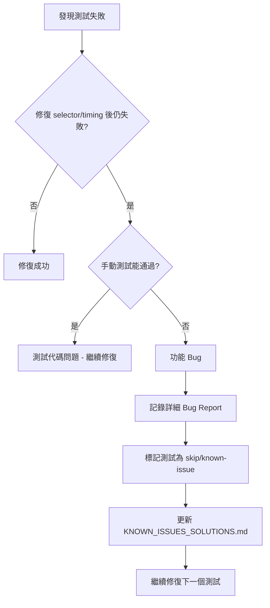

# Test Plan Fix - Context & Key Decisions

**專案**: 鴿子競賽 GPS 追蹤系統自動化測試修復
**建立日期**: 2025-11-21
**最後更新**: 2025-11-25 11:07

---

## 📊 當前狀態 (2025-11-25)

| 測試套件 | 通過 | 失敗 | 通過率 |
|----------|------|------|--------|
| TC-02-001 (2D 靜態) | 2 | 2 | 50% |
| TC-03-001 (模式切換) | 0 | 5 | 0% |
| TC-04-001 (3D 模式) | 5 | 2 | 71% |
| **總計** | **7** | **9** | **43.75%** |

**Phase 1 狀態**: ✅ 完成 (基線提升 +31.25%)
**當前階段**: Phase 2 準備中

---

## 🎯 專案目標

修復 P0 測試套件，將測試通過率從 12.5% (2/16) 提升到至少 75% (12/16)。

**目標調整** (2025-11-25):
- Phase 2 目標: 56.25% (9/16)
- Phase 3 目標: 75% (12/16)

---

## 📁 關鍵檔案清單

### 需要修改的檔案

#### 高優先級（Phase 1）
```
tests/helpers/navigation.ts
├─ Line 124-142: getCurrentMode() 函數 ← 主要修復目標
└─ 影響: 7 個測試（TC-03-001:144, TC-04-001 全部 6 個）
```

#### 中優先級（Phase 2）
```
tests/e2e/tc-02-001-2d-static.spec.ts
├─ Line 60: Timeline button selector
└─ Line 129: Marker detection 邏輯
```

#### 低優先級（Phase 3）
```
tests/e2e/tc-03-001-mode-switch.spec.ts
├─ Line 33: 靜態→動態→靜態切換測試
├─ Line 90: 動態模式播放控制測試
├─ Line 111: 動態模式播放功能測試
└─ Line 170: Canvas 更新測試
```

### 參考檔案（唯讀）

```
docs/test-plan/
├─ TEST_PLAN_OVERVIEW.md - 測試計劃總覽
├─ TEST_CASES.md - 詳細測試案例
└─ KNOWN_ISSUES_SOLUTIONS.md - 已知問題解決方案（需更新）

docs/guides/
├─ mode-switching.md - 2D/3D 模式切換深度指南
├─ troubleshooting.md - 故障排除指南
├─ testing-strategies.md - 測試策略（三重驗證）
└─ playwright-workflow.md - Playwright MCP 工作流程

docs/architecture/
└─ test-framework.md - 測試框架架構設計

dev/測試計劃修復作業1121/
└─ FIX_PLAN.md - 原始修復計劃（本專案的基礎）

test-summary-report.md - 2025-11-21 測試執行報告
```

### 配置檔案
```
playwright.config.ts - Playwright 測試配置
tsconfig.json - TypeScript 配置
package.json - 專案依賴和腳本
```

---

## 🔑 核心決策記錄

### Decision 1: getCurrentMode() 修復方案選擇

**決策**: 採用方案 B（多重檢測）而非方案 A（快速修復）

**理由**:
1. **穩健性**: 三層檢測（視角按鈕 → 模式按鈕文字 → 地圖容器）提供多重後備
2. **可調試性**: 詳細日誌輸出便於問題追蹤
3. **未來兼容**: 減少對單一 UI 元素的依賴
4. **風險較低**: 即使一層失敗，仍有後備策略

**方案 A（被拒絕）**:
```typescript
// 簡單但脆弱：只檢查按鈕文字
if (buttonText.includes('3D')) return '2D';
if (buttonText.includes('2D')) return '3D';
```

**方案 B（被採用）**:
```typescript
// Layer 1: 檢查 3D 特徵元素
if (hasView1Button) return '3D';

// Layer 2: 檢查模式按鈕文字（關鍵邏輯）
if (buttonText.includes('3D')) return '2D';
if (buttonText.includes('2D')) return '3D';

// Layer 3: 後備 - 檢查地圖容器
if (hasMapContainer) return '2D';

return 'unknown';
```

**影響範圍**: 7 個測試（預期 +50% 通過率）

**風險**: 低（有完整備份和回滾計劃）

---

### Decision 2: Phase 執行優先級

**決策**: Phase 1 必須完成 > Phase 2 盡量完成 > Phase 3 彈性安排

**理由**:
- Phase 1 影響 7 個測試（ROI 最高）
- Phase 2 影響 2 個測試（中等 ROI）
- Phase 3 影響 4-5 個測試（但可能包含功能 bug，需深入調查）

**時間分配**:
```
Phase 1: 嚴格 60 分鐘上限（必須完成）
Phase 2: 嚴格 40 分鐘上限（高優先級）
Phase 3: 彈性 1-2 小時（時間允許再做）
```

**時間超支處理**:
- Phase 1 超時 → 回滾並重新評估
- Phase 2 超時 → 標記問題，繼續 Phase 3
- Phase 3 超時 → 記錄未完成項，後續處理

---

### Decision 3: Selector 策略選擇

**決策**: 優先使用 Role-based selector，其次 Parent container + Role，最後才用 CSS

**理由**:
1. **穩健性**: Role-based selector 不易因 UI 樣式改變而失效
2. **可讀性**: 語義化的 selector（`getByRole('button', { name: /timeline/i })`）
3. **可維護性**: 減少對脆弱 CSS class 的依賴

**優先級順序**:
```
1. Role-based selector
   getByRole('button', { name: /timeline/i })

2. Parent container + Role selector
   page.locator('.control-panel').getByRole('button', { name: /timeline/i })

3. Text-based selector
   page.locator('button').filter({ hasText: /timeline/i })

4. API 數據驗證（如 DOM 不可行）
   const response = await page.waitForResponse(/ugetPigeonAllJsonInfo/);

5. 截圖視覺驗證（最後手段）
   await expect(page).toHaveScreenshot('trajectory.png');
```

**影響範圍**: TC-02-001 的 2 個測試

---

### Decision 4: 功能 Bug 處理策略

**決策**: 記錄為已知問題，標記測試為 `skip` 或 `known-issue`，繼續修復其他可修復的測試

**理由**:
1. **專注於可控範圍**: 測試修復專案不應該阻塞在功能 bug
2. **透明化**: 詳細記錄問題，便於開發團隊跟進
3. **進度保證**: 確保可修復的測試都得到修復

**處理流程**:


**標記範例**:
```typescript
test.skip('應該成功切換靜態→動態→靜態 [KNOWN-ISSUE-#123]', async ({ page }) => {
  // 測試代碼
});
```

---

## 🧭 技術依賴關係

### getCurrentMode() 函數依賴鏈

```
getCurrentMode() (navigation.ts:124)
    ↓ 直接調用
    ├─→ page.getByRole('button', { name: '視角1' })
    ├─→ page.getByRole('button', { name: /[23]D模式/ })
    └─→ page.locator('.amap-container')

    ↓ 被以下函數調用
    ├─→ ensureMode2D() (mode-switching.ts)
    ├─→ ensureMode3D() (mode-switching.ts)
    └─→ switchMode() (可能存在)

    ↓ 被以下測試使用
    ├─→ TC-03-001: 應該正確偵測當前模式 (直接)
    ├─→ TC-04-001: 所有 6 個 3D 測試 (間接 via ensureMode3D)
    └─→ TC-03-001: 其他 4 個模式切換測試 (間接)
```

### 測試執行依賴

```
所有 P0 測試
    ↓ 依賴
    ├─→ reload2DTrajectory() ✅ (已修復 - 100% 運作)
    ├─→ getCurrentMode() ⚠️ (Phase 1 修復目標)
    ├─→ waitForMapTiles()
    ├─→ waitForCesiumReady()
    └─→ enterRace() / selectPigeon() / openTrajectory()
```

### 外部依賴

```
測試環境
    ├─→ Playwright ^1.40.0
    ├─→ TypeScript ^5.0.0
    └─→ Node.js (版本待確認)

測試目標網站
    ├─→ https://skyracing.com.cn (生產環境)
    ├─→ 需要網路連接（地圖瓦片加載）
    └─→ API 端點:
        ├─ /ugetPublicRaceList
        ├─ /ugetPigeonAllJsonInfo ← 最關鍵
        └─ /ugetTrackInfoByRank
```

---

## 📊 關鍵數據與基線

### 測試通過率基線

```
修復前 (2025-11-21):
- 總測試數: 16 個 P0 測試
- 通過: 2 個 (12.5%)
  - TC-02-001: 應該顯示完整的軌跡線 ✓
  - TC-02-001: 應該無控制台錯誤 ✓
- 失敗: 14 個 (87.5%)
- 導航失敗: 0 個 (reload2DTrajectory 已修復)
```

### 預期改善軌跡

```
Phase 1 完成後:
- 預期通過: 10/16 (62.5%)
- 新增通過: +8 tests
  - getCurrentMode() 檢測測試 ✓
  - 6 個 3D 模式測試 ✓
  - 可能的連鎖效應 +1

Phase 2 完成後:
- 預期通過: 12/16 (75%)
- 新增通過: +2 tests
  - Timeline button 測試 ✓
  - Marker detection 測試 ✓

Phase 3 完成後:
- 保守估計: 14/16 (87.5%)
- 理想目標: 16/16 (100%)
- 新增通過: +2 to +4 tests
```

### 性能基線

```
reload2DTrajectory 執行時間:
- 平均: 15-20 秒
- 地圖瓦片數: 139 (穩定)
- Canvas 圖層: 1 (穩定)

完整 P0 測試套件:
- 預估總時間: ~10 分鐘
- 不應因修復而顯著增加（<20%）
```

---

## 🔍 已知限制與假設

### 已知限制

1. **網路依賴**: 測試需要穩定的網路連接（地圖瓦片加載）
2. **測試數據**: 依賴生產環境的實際賽事數據（可能變化）
3. **時間敏感**: 某些測試可能對執行時間敏感（需調整 timeout）
4. **瀏覽器特定**: 主要測試 Chrome，其他瀏覽器未完全驗證

### 假設

1. ✅ **reload2DTrajectory 穩定**: 假設導航問題已徹底解決（有測試證據支持）
2. ✅ **API 穩定**: 假設後端 API 響應格式不變
3. ⚠️ **UI 結構穩定**: 假設前端 DOM 結構在修復期間不變（風險：如果網站更新）
4. ⚠️ **getCurrentMode() 是唯一根因**: 假設 7 個失敗測試都是因為模式檢測問題

### 驗證方法

```bash
# 驗證假設 1: reload2DTrajectory 穩定
npm run test:p0 2>&1 | grep "✅ 2D 軌跡加載成功"

# 驗證假設 2: API 穩定
npx playwright test --grep "ugetPigeonAllJsonInfo"

# 驗證假設 3: UI 結構
# 手動檢查網站是否有更新（檢查版本號或更新日期）

# 驗證假設 4: 修復後運行測試
npm run test:p0 | grep "TC-04-001"
```

---

## 📝 學習與最佳實踐

### 從 reload2DTrajectory 修復學到的經驗

**成功經驗**:
1. ✅ **多重後備策略**: 返回按鈕 → 重新進入賽事
2. ✅ **詳細日誌**: 控制台輸出幫助快速 debug
3. ✅ **穩健的錯誤處理**: 每個步驟都有 try-catch
4. ✅ **直接檢測**: 檢測表格可見性比檢測 canvas 更可靠

**應用到 getCurrentMode() 修復**:
- ✅ 採用三層檢測策略（類似多重後備）
- ✅ 添加詳細的控制台日誌
- ✅ 每個檢測步驟都有錯誤處理（`.catch(() => false)`）
- ✅ 優先檢測明確的 UI 元素（視角按鈕）

### Selector 最佳實踐

**優先順序**:
```
1. data-testid (最穩健 - 需與開發團隊協調)
2. Role + Accessible Name (語義化，推薦)
3. Text content (可讀性高)
4. CSS class (脆弱，需謹慎)
5. XPath (最不推薦，難維護)
```

**範例**:
```typescript
// ✅ 推薦: Role-based
page.getByRole('button', { name: /timeline/i })

// ✅ 可接受: Parent + Role
page.locator('.control-panel').getByRole('button', { name: /timeline/i })

// ⚠️ 謹慎使用: CSS class
page.locator('button.timeline-btn')

// ❌ 避免: 脆弱的 CSS
page.locator('div > div:nth-child(3) > button')
```

### 等待策略最佳實踐

**推薦模式**:
```typescript
// ✅ 推薦: 等待特定狀態
await page.waitForLoadState('networkidle');
await page.waitForSelector('[data-loaded="true"]');

// ✅ 可接受: 等待 API 響應
await page.waitForResponse(/ugetPigeonAllJsonInfo/);

// ⚠️ 謹慎使用: 固定時間（僅作為額外緩衝）
await page.waitForTimeout(1000); // 用於等待動畫

// ❌ 避免: 過長的固定等待
await page.waitForTimeout(10000); // 太長，影響測試速度
```

---

## 🚨 風險警示

### 高風險操作

1. **修改 getCurrentMode() 邏輯**
   - 風險: 可能影響所有模式切換功能
   - 緩解: 完整備份 + 逐步驗證

2. **批次修改 Selector**
   - 風險: 可能引入新的失敗
   - 緩解: 每個修改後立即驗證

3. **調整等待時間**
   - 風險: 可能導致測試變慢或仍然不穩定
   - 緩解: 記錄原始值，測試多次確認

### 回滾觸發條件

**立即回滾如果**:
- [ ] 修復後測試通過率**下降**
- [ ] 新引入的失敗數量 > 修復的測試數量
- [ ] 測試執行時間增加 > 50%
- [ ] 無法在限定時間內解決問題

**回滾指令**:
```bash
# 回滾所有修改
git checkout -- tests/helpers/navigation.ts
git checkout -- tests/e2e/tc-02-001-2d-static.spec.ts
git checkout -- tests/e2e/tc-03-001-mode-switch.spec.ts

# 或使用備份
cp tests/helpers/navigation.ts.backup tests/helpers/navigation.ts

# 驗證回滾
npm run test:p0
```

---

## 📈 進度追蹤

### 執行時間記錄

| 階段 | 預計開始 | 預計完成 | 實際開始 | 實際完成 | 實際耗時 | 狀態 |
|------|---------|---------|---------|---------|---------|------|
| Phase 1 | 15:00 | 16:00 | 11-24 | 11-25 11:07 | ~90 min | ✅ Completed |
| Phase 2 | 16:00 | 16:40 | ________ | ________ | ________ | ⏳ Ready |
| Phase 3 | 17:00 | 18:40 | ________ | ________ | ________ | ⏳ Pending |

### 檢查點記錄

**Phase 1 檢查點**:
- [ ] 備份已創建: `navigation.ts.backup`
- [ ] 代碼已修改: `getCurrentMode()` 函數
- [ ] 單元測試通過: TC-03-001:144
- [ ] 集成測試通過: TC-04-001 所有測試
- [ ] 通過率達標: ≥ 62.5%
- [ ] 代碼已提交: Git commit

**Phase 2 檢查點**:
- [ ] Selector 調查完成: Timeline button
- [ ] Selector 調查完成: Marker detection
- [ ] 代碼已修改: `tc-02-001-2d-static.spec.ts`
- [ ] 測試通過: TC-02-001 所有測試
- [ ] 通過率達標: ≥ 75%
- [ ] 代碼已提交: Git commit

**Phase 3 檢查點**:
- [ ] 錯誤訊息已收集: 所有失敗測試
- [ ] 問題已分類: Selector/Timing/Logic/Bug
- [ ] 簡單問題已修復: ≥ 2 個測試
- [ ] 複雜問題已記錄: `KNOWN_ISSUES_SOLUTIONS.md`
- [ ] 通過率達標: ≥ 87.5% 或 ≥ 75% + 問題已記錄
- [ ] 代碼已提交: Git commit

---

## 🔗 快速參考連結

### 本地檔案路徑

```bash
# 主要修改檔案
/Users/tf/Downloads/PIGEON_RACING_TEST_PROJECT/tests/helpers/navigation.ts
/Users/tf/Downloads/PIGEON_RACING_TEST_PROJECT/tests/e2e/tc-02-001-2d-static.spec.ts
/Users/tf/Downloads/PIGEON_RACING_TEST_PROJECT/tests/e2e/tc-03-001-mode-switch.spec.ts

# 參考文檔
/Users/tf/Downloads/PIGEON_RACING_TEST_PROJECT/docs/test-plan/KNOWN_ISSUES_SOLUTIONS.md
/Users/tf/Downloads/PIGEON_RACING_TEST_PROJECT/docs/guides/mode-switching.md
/Users/tf/Downloads/PIGEON_RACING_TEST_PROJECT/dev/測試計劃修復作業1121/FIX_PLAN.md

# 工作目錄
/Users/tf/Downloads/PIGEON_RACING_TEST_PROJECT/dev/active/test-plan-fix/
```

### 常用命令

```bash
# 測試執行
npm run test:p0
npx playwright test tests/e2e/tc-03-001-mode-switch.spec.ts:144
npx playwright test tests/e2e/tc-04-001-3d-mode.spec.ts
npx playwright test tests/e2e/tc-02-001-2d-static.spec.ts --debug

# 報告查看
npx playwright show-report

# 檔案操作
cp tests/helpers/navigation.ts tests/helpers/navigation.ts.backup
diff tests/helpers/navigation.ts tests/helpers/navigation.ts.backup

# Git 操作
git diff tests/helpers/navigation.ts
git add tests/helpers/navigation.ts
git commit -m "fix: ..."
```

---

## 💡 關鍵洞察

### 為什麼 getCurrentMode() 是關鍵？

1. **高影響力**: 影響 7 個測試（43.75% 的失敗測試）
2. **連鎖反應**: 修復後可能解鎖其他測試
3. **根本原因**: 邏輯錯誤而非環境問題，修復穩定性高
4. **低風險**: 函數邏輯清晰，修復方案明確

### 為什麼優先 Phase 1？

| 因素 | Phase 1 | Phase 2 | Phase 3 |
|------|---------|---------|---------|
| **影響測試數** | 7 | 2 | 4-5 |
| **ROI** | 最高 (50%) | 中等 (14%) | 中低 (14-36%) |
| **修復難度** | 中 | 中 | 中-高 |
| **確定性** | 高（邏輯錯誤） | 中（selector問題） | 低（可能有功能bug） |
| **時間** | 1 小時 | 40 分鐘 | 1-2 小時 |

**結論**: Phase 1 是最佳的時間-效益比（1小時 → +50%通過率）

---

**文檔版本**: 1.0
**最後更新**: 2025-11-21
**維護者**: 測試自動化團隊
