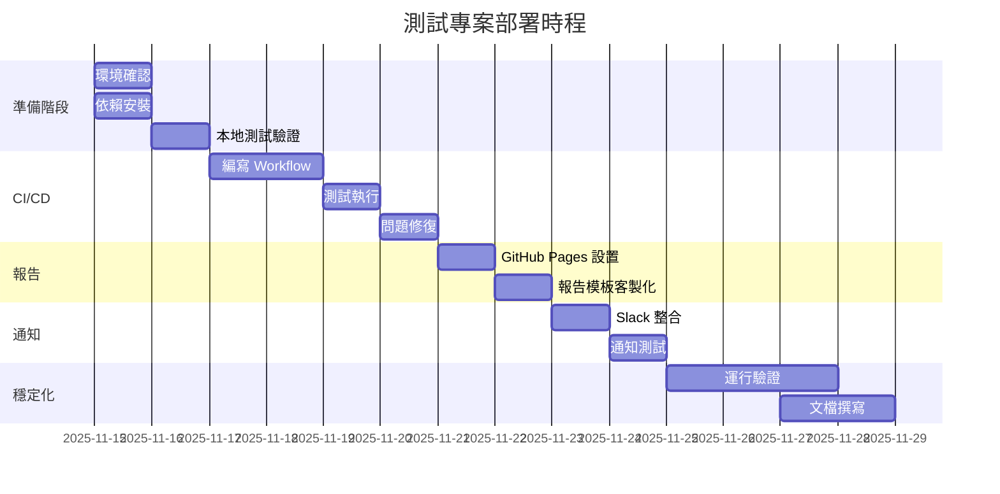

# 賽鴿追蹤系統測試專案 - 部署計畫書

> 版本：v1.0
> 日期：2025-11-14
> 狀態：草案待討論

---

## 📋 目錄

1. [專案背景](#專案背景)
2. [部署目標](#部署目標)
3. [方案對比](#方案對比)
4. [推薦架構](#推薦架構)
5. [實施階段](#實施階段)
6. [成本分析](#成本分析)
7. [風險評估](#風險評估)
8. [時程規劃](#時程規劃)
9. [決策檢查表](#決策檢查表)

---

## 專案背景

### 專案性質
- **類型**：前端自動化測試套件
- **目的**：監控賽鴿追蹤系統 UI 異常、數據錯誤、地圖渲染問題
- **測試頻率**：建議每日 2-4 次自動執行
- **關鍵指標**：數據異常檢測（距離、速度、航點連續性）

### 當前狀態
- ✅ 測試代碼完整（基於 Playwright + TypeScript）
- ✅ 驗證邏輯健全（FlightDataValidator）
- ⚠️ 尚未自動化執行
- ⚠️ 缺乏報告可視化
- ⚠️ 無告警機制

---

## 部署目標

### 核心目標
1. **自動化執行**：每天定時執行測試，無需人工介入
2. **快速反饋**：發現異常數據後 5 分鐘內通知相關人員
3. **歷史追蹤**：保留 30 天測試記錄，追蹤問題趨勢
4. **易於維護**：開發人員可輕鬆擴展測試案例

### 次要目標
- 跨瀏覽器兼容性測試（Chrome、Safari、Mobile）
- 視覺回歸測試（未來擴展）
- 性能監控（頁面載入時間）
- 整合到開發流程（PR 自動測試）

---

## 方案對比

### 方案 A：GitHub Actions（推薦）

**架構圖**
```
GitHub Repository
    ↓ (自動觸發)
GitHub Actions
    ├─ Chromium 測試
    ├─ WebKit 測試
    └─ Mobile 測試
    ↓ (生成報告)
GitHub Pages (靜態報告)
    ↓ (異常時)
Slack/Email 通知
```

**優點**
- ✅ 完全免費（公開 Repo 無限額度）
- ✅ 零維護成本（GitHub 管理基礎設施）
- ✅ 配置簡單（1 個 YAML 文件）
- ✅ 與代碼倉庫深度整合
- ✅ 自帶 Artifacts 存儲（截圖、視頻）

**缺點**
- ⚠️ 私有 Repo 有額度限制（每月 2000 分鐘）
- ⚠️ 報告樣式受限於 Playwright HTML Reporter
- ⚠️ 無即時儀表板

**成本**
- 公開 Repo：**$0/月**
- 私有 Repo：**$0-4/月**（超額 $0.008/分鐘）

**適用場景**
- 小型團隊（< 10 人）
- 開源專案
- 預算有限
- 快速啟動需求

---

### 方案 B：Self-Hosted（自建）

**架構圖**
```
Git Repository
    ↓ (Webhook)
Jenkins/GitLab CI
    ↓ (容器化執行)
Docker (Playwright 環境)
    ↓ (存儲)
├─ MinIO/S3 (截圖/視頻)
├─ InfluxDB (測試指標)
└─ Allure Report (報告)
    ↓ (可視化)
Grafana Dashboard
    ↓ (告警)
Slack/Teams/PagerDuty
```

**優點**
- ✅ 完全控制（安全、合規）
- ✅ 客製化能力強
- ✅ 無使用額度限制
- ✅ 可整合企業內部系統
- ✅ 豐富的可視化選項（Grafana）

**缺點**
- ❌ 需要維護基礎設施
- ❌ 初期設置成本高
- ❌ 需要專業運維知識
- ❌ 硬體成本

**成本**
- 伺服器：**$20-100/月**（AWS EC2 t3.medium）
- 存儲：**$5-20/月**（S3/MinIO）
- 維護人力：**2-4 小時/月**
- **總計：$25-120/月**

**適用場景**
- 大型團隊（> 20 人）
- 嚴格安全要求
- 需要複雜客製化
- 已有 DevOps 團隊

---

### 方案 C：雲端 SaaS（第三方服務）

**服務選項**
- **BrowserStack** / **Sauce Labs**：雲端跨瀏覽器測試
- **Percy**：視覺回歸測試
- **LaunchDarkly**：功能開關 + 測試管理

**架構圖**
```
GitHub Repository
    ↓ (API 觸發)
BrowserStack Automate
    ↓ (並行測試)
雲端真實設備 (100+ 組合)
    ↓ (報告)
BrowserStack Dashboard
    ↓ (整合)
Jira/Slack/Email
```

**優點**
- ✅ 零維護
- ✅ 豐富的設備覆蓋
- ✅ 專業級報告
- ✅ 並行能力強

**缺點**
- ❌ 費用高
- ❌ 數據安全疑慮
- ❌ 依賴第三方

**成本**
- BrowserStack：**$29-99/月/用戶**
- Percy：**$49-249/月**
- **總計：$78-348/月**

**適用場景**
- 需要大量真實設備測試
- 視覺回歸要求高
- 預算充足
- 不想自建基礎設施

---

### 方案 D：混合架構（彈性方案）

**架構圖**
```
GitHub Actions (核心測試)
    ├─ 功能測試 → GitHub Pages
    ├─ 數據驗證 → Slack
    └─ 關鍵測試失敗時
        ↓ (觸發深度測試)
BrowserStack (擴展測試)
    ├─ 跨平台驗證
    └─ 視覺回歸
```

**優點**
- ✅ 成本可控
- ✅ 靈活擴展
- ✅ 最佳實踐平衡

**成本**
- **$0-50/月**（取決於使用頻率）

---

## 推薦架構

### 階段式部署建議

#### 階段 1：基礎部署（立即實施）
**方案**：GitHub Actions + GitHub Pages

```yaml
觸發條件：
  - 每日 9:00 和 15:00 自動執行
  - Pull Request 提交時
  - 手動觸發

執行內容：
  - Chromium 測試（所有 spec 文件）
  - WebKit 測試（所有 spec 文件）

輸出：
  - HTML 測試報告（GitHub Pages）
  - 失敗截圖（GitHub Artifacts）
  - Slack 通知（測試失敗時）

存儲：
  - 報告保留 30 天
  - 截圖保留 7 天
```

**實施清單**
- [ ] 建立 `.github/workflows/e2e-tests.yml`
- [ ] 啟用 GitHub Pages（Settings → Pages → GitHub Actions）
- [ ] 配置 Slack Webhook（可選）
- [ ] 測試首次執行
- [ ] 文檔更新

**預估時間**：2-4 小時

---

#### 階段 2：增強監控（1 個月後）
**新增功能**：

```yaml
新增測試：
  - Mobile Chrome 測試
  - Mobile Safari 測試
  - 性能指標收集

報告增強：
  - 整合 Allure Report
  - 趨勢圖表（通過率、執行時間）
  - 歷史數據對比

通知優化：
  - 錯誤分類（Critical、Warning）
  - 附帶失敗截圖
  - @mention 負責人
```

**實施清單**
- [ ] 安裝 Allure Reporter
- [ ] 配置性能測試
- [ ] 優化通知邏輯
- [ ] 建立儀表板

**預估時間**：4-8 小時

---

#### 階段 3：智能化（3 個月後）
**可選擴展**：

```yaml
AI 驗證：
  - Midscene.js 視覺驗證
  - 異常模式自動識別

自動修復：
  - 輕微數據異常自動標記
  - 建議修復方案

進階分析：
  - InfluxDB 時序數據庫
  - Grafana 儀表板
  - 異常趨勢預測
```

**實施清單**
- [ ] 評估 Midscene.js 效果
- [ ] 建立時序數據庫
- [ ] 開發自訂 Grafana 儀表板

**預估時間**：16-24 小時

---

## 實施階段

### Phase 1：環境準備（Day 1-2）

**任務清單**
- [ ] 確認 GitHub Repository 權限
- [ ] 安裝本地依賴驗證
  ```bash
  npm install
  npx playwright install
  npm test  # 本地執行一次
  ```
- [ ] 準備 Slack Webhook URL（可選）
- [ ] 確認目標測試 URL 可訪問

**產出**
- ✅ 本地測試成功執行
- ✅ 環境配置文檔

---

### Phase 2：CI/CD 配置（Day 3-5）

**任務清單**
- [ ] 創建 GitHub Actions Workflow
- [ ] 配置測試矩陣（多瀏覽器）
- [ ] 設置 Secrets（API Keys）
- [ ] 首次 Pipeline 執行測試

**產出**
- ✅ `.github/workflows/e2e-tests.yml`
- ✅ 測試報告自動生成

---

### Phase 3：報告部署（Day 6-7）

**任務清單**
- [ ] 啟用 GitHub Pages
- [ ] 配置報告自動發布
- [ ] 測試報告存取權限
- [ ] 建立報告索引頁

**產出**
- ✅ 公開測試報告 URL
- ✅ 報告瀏覽文檔

---

### Phase 4：通知整合（Day 8-9）

**任務清單**
- [ ] 配置 Slack Webhook
- [ ] 設計通知模板
- [ ] 測試通知觸發
- [ ] 優化通知頻率

**產出**
- ✅ 自動化告警系統

---

### Phase 5：驗證與優化（Day 10-14）

**任務清單**
- [ ] 運行 7 天穩定性測試
- [ ] 收集團隊反饋
- [ ] 調整測試頻率
- [ ] 文檔完善

**產出**
- ✅ 穩定運行的 CI/CD Pipeline
- ✅ 使用文檔
- ✅ 故障排除指南

---

## 成本分析

### 方案 A：GitHub Actions（推薦起步）

| 項目 | 成本 | 說明 |
|------|------|------|
| GitHub Actions | $0 | 公開 Repo |
| GitHub Pages | $0 | 免費託管 |
| Slack | $0 | 免費版足夠 |
| 人力成本（初期） | 8-16 小時 | 一次性設置 |
| 人力成本（維護） | 1-2 小時/月 | 更新測試案例 |
| **總計** | **$0/月** | |

**私有 Repo 成本**
- GitHub Free：2000 分鐘/月（約 40 次完整測試）
- 超額：$0.008/分鐘
- 預估月使用：4000 分鐘（每日 2 次 × 30 天 × 4 瀏覽器 × 25 分鐘）
- **額外費用：$16/月**

---

### 方案 B：Self-Hosted（企業級）

| 項目 | 成本 | 說明 |
|------|------|------|
| AWS EC2 (t3.medium) | $30/月 | Jenkins Server |
| S3 存儲 | $5/月 | 截圖、視頻 |
| RDS (PostgreSQL) | $15/月 | 測試結果數據庫 |
| CloudWatch | $5/月 | 日誌監控 |
| 網域 & SSL | $12/年 | Let's Encrypt 免費 |
| 人力成本（初期） | 40-60 小時 | 基礎設施建置 |
| 人力成本（維護） | 4-6 小時/月 | 系統維護 |
| **總計** | **$55/月** | + 初期投入 |

---

### 方案 C：SaaS（BrowserStack）

| 項目 | 成本 | 說明 |
|------|------|------|
| BrowserStack Automate | $99/月 | 1 並行測試 |
| Percy (視覺測試) | $49/月 | Starter Plan |
| Slack | $0 | 免費版 |
| 人力成本（初期） | 4-8 小時 | 整合設置 |
| 人力成本（維護） | 1-2 小時/月 | 幾乎零維護 |
| **總計** | **$148/月** | |

---

### 成本對比總結

| 方案 | 初期成本 | 月運營成本 | 適用規模 | ROI |
|------|---------|----------|---------|-----|
| A: GitHub Actions | 低 | $0-16 | 小型 | ⭐⭐⭐⭐⭐ |
| B: Self-Hosted | 高 | $55+ | 中大型 | ⭐⭐⭐ |
| C: SaaS | 極低 | $148+ | 任意 | ⭐⭐ |
| D: 混合 | 低 | $0-50 | 成長型 | ⭐⭐⭐⭐ |

---

## 風險評估

### 技術風險

| 風險 | 等級 | 影響 | 應對策略 |
|------|------|------|----------|
| 測試環境不穩定 | 中 | 假陰性報告 | 加入重試機制（Playwright 內建） |
| 目標網站變更 | 高 | 測試失效 | 使用彈性選擇器，定期審查 |
| GitHub Actions 故障 | 低 | 測試中斷 | 監控 GitHub Status，備用本地執行 |
| 測試執行時間過長 | 中 | CI 額度超支 | 並行執行、優化等待時間 |
| 報告存儲空間不足 | 低 | 舊報告丟失 | 設置自動清理（30 天） |

---

### 業務風險

| 風險 | 等級 | 影響 | 應對策略 |
|------|------|------|----------|
| 團隊缺乏維護能力 | 中 | 測試荒廢 | 詳細文檔、知識轉移 |
| 測試覆蓋率不足 | 中 | 漏檢問題 | 逐步增加測試案例 |
| 告警疲勞 | 高 | 忽略真實問題 | 精準閾值設定、分級通知 |
| 成本超預算（私有 Repo） | 低 | 財務壓力 | 監控用量、優化執行頻率 |

---

### 安全風險

| 風險 | 等級 | 應對策略 |
|------|------|----------|
| Secrets 洩露 | 高 | 使用 GitHub Secrets，不硬編碼 |
| 未授權存取報告 | 中 | GitHub Pages 設為 Private（付費功能） |
| 依賴套件漏洞 | 中 | Dependabot 自動更新 |

---

## 時程規劃

### 快速部署（2 週計畫）



---

### 里程碑

| 階段 | 日期 | 交付成果 | 驗收標準 |
|------|------|---------|----------|
| M1: 本地測試 | Day 2 | 測試套件本地通過 | 所有測試綠燈 |
| M2: CI 基礎 | Day 5 | GitHub Actions 運行 | 自動執行成功 |
| M3: 報告發布 | Day 7 | 公開測試報告 | 可透過 URL 存取 |
| M4: 通知整合 | Day 9 | Slack 告警 | 失敗時收到通知 |
| M5: 正式上線 | Day 14 | 穩定運行 7 天 | 無重大故障 |

---

## 決策檢查表

### 請回答以下問題以協助決策

#### 團隊與資源
- [ ] 團隊規模：___ 人
- [ ] 是否有專職 DevOps？ ☐ 是 ☐ 否
- [ ] 每月維護預算：$___
- [ ] 可投入初期設置時間：___ 小時

#### 技術需求
- [ ] Repository 類型：☐ 公開 ☐ 私有
- [ ] 需要測試的瀏覽器：
  - [ ] Chrome
  - [ ] Safari
  - [ ] Mobile
  - [ ] 其他：___
- [ ] 測試頻率：☐ 每日 ☐ 每次 PR ☐ 其他：___
- [ ] 需要視覺回歸測試？ ☐ 是 ☐ 否

#### 安全與合規
- [ ] 是否有內網測試需求？ ☐ 是 ☐ 否
- [ ] 是否需要數據保留超過 30 天？ ☐ 是 ☐ 否
- [ ] 是否有合規要求（如 GDPR）？ ☐ 是 ☐ 否

#### 通知需求
- [ ] 首選通知方式：
  - [ ] Slack
  - [ ] Email
  - [ ] Microsoft Teams
  - [ ] 其他：___
- [ ] 需要通知的人數：___ 人
- [ ] 是否需要 on-call 輪值？ ☐ 是 ☐ 否

---

## 推薦方案總結

### 基於一般情況的建議

```
如果您是...                    建議方案              預算
=================================================================
小型團隊 (<5人)                方案 A               $0/月
開源專案                       方案 A               $0/月
成長中的新創                   方案 D (混合)         $0-30/月
中大型企業 (>20人)             方案 B (自建)         $50-100/月
需要大量設備測試               方案 C (SaaS)         $150+/月
有嚴格安全要求                 方案 B (自建)         $50-100/月
```

### 我的推薦（針對此專案）

**第 1 階段（立即）**：方案 A - GitHub Actions
- 理由：零成本、快速啟動、滿足核心需求
- 時間：2 週內上線

**第 2 階段（3 個月後評估）**：
- 如果測試用例增加 > 50%：考慮優化或升級
- 如果需要深度視覺測試：加入 Percy
- 如果團隊擴大 > 15 人：評估 Self-Hosted

---

## 下一步行動

### 請確認以下事項後，我們開始實施

- [ ] 已閱讀完整計畫書
- [ ] 已選擇部署方案：☐ A ☐ B ☐ C ☐ D
- [ ] 已填寫決策檢查表
- [ ] 已確認預算與時程
- [ ] 已準備好 GitHub Repository
- [ ] 已取得必要權限（GitHub Admin、Slack Webhook）

### 討論議題

1. **測試頻率**：每天幾次？什麼時間？
2. **通知對象**：誰需要收到告警？
3. **報告公開性**：是否需要公開測試報告？
4. **預算上限**：每月願意投入多少？
5. **時程期望**：希望多久上線？

---

## 附錄

### A. 參考資源
- [Playwright 官方文檔](https://playwright.dev)
- [GitHub Actions 文檔](https://docs.github.com/en/actions)
- [Allure Report](https://docs.qameta.io/allure/)

### B. 相關工具比較
- CI/CD：GitHub Actions vs Jenkins vs GitLab CI
- 報告：Playwright HTML vs Allure vs ReportPortal
- 通知：Slack vs Teams vs Email

### C. 故障排除預案
- GitHub Actions 故障 → 本地手動執行
- 測試網站無法連接 → 跳過測試並通知
- 報告存儲滿 → 自動清理 30 天前數據

---

**準備好了嗎？讓我們開始討論吧！** 🚀
