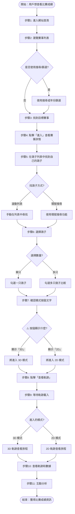
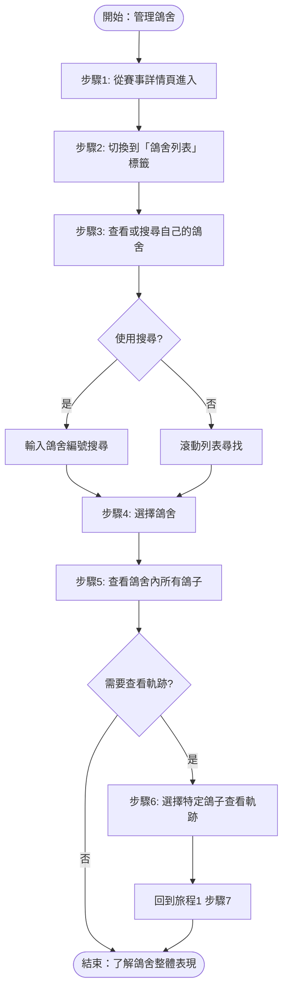

# 用戶旅程地圖

**專案**：鴿子競賽 GPS 追蹤系統
**最後更新**：2025-11-18
**版本**：1.0

---

## 📖 目的

本文檔描述賽鴿愛好者/參賽者在使用系統時的典型旅程，包括：
- 完整的步驟序列和決策點
- 用戶在每個階段的目標和期望
- 可能遇到的問題和挑戰
- 不同旅程路徑的分支選項

這些用戶旅程將指導：
- 測試案例設計和優先級
- UI/UX 改進方向
- 功能開發優先級
- 問題排查策略

---

## 🎯 主要用戶旅程

### 旅程 1：查看比賽軌跡和成績（核心旅程）

**用戶目標**：在賽事結束後查看自己鴿子的飛行軌跡和成績排名

**使用頻率**：高（每次賽事後必用）

**重要性**：⭐⭐⭐ 核心功能

---

#### 📋 完整步驟流程



---

#### 詳細步驟說明

##### 步驟 1：進入網站首頁
**用戶操作**：
- 在瀏覽器輸入 `https://skyracing.com.cn/`
- 或點擊書籤/收藏連結

**用戶期望**：
- 頁面快速載入（<3秒）
- 看到最新的賽事列表
- 界面熟悉且易用

**系統行為**：
- 載入首頁
- 呼叫 API: `/ugetPublicRaceList` 獲取賽事列表
- 顯示賽事卡片（通常 10+ 個）

**可能問題**：
- 網路慢導致載入時間長
- API 回應延遲

**對應測試案例**：TC-01-001

---

##### 步驟 2：瀏覽賽事列表
**用戶操作**：
- 滾動查看賽事卡片
- 閱讀賽事名稱和日期

**用戶期望**：
- 快速找到自己參加的賽事
- 賽事資訊清晰顯示

**系統行為**：
- 顯示賽事卡片網格
- 每個卡片包含：賽事名稱、日期、「進入」按鈕

**分支選項**：
- **選項 A**：直接瀏覽列表（賽事不多時）
- **選項 B**：使用搜尋功能（輸入關鍵字）
- **選項 C**：使用年份篩選（選擇特定年份）

**對應測試案例**：TC-01-002（搜尋）、TC-01-003（篩選）、TC-01-005（卡片資訊）

---

##### 步驟 3：找到目標賽事
**用戶操作**：
- 確認找到正確的賽事
- 準備點擊進入

**用戶期望**：
- 賽事名稱和日期匹配
- 「進入」按鈕清晰可見

---

##### 步驟 4：點擊「進入」查看賽事詳情
**用戶操作**：
- 點擊賽事卡片上的「進入」按鈕

**用戶期望**：
- 頁面立即響應
- 載入賽事詳情頁面

**系統行為**：
- 導航到賽事詳情頁（SPA 內部切換，無 URL 變化）
- 呼叫 API: `/ugetTrackInfoByRank` 獲取鴿子排名列表
- 顯示鴿子排名表格

**可能問題**：
- 按鈕點擊無響應
- 表格載入慢

**對應測試案例**：TC-01-004

---

##### 步驟 5：在鴿子列表中找到自己的鴿子
**用戶操作**：
- 查看排名表格
- 尋找自己鴿子的環號或名稱

**用戶期望**：
- 快速找到自己的鴿子
- 排名清晰顯示

**系統行為**：
- 顯示完整的鴿子排名表格
- 表格包含：排名、環號、鴿舍、速度、距離等

**分支選項**：
- **選項 A**：手動滾動列表尋找（鴿子排名靠前時）
- **選項 B**：使用環號搜尋功能（如果提供）

**痛點**：
- 列表很長時難以找到（特別是排名靠後的鴿子）
- 缺少快速定位功能

---

##### 步驟 6：選擇鴿子（勾選 checkbox）
**用戶操作**：
- 點擊鴿子列表行左側的 checkbox

**用戶期望**：
- checkbox 立即勾選
- 「勾選清單」計數更新
- 「查看軌跡」按鈕啟用

**系統行為**：
- checkbox 狀態切換
- 頁面顯示「勾選清單 N」（N = 已選數量）
- 「查看軌跡」按鈕從禁用變為啟用

**分支選項**：
- **單只鴿子**：只勾選一只（最常見）
- **多只鴿子**：勾選 2-5 只用於比較

**對應測試案例**：TC-02-001

---

##### 步驟 7：確認模式按鈕文字（⚠️ 關鍵決策點）
**用戶操作**：
- 查看「查看軌跡」按鈕旁邊的模式切換按鈕

**用戶期望**：
- 知道點擊後會進入哪個模式

**系統行為**：
- 按鈕顯示當前**未啟用**的模式名稱
  - 顯示「3D」→ 點擊後進入 **3D 模式**
  - 顯示「2D」→ 點擊後進入 **2D 模式**

**⚠️ 關鍵警告**：
- **按鈕文字決定行為，非 checkbox 狀態！**
- 這是最容易混淆的操作

**用戶困惑點**：
- 按鈕文字「3D」讓用戶誤以為是「切換到 3D」的按鈕
- 實際上「3D」表示「當前在 2D，點擊進入 3D」

**對應測試案例**：TC-03-008

**參考文檔**：[Mode Switching Guide](../../guides/mode-switching.md)

---

##### 步驟 8：點擊「查看軌跡」按鈕
**用戶操作**：
- 點擊「查看軌跡」按鈕

**用戶期望**：
- 載入軌跡視圖
- 看到地圖和飛行軌跡

**系統行為**：
- 根據步驟 7 的按鈕狀態，進入對應模式：
  - 按鈕顯示「3D」→ 進入 **3D 模式**（Cesium 地球）
  - 按鈕顯示「2D」→ 進入 **2D 模式**（AMap 平面地圖）
- 呼叫 API: `/ugetPigeonAllJsonInfo` 獲取軌跡數據

**對應測試案例**：TC-02-001、TC-04-001

---

##### 步驟 9：等待軌跡載入
**用戶操作**：
- 等待（無需操作）

**用戶期望**：
- 看到載入提示（理想情況）
- 載入時間合理（<5秒）

**系統行為**：
- 獲取軌跡數據（API 調用）
- 渲染地圖和軌跡線
- 標記軌跡點

**可能問題**：
- 載入時間過長
- 2D 模式初次載入失敗（已知問題 #1）

**已知解決方案**：
- 2D 失敗時使用 3D→2D 切換順序

**對應測試案例**：TC-02-002、TC-02-006

---

##### 步驟 10：查看軌跡和數據
**用戶操作**：
- 查看地圖上的飛行軌跡
- 觀察軌跡線和標記點

**用戶期望**：
- 軌跡清晰可見
- 標記點位置準確
- 數據易於理解

**系統行為（根據模式不同）**：

**2D 模式**：
- 平面地圖（AMap 2.0）
- 紅色虛線軌跡
- 多個軌跡點標記（靜態模式）或 1-3 個（動態模式）
- 可切換靜態/動態模式

**3D 模式**：
- 3D 地球（Cesium）
- 立體軌跡顯示
- 軌跡點標記
- 可切換視角（視角1/視角2）

**對應測試案例**：
- 2D: TC-02-003（靜態）、TC-02-005（軌跡線）、TC-03-001（動態）
- 3D: TC-04-001、TC-04-002、TC-04-003

---

##### 步驟 11：互動分析飛行數據
**用戶操作**：
- 點擊軌跡點查看詳細資訊
- 切換視圖模式
- 播放動態軌跡（如果在動態模式）

**用戶期望**：
- 點擊響應迅速
- 數據顯示完整準確
- 互動流暢

**系統行為**：
- 點擊軌跡點後彈出資訊窗格
- 顯示：環號、時間、速度、方向、海拔、名次
- 提供模式切換和播放控制

**可能問題**：
- 軌跡點點擊無響應（已知問題 #3）
- 靜態/動態模式混淆（已知問題 #2）

**已知解決方案**：
- 使用 accessibility tree locator 定位軌跡點
- 通過標記點數量判斷模式（15-20 vs 1-3）

**對應測試案例**：TC-02-004、TC-06-001~004

**參考文檔**：[Troubleshooting Guide](../../guides/troubleshooting.md)

---

#### 🎯 關鍵路徑（Happy Path）

最順利的情況下，用戶的操作序列：

```
步驟1（首頁） → 步驟3（找到賽事） → 步驟4（進入詳情） →
步驟5（找到鴿子） → 步驟6（勾選） → 步驟7（確認模式） →
步驟8（查看軌跡） → 步驟10（查看數據）
```

**預期完成時間**：2-3 分鐘

---

#### ⚠️ 關鍵決策點

| 決策點 | 位置 | 影響 | 重要性 |
|--------|------|------|--------|
| **模式按鈕文字判斷** | 步驟7 | 決定進入 2D 或 3D | ⭐⭐⭐ 最關鍵 |
| 單只 vs 多只鴿子 | 步驟6 | 影響數據比較方式 | ⭐⭐ |
| 靜態 vs 動態模式 | 步驟10（2D中） | 影響查看方式 | ⭐⭐ |
| 使用搜尋/篩選 | 步驟2 | 影響查找效率 | ⭐ |

---

#### 😖 可能遇到的問題

| 問題 | 出現階段 | 影響程度 | 解決方案 |
|------|----------|----------|----------|
| 2D 軌跡初次載入失敗 | 步驟9 | 高 | 使用 3D→2D 切換順序 |
| 靜態/動態模式混淆 | 步驟10 | 中 | 觀察標記點數量（15-20 vs 1-3） |
| 軌跡點點擊無響應 | 步驟11 | 中 | 使用 accessibility tree locator |
| 數據載入時機不明確 | 步驟9 | 低 | 切換後等待 2-3 秒 |
| 找不到目標鴿子 | 步驟5 | 中 | 提供環號搜尋功能（功能需求） |

**參考文檔**：[Known Issues Solutions](../../test-plan/KNOWN_ISSUES_SOLUTIONS.md)

---

#### 📊 預期成果

用戶完成此旅程後應該：
- ✅ 看到鴿子的飛行軌跡
- ✅ 了解鴿子的排名和成績
- ✅ 獲得關鍵飛行數據（速度、高度、距離）
- ✅ 理解鴿子的飛行策略

---

## 🎯 次要用戶旅程

### 旅程 2：管理鴿舍資訊

**用戶目標**：查看自己鴿舍內所有鴿子的比賽表現

**使用頻率**：中（賽季期間定期查看）

**重要性**：⭐⭐ 重要功能

---

#### 📋 完整步驟流程



---

#### 詳細步驟說明

##### 步驟 1：從賽事詳情頁進入
**用戶操作**：
- 完成旅程1的步驟1-4（進入賽事詳情頁）

**用戶期望**：
- 看到賽事詳情頁面

---

##### 步驟 2：切換到「鴿舍列表」標籤
**用戶操作**：
- 點擊「鴿舍列表」標籤（tab）

**用戶期望**：
- 標籤切換流暢
- 顯示鴿舍列表

**系統行為**：
- 從「排名」標籤切換到「鴿舍列表」標籤
- 顯示按鴿舍分組的鴿子列表

**對應測試案例**：TC-05-001

---

##### 步驟 3：查看或搜尋自己的鴿舍
**用戶操作**：
- 滾動查看鴿舍列表
- 或使用搜尋框輸入鴿舍編號

**用戶期望**：
- 快速找到自己的鴿舍
- 鴿舍編號清晰顯示

**分支選項**：
- **選項 A**：滾動列表（鴿舍不多時）
- **選項 B**：使用搜尋功能（鴿舍很多時）

**對應測試案例**：TC-05-002

---

##### 步驟 4：選擇鴿舍
**用戶操作**：
- 點擊鴿舍行展開

**用戶期望**：
- 顯示該鴿舍下所有鴿子
- 鴿子資訊完整

**系統行為**：
- 展開鴿舍詳情
- 顯示鴿子列表（環號、排名、成績）

---

##### 步驟 5：查看鴿舍內所有鴿子
**用戶操作**：
- 瀏覽鴿舍內的鴿子列表
- 查看每只鴿子的排名和成績

**用戶期望**：
- 一目了然看到所有鴿子表現
- 可以比較不同鴿子

**對應測試案例**：TC-05-003

---

##### 步驟 6（可選）：選擇特定鴿子查看軌跡
**用戶操作**：
- 勾選特定鴿子
- 點擊「查看軌跡」

**系統行為**：
- 回到旅程1的步驟7（模式選擇）
- 進入軌跡查看流程

**對應測試案例**：TC-05-004

---

#### 🎯 關鍵路徑（Happy Path）

```
步驟1（進入賽事詳情） → 步驟2（切換標籤） → 步驟3（找到鴿舍） →
步驟5（查看所有鴿子）
```

**預期完成時間**：1-2 分鐘

---

#### 📊 預期成果

用戶完成此旅程後應該：
- ✅ 看到自己鴿舍的所有參賽鴿子
- ✅ 了解每只鴿子的排名
- ✅ 能夠比較不同鴿子的表現
- ✅ 識別表現優異的鴿子

---

## 🎯 進階用戶旅程（低頻場景）

### 旅程 3：賽後深度分析

**用戶目標**：分析鴿子的飛行策略，找出改進空間

**使用頻率**：低（賽後數天內）

**重要性**：⭐ 進階需求

---

#### 📋 關鍵操作

1. **多只鴿子比較**
   - 勾選 2-5 只鴿子
   - 同時查看軌跡
   - 比較飛行路線差異

2. **2D/3D 視圖切換**
   - 在 2D 平面地圖查看整體路線
   - 切換到 3D 查看高度變化
   - 對比不同視角下的飛行策略

3. **軌跡點詳細數據分析**
   - 點擊每個軌跡點
   - 記錄速度、高度、方向數據
   - 找出速度變化規律

4. **靜態/動態播放切換**
   - 靜態模式：查看完整路線和所有軌跡點
   - 動態模式：播放飛行過程，觀察時間推進

---

#### 對應測試案例

- TC-03-001~008（2D 動態播放）
- TC-04-001~006（3D 模式）
- TC-06-001~004（軌跡點互動）

---

## 📊 旅程總結

| 旅程 | 頻率 | 重要性 | 平均時長 | 關鍵功能 |
|------|------|--------|----------|----------|
| 旅程1: 查看比賽軌跡和成績 | 高 | ⭐⭐⭐ | 2-3 分鐘 | 軌跡查看、數據顯示 |
| 旅程2: 管理鴿舍資訊 | 中 | ⭐⭐ | 1-2 分鐘 | 鴿舍列表、鴿子管理 |
| 旅程3: 賽後深度分析 | 低 | ⭐ | 5-10 分鐘 | 多鴿比較、模式切換 |

---

## 🔗 與測試案例的映射

### 旅程1 → 測試案例映射

| 旅程步驟 | 對應測試案例 | 優先級 |
|---------|-------------|--------|
| 步驟1: 進入首頁 | TC-01-001 | P1 |
| 步驟2: 瀏覽賽事列表 | TC-01-002, TC-01-003, TC-01-005 | P1 |
| 步驟4: 進入賽事詳情 | TC-01-004 | P1 |
| 步驟6: 選擇鴿子 | TC-02-001 | P0 |
| 步驟7: 確認模式（關鍵！） | TC-03-008 | P0 |
| 步驟9: 軌跡載入 | TC-02-002, TC-02-006 | P0 |
| 步驟10: 2D 軌跡查看 | TC-02-003, TC-02-005 | P0 |
| 步驟10: 3D 軌跡查看 | TC-04-001~006 | P0 |
| 步驟11: 軌跡點互動 | TC-02-004, TC-06-001~004 | P0/P1 |

### 旅程2 → 測試案例映射

| 旅程步驟 | 對應測試案例 | 優先級 |
|---------|-------------|--------|
| 步驟2: 切換標籤 | TC-05-001 | P1 |
| 步驟3: 搜尋鴿舍 | TC-05-002 | P1 |
| 步驟5: 查看鴿舍鴿子 | TC-05-003 | P1 |
| 步驟6: 選擇鴿子查看軌跡 | TC-05-004 | P1 |

---

## 🔗 相關文檔

- [User Personas](USER_PERSONAS.md) - 用戶角色定義
- [Feature Catalog](../features/FEATURE_CATALOG.md) - 33個功能點清單
- [Site Map](../information-architecture/SITE_MAP.md) - 網站結構地圖
- [Test Cases](../test-plan/TEST_CASES.md) - 35+ 詳細測試案例
- [Known Issues Solutions](../test-plan/KNOWN_ISSUES_SOLUTIONS.md) - 已知問題和解決方案
- [Mode Switching Guide](../guides/mode-switching.md) - 2D/3D 模式切換指南
- [Troubleshooting Guide](../guides/troubleshooting.md) - 問題排解指南

---

**文檔維護者**：專案團隊
**審核狀態**：初版
**下次審核日期**：Phase 2 實作後
