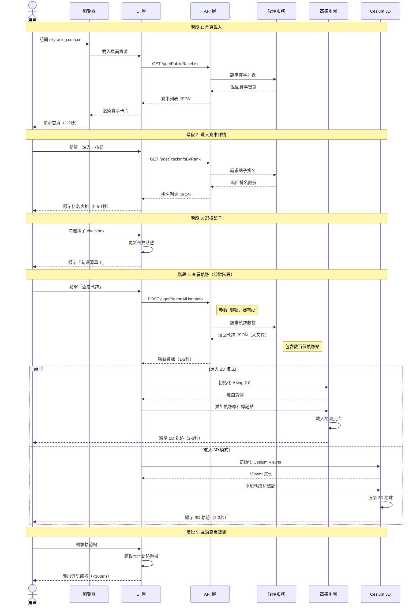
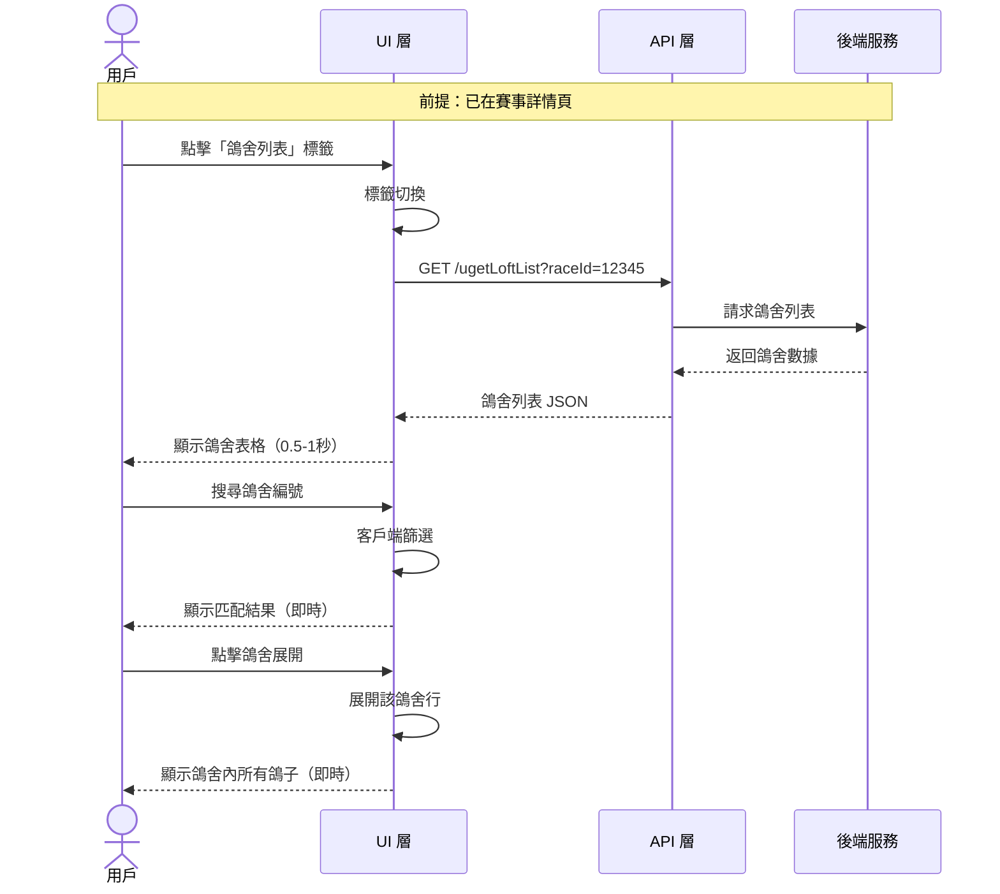

# 完整端到端用戶旅程

**專案**：鴿子競賽 GPS 追蹤系統
**最後更新**：2025-11-18
**版本**：1.0

---

## 📖 目的

本文檔描述**端到端**的完整用戶旅程，串聯前端用戶操作、API 調用、後端處理、數據渲染的完整流程。包括：
- 用戶操作 → API 請求 → 後端響應 → 前端渲染的完整鏈路
- 關鍵時序和性能指標
- 數據流向和狀態變化
- 各層次的職責和依賴關係

這些端到端旅程將指導：
- 整合測試設計
- 性能優化方向
- 錯誤處理策略
- 系統架構理解

---

## 🎯 端到端旅程 1：查看鴿子飛行軌跡（核心流程）

### 概覽

這是最核心的端到端流程，涵蓋從用戶進入首頁到查看完整軌跡的所有環節。

**總時長（預期）**：8-15 秒
**關鍵 API 數量**：3 個
**涉及層次**：UI 層、API 層、地圖渲染層

---

### 完整時序圖



---

### 階段詳細說明

#### 階段 1：首頁載入（1-2 秒）

**用戶操作**：
- 在瀏覽器輸入 URL 並按 Enter

**前端行為**：
```typescript
// 1. 頁面載入
window.onload = () => {
  // 2. 初始化 Angular 應用
  // 3. 發起 API 請求
}
```

**API 調用**：
```http
GET https://skyracing.com.cn/api/ugetPublicRaceList
Content-Type: application/json
```

**響應數據結構**：
```json
{
  "status": "success",
  "data": [
    {
      "raceId": "12345",
      "raceName": "2024春季賽",
      "raceDate": "2024-03-15",
      "participantCount": 156
    },
    // ... 更多賽事
  ]
}
```

**前端渲染**：
- 使用 Angular Material 的 `<mat-card>` 組件
- 每個賽事渲染為一個卡片
- 顯示賽事名稱、日期、「進入」按鈕

**時間分解**：
- 網路請求：0.3-0.5 秒
- 數據解析：<0.1 秒
- DOM 渲染：0.2-0.5 秒
- **總計：0.5-1.1 秒**

**可能的性能瓶頸**：
- API 響應慢（後端數據庫查詢）
- 賽事數量過多（>100 個）導致渲染慢

---

#### 階段 2：進入賽事詳情（0.5-1 秒）

**用戶操作**：
- 點擊賽事卡片上的「進入」按鈕

**前端行為**：
```typescript
onEnterRace(raceId: string) {
  // 1. SPA 內部路由切換（無完整頁面刷新）
  this.router.navigate(['/race-detail', raceId]);

  // 2. 發起 API 請求
  this.api.getTrackInfoByRank(raceId).subscribe(data => {
    this.pigeonList = data;
  });
}
```

**API 調用**：
```http
GET https://skyracing.com.cn/api/ugetTrackInfoByRank?raceId=12345
Content-Type: application/json
```

**響應數據結構**：
```json
{
  "status": "success",
  "data": [
    {
      "rank": 1,
      "ringNumber": "2025-26-123456",
      "loftNumber": "A001",
      "speed": "1245.67 m/min",
      "distance": "456.78 km",
      "arrivalTime": "2024-03-15 14:32:15"
    },
    // ... 更多鴿子（可能 100+ 條）
  ]
}
```

**前端渲染**：
- 使用 Angular Material 的 `<table>` 組件
- 顯示可滾動的排名表格
- 每行包含 checkbox 用於選擇

**時間分解**：
- 路由切換：<0.1 秒
- 網路請求：0.3-0.6 秒
- 表格渲染：0.1-0.3 秒
- **總計：0.4-1.0 秒**

---

#### 階段 3：選擇鴿子（即時響應 <100ms）

**用戶操作**：
- 勾選表格行左側的 checkbox

**前端行為**：
```typescript
onSelectPigeon(pigeon: Pigeon) {
  // 1. 更新選擇狀態
  this.selectedPigeons.push(pigeon);

  // 2. 更新 UI
  this.updateSelectionCount();

  // 3. 啟用「查看軌跡」按鈕
  this.enableTrajectoryButton();
}
```

**狀態變化**：
```typescript
// 前：
selectedPigeons = []
buttonEnabled = false
selectionCount = 0

// 後：
selectedPigeons = [pigeon1]
buttonEnabled = true
selectionCount = 1
```

**UI 更新**：
- checkbox 從空白變為勾選
- 顯示「勾選清單 1」
- 「查看軌跡」按鈕從灰色變為藍色（可點擊）

**時間分解**：
- 事件處理：<10ms
- 狀態更新：<10ms
- DOM 重繪：<50ms
- **總計：<100ms**

---

#### 階段 4：查看軌跡（3-5 秒，最關鍵階段）

**用戶操作**：
- 點擊「查看軌跡」按鈕

**前端行為**：
```typescript
async onViewTrajectory() {
  // 1. 檢查模式按鈕狀態
  const buttonText = this.modeButton.textContent;
  const targetMode = buttonText === '3D' ? '3D' : '2D';

  // 2. 發起 API 請求
  const trajectoryData = await this.api.getPigeonAllJsonInfo({
    ringNumbers: this.selectedPigeons.map(p => p.ringNumber),
    raceId: this.currentRaceId
  });

  // 3. 根據模式初始化地圖
  if (targetMode === '2D') {
    this.init2DMap(trajectoryData);
  } else {
    this.init3DMap(trajectoryData);
  }
}
```

**API 調用（最重要的 API）**：
```http
POST https://skyracing.com.cn/api/ugetPigeonAllJsonInfo
Content-Type: application/json

{
  "ringNumbers": ["2025-26-123456"],
  "raceId": "12345"
}
```

**響應數據結構（大文件，可達數 MB）**：
```json
{
  "status": "success",
  "data": {
    "2025-26-123456": {
      "pigeonInfo": {
        "ringNumber": "2025-26-123456",
        "loftNumber": "A001",
        "rank": 1
      },
      "trajectoryPoints": [
        {
          "timestamp": "2024-03-15 08:00:00",
          "latitude": 24.1234,
          "longitude": 120.5678,
          "altitude": 156.7,
          "speed": 1234.5,
          "direction": 45.2
        },
        // ... 200-500 個軌跡點
      ]
    }
  }
}
```

**地圖初始化（根據模式）**：

**2D 模式（AMap 2.0）**：
```typescript
init2DMap(trajectoryData) {
  // 1. 創建地圖實例
  this.map = new AMap.Map('map-container', {
    zoom: 11,
    center: [trajectoryData[0].longitude, trajectoryData[0].latitude],
    mapStyle: 'amap://styles/normal'
  });

  // 2. 添加軌跡線
  const polyline = new AMap.Polyline({
    path: trajectoryData.map(p => [p.longitude, p.latitude]),
    strokeColor: '#FF0000',
    strokeWeight: 2,
    strokeStyle: 'dashed'
  });
  this.map.add(polyline);

  // 3. 添加標記點（靜態模式：所有點，動態模式：1-3個點）
  trajectoryData.forEach(point => {
    const marker = new AMap.Marker({
      position: [point.longitude, point.latitude],
      title: point.timestamp
    });
    this.map.add(marker);
  });

  // 4. 等待地圖瓦片載入
  this.map.on('complete', () => {
    console.log('2D map loaded');
  });
}
```

**3D 模式（Cesium）**：
```typescript
init3DMap(trajectoryData) {
  // 1. 創建 Cesium Viewer
  this.viewer = new Cesium.Viewer('cesium-container', {
    terrainProvider: Cesium.createWorldTerrain()
  });

  // 2. 添加軌跡線
  this.viewer.entities.add({
    polyline: {
      positions: Cesium.Cartesian3.fromDegreesArrayHeights(
        trajectoryData.flatMap(p => [p.longitude, p.latitude, p.altitude])
      ),
      width: 2,
      material: Cesium.Color.RED
    }
  });

  // 3. 添加標記點
  trajectoryData.forEach(point => {
    this.viewer.entities.add({
      position: Cesium.Cartesian3.fromDegrees(
        point.longitude, point.latitude, point.altitude
      ),
      point: {
        pixelSize: 5,
        color: Cesium.Color.BLUE
      }
    });
  });

  // 4. 飛向起點
  this.viewer.camera.flyTo({
    destination: Cesium.Cartesian3.fromDegrees(
      trajectoryData[0].longitude,
      trajectoryData[0].latitude,
      50000
    )
  });
}
```

**時間分解**：
- API 請求：1.0-2.0 秒（數據量大）
- 數據解析：0.1-0.3 秒
- 地圖初始化：0.5-1.0 秒
- 軌跡渲染：0.5-1.0 秒
- 瓦片/3D 載入：1.0-2.0 秒
- **總計：3.1-6.3 秒**

**已知問題**：
- **問題 #1**：2D 模式初次載入可能失敗（gpx2d undefined）
  - **原因**：AMap 實例初始化時機問題
  - **解決方案**：先切換到 3D，再切換回 2D

**參考文檔**：[Known Issues #1](../test-plan/KNOWN_ISSUES_SOLUTIONS.md#問題-1)

---

#### 階段 5：互動查看數據（<100ms）

**用戶操作**：
- 點擊軌跡點標記

**前端行為**：
```typescript
onMarkerClick(point: TrajectoryPoint) {
  // 1. 從本地數據讀取（不需要 API 調用）
  const pointData = this.trajectoryData.find(p => p.timestamp === point.timestamp);

  // 2. 構建資訊窗格
  const infoWindow = new AMap.InfoWindow({
    content: this.buildInfoContent(pointData)
  });

  // 3. 在地圖上顯示
  infoWindow.open(this.map, point.position);
}

buildInfoContent(point: TrajectoryPoint): string {
  return `
    <div class="info-pane">
      <h3>${point.ringNumber}</h3>
      <p>時間：${point.timestamp}</p>
      <p>速度：${point.speed} m/min</p>
      <p>方向：${point.direction}°</p>
      <p>海拔：${point.altitude} m</p>
      <p>名次：${point.rank}</p>
    </div>
  `;
}
```

**時間分解**：
- 事件處理：<10ms
- 數據查找：<10ms
- 窗格渲染：<50ms
- **總計：<100ms**

**已知問題**：
- **問題 #3**：軌跡點點擊無響應
  - **原因**：DOM 選擇器無法正確定位動態生成的標記
  - **解決方案**：使用 accessibility tree locator

**參考文檔**：[Known Issues #3](../test-plan/KNOWN_ISSUES_SOLUTIONS.md#問題-3)

---

### 完整數據流向圖

```mermaid
flowchart LR
    A[用戶點擊進入] --> B[API: ugetTrackInfoByRank]
    B --> C[排名數據 JSON]
    C --> D[渲染表格]

    D --> E[用戶勾選鴿子]
    E --> F[更新前端狀態]

    F --> G[用戶點擊查看軌跡]
    G --> H[API: ugetPigeonAllJsonInfo]
    H --> I[軌跡數據 JSON<br/>200-500 個點]

    I --> J{模式判斷}
    J -->|2D| K[AMap 2.0 初始化]
    J -->|3D| L[Cesium 初始化]

    K --> M[添加軌跡線<br/>紅色虛線]
    L --> N[添加 3D 軌跡<br/>立體顯示]

    M --> O[添加標記點<br/>靜態: 全部<br/>動態: 1-3個]
    N --> P[添加 3D 標記]

    O --> Q[載入地圖瓦片]
    P --> R[渲染 3D 地球]

    Q --> S[顯示完整軌跡]
    R --> S

    S --> T[用戶點擊軌跡點]
    T --> U[讀取本地數據]
    U --> V[顯示資訊窗格]
```



---

### 關鍵時序總結

| 階段 | 操作 | 時間 | 是否阻塞 | 優化建議 |
|------|------|------|----------|----------|
| 1 | 首頁載入 | 0.5-1.1s | 是 | 快取賽事列表 |
| 2 | 賽事詳情 | 0.4-1.0s | 是 | 預載入熱門賽事 |
| 3 | 選擇鴿子 | <0.1s | 否 | - |
| 4 | 軌跡載入 | 3.1-6.3s | 是（最慢） | 壓縮 JSON、CDN 加速 |
| 5 | 互動查看 | <0.1s | 否 | - |
| **總計** | - | **4-8.5s** | - | - |

**最大瓶頸**：階段 4 的軌跡數據 API 調用（1-2 秒）和地圖渲染（2-3 秒）

---

## 🎯 端到端旅程 2：鴿舍管理流程

### 概覽

**總時長（預期）**：3-5 秒
**關鍵 API 數量**：2 個
**涉及層次**：UI 層、API 層

---

### 完整時序圖



---

### API 調用

```http
GET https://skyracing.com.cn/api/ugetLoftList?raceId=12345
Content-Type: application/json
```

**響應數據結構**：
```json
{
  "status": "success",
  "data": [
    {
      "loftNumber": "A001",
      "loftName": "優勝鴿舍",
      "pigeonCount": 12,
      "pigeons": [
        {
          "ringNumber": "2025-26-123456",
          "rank": 1,
          "speed": "1245.67 m/min"
        },
        // ... 更多鴿子
      ]
    },
    // ... 更多鴿舍
  ]
}
```

---

### 時間分解

- 標籤切換：<0.1 秒
- API 請求：0.3-0.6 秒
- 表格渲染：0.2-0.4 秒
- **總計：0.5-1.1 秒**

---

## 📊 性能指標總結

### 關鍵 API 性能

| API 端點 | 平均響應時間 | 數據大小 | 調用頻率 | 優先級 |
|---------|-------------|---------|---------|--------|
| /ugetPublicRaceList | 0.3-0.5s | 10-50 KB | 每次訪問首頁 | P0 |
| /ugetTrackInfoByRank | 0.3-0.6s | 20-100 KB | 每次進入賽事 | P0 |
| **/ugetPigeonAllJsonInfo** | **1.0-2.0s** | **1-5 MB** | 每次查看軌跡 | **P0（最關鍵）** |
| /ugetLoftList | 0.3-0.6s | 30-150 KB | 查看鴿舍時 | P1 |

### 前端渲染性能

| 組件 | 初始化時間 | 渲染時間 | 優化建議 |
|------|-----------|---------|---------|
| 賽事列表 | - | 0.2-0.5s | 虛擬滾動 |
| 排名表格 | - | 0.1-0.3s | 分頁載入 |
| 2D 地圖 | 0.5-1.0s | 0.5-1.0s | 預初始化 |
| 3D 地球 | 1.0-1.5s | 1.0-2.0s | 按需載入 |

### 用戶感知時間

| 操作 | 用戶期望 | 實際時間 | 滿意度 |
|------|---------|---------|--------|
| 點擊按鈕響應 | <100ms | <100ms | ✅ 優秀 |
| 頁面切換 | <500ms | 0.5-1s | ⚠️ 可接受 |
| 軌跡載入 | <3s | 3-6s | ❌ 需優化 |

---

## 🔗 相關文檔

- [User Journeys](../user-research/USER_JOURNEYS.md) - 用戶視角的旅程
- [System Architecture](../technical-architecture/SYSTEM_ARCHITECTURE.md) - 技術架構
- [API Endpoints](../api-reference/API_ENDPOINTS.md) - API 端點文檔
- [Test Cases](../test-plan/TEST_CASES.md) - 測試案例
- [Known Issues Solutions](../test-plan/KNOWN_ISSUES_SOLUTIONS.md) - 已知問題

---

**文檔維護者**：專案團隊
**審核狀態**：初版
**下次審核日期**：Phase 2 實作後
