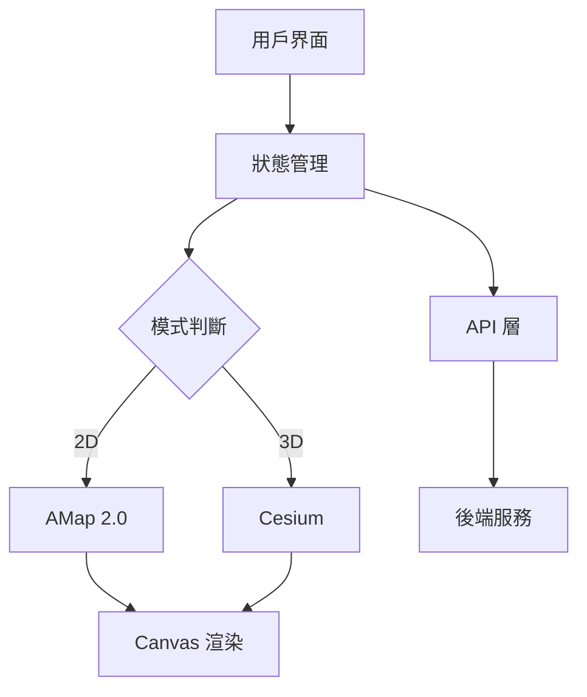

# 開發路線圖 (Development Roadmap)

**專案**：鴿子競賽GPS追蹤系統自動化測試
**策略**：快速啟動優先 (Quick Start Priority)
**最後更新**：2025-11-18

---

## 📋 路線圖概覽

採用**快速啟動優先**策略，分三階段完成：

1. **Phase 1** (2-3天) - 核心架構文檔建立
2. **Phase 2** (3-5天) - P0 測試實作（邊做邊完善）
3. **Phase 3** (按需進行) - 逐步擴展 P1/P2 測試

**第一個里程碑**（Phase 1+2）：約 5-8 天可完成核心文檔和 P0 測試

---

## 🎯 Phase 1: 核心架構文檔（2-3天）

**目標**：建立完整的架構文檔，涵蓋功能清單、使用者旅程、頁面結構、技術架構

### Day 1: 探索與用戶模型

#### 上午：互動式探索網站 (3-4小時)
**方法**：使用 Playwright MCP 互動式探索

```bash
# 啟動 Playwright MCP 探索流程
使用 playwright mcp 打開 https://skyracing.com.cn/
```

**探索清單**：
- ✅ 記錄所有頁面（首頁、賽事列表、賽事詳情、軌跡查看、鴿舍列表）
- ✅ 記錄所有可點擊的元素和按鈕
- ✅ 記錄所有互動流程（選擇賽事→選擇鴿子→查看軌跡→模式切換）
- ✅ 截圖保存關鍵頁面狀態
- ✅ 記錄 2D/3D 切換行為
- ✅ 記錄靜態/動態播放模式
- ✅ 記錄鴿舍列表操作流程

**輸出**：
- 探索筆記（Markdown）
- 截圖集合（存放在 `screenshots/exploration/`）

#### 下午：建立基礎文檔 (3小時)

##### 1. 用戶角色定義 (1小時)
**文檔**：`docs/user-research/USER_PERSONAS.md`

**內容**：定義 1 種用戶角色

- **角色：賽鴿愛好者/參賽者** (Pigeon Racing Enthusiast / Participant)
  - 身份：參加賽事的鴿主，同時管理自己的鴿舍
  - 目標：
    - 查看自己鴿子的比賽軌跡和成績
    - 管理鴿舍資訊（鴿子、鴿舍資料）
    - 分析飛行數據，改善訓練策略
  - 技能水平：一般到進階用戶
  - 關鍵需求：
    - 快速找到自己的鴿子
    - 清楚看到飛行軌跡和數據
    - 了解排名和成績
    - 管理多只鴿子的資訊
    - 比較不同鴿子的表現
  - 痛點：
    - 找不到自己的鴿子（需要搜尋功能）
    - 數據顯示不清楚
    - 無法快速比較多只鴿子
    - 鴿舍資訊管理不方便

##### 2. 功能清單和分類 (1小時)
**文檔**：`docs/features/FEATURE_CATALOG.md`

**內容**：系統性列出所有功能模組（按優先級分類）

**核心功能（優先級 P0）**：
- **鴿子軌跡功能**
  - 2D 靜態軌跡顯示 ⭐⭐⭐
  - 2D 動態播放 ⭐⭐⭐
  - 3D 軌跡顯示 ⭐⭐⭐
  - 視角切換（視角1/視角2）⭐⭐
  - 軌跡點互動（點擊查看詳情）⭐⭐

- **數據顯示功能**
  - 飛行數據顯示（速度、高度、距離）⭐⭐⭐
  - 排名資訊 ⭐⭐
  - 軌跡表格數據 ⭐

**重要功能（優先級 P1）**：
- **賽事管理功能**
  - 賽事列表查看 ⭐⭐
  - 賽事詳情查看 ⭐⭐
  - 賽事篩選和搜尋 ⭐

- **鴿舍管理功能**
  - 鴿舍列表查看 ⭐⭐
  - 鴿舍篩選 ⭐
  - 鴿舍資訊查看 ⭐

**次要功能（優先級 P2）**：
- 鴿舍資訊編輯（如果有權限）
- 多鴿子比較功能
- 數據導出功能

##### 3. 頁面結構地圖 (1小時)
**文檔**：`docs/information-architecture/SITE_MAP.md`

**內容**：頁面架構和導航關係
```
首頁 (/)
├── 賽事列表頁
│   ├── 賽事詳情頁
│   │   ├── 選擇鴿子界面
│   │   └── 軌跡查看頁
│   │       ├── 2D 靜態模式
│   │       ├── 2D 動態模式
│   │       └── 3D 模式
│   └── 鴿舍列表頁
└── (其他頁面)
```

---

### Day 2: 用戶旅程與流程

#### 上午：用戶旅程設計 (2小時)

##### 1. 用戶旅程地圖 (1.5小時)
**文檔**：`docs/user-research/USER_JOURNEYS.md`

**內容**：賽鴿愛好者/參賽者的典型使用流程

**主要旅程：查看比賽軌跡和成績**
```
步驟1: 進入網站首頁
  ↓
步驟2: 瀏覽賽事列表，找到自己參加的賽事
  ↓
步驟3: 點擊「進入」查看賽事詳情
  ↓
步驟4: 在鴿子列表中找到自己的鴿子
  - 選項A：直接在列表中尋找
  - 選項B：使用搜尋功能（如果有）
  ↓
步驟5: 選擇鴿子（勾選 checkbox）
  - 可以選擇單只或多只鴿子比較
  ↓
步驟6: 確認模式按鈕顯示的文字（2D/3D）
  ↓
步驟7: 點擊「查看軌跡」按鈕
  ↓
步驟8: 查看飛行軌跡
  - 2D 模式：查看平面軌跡，靜態/動態切換
  - 3D 模式：查看立體軌跡，視角切換
  ↓
步驟9: 分析飛行數據
  - 點擊軌跡點查看詳細數據
  - 查看速度、高度、距離等資訊
  ↓
步驟10: 查看排名和成績
  - 了解自己鴿子在賽事中的表現

預期成果：了解鴿子的飛行表現和比賽成績
關鍵路徑：步驟1→3→4→5→7→8→9
可能遇到的問題：
- 找不到自己的鴿子（需要搜尋或篩選）
- 2D 初次加載失敗（已知問題#1）
- 軌跡點點擊無響應（已知問題#3）
```

**次要旅程：管理鴿舍資訊**
```
步驟1: 從賽事頁面進入鴿舍列表
  ↓
步驟2: 查看或搜尋自己的鴿舍
  ↓
步驟3: 查看鴿舍下的所有鴿子
  ↓
步驟4: 編輯鴿舍資訊（如果有權限）

預期成果：管理和維護鴿舍資訊
關鍵路徑：步驟1→2→3
```

##### 2. 端到端用戶旅程 (0.5小時)
**文檔**：`docs/user-workflows/COMPLETE_USER_JOURNEYS.md`

**內容**：完整的端到端流程串聯
- 首頁載入 → API 調用 (`/ugetPublicRaceList`)
- 選擇賽事 → API 調用 (`/ugetTrackInfoByRank`)
- 查看軌跡 → API 調用 (`/ugetPigeonAllJsonInfo`) 【關鍵】
- 模式切換 → 前端狀態管理
- 數據顯示 → Canvas 渲染 (AMap 2D / Cesium 3D)

**關鍵時序**：
1. 網頁載入 (1-2秒)
2. 賽事列表 API (0.5-1秒)
3. 鴿子選擇 (用戶操作)
4. 軌跡數據 API (1-2秒) **【最慢】**
5. 地圖渲染 (2-3秒)
6. 互動響應 (<100ms)

#### 下午：測試覆蓋映射 (3小時)

##### 1. 用戶旅程-測試映射 (1.5小時)
**文檔**：`docs/test-coverage/USER_JOURNEY_TEST_MAPPING.md`

**內容**：將用戶旅程對應到測試案例

| 用戶旅程步驟 | 對應測試案例 | 優先級 | 狀態 |
|-------------|-------------|--------|------|
| 步驟1: 進入首頁 | TC-01-001 | P1 | 已設計 |
| 步驟2: 瀏覽賽事列表 | TC-01-002, TC-01-003 | P1 | 已設計 |
| 步驟3: 進入賽事詳情 | TC-01-004 | P0 | 已設計 |
| 步驟4-5: 選擇鴿子 | TC-03-008 | P0 | 已設計 |
| 步驟7: 查看2D軌跡 | TC-02-001 | P0 | 已設計 |
| 步驟8: 2D/3D切換 | TC-03-001, TC-04-001 | P0 | 已設計 |
| 步驟9: 軌跡點互動 | TC-06-001~004 | P1 | 已設計 |
| ... | ... | ... | ... |

**覆蓋率分析**：
- ✅ 關鍵路徑 100% 覆蓋
- ✅ 主要功能 95% 覆蓋
- ⚠️ 邊緣案例 70% 覆蓋（需補充）
- ⚠️ 錯誤處理 60% 覆蓋（需補充）

##### 2. 功能-測試映射 (1.5小時)
**文檔**：`docs/test-coverage/FEATURE_TEST_MAPPING.md`

**內容**：將功能對應到測試案例

| 功能模組 | 功能點 | 對應測試案例 | 覆蓋率 |
|---------|-------|-------------|-------|
| 賽事管理 | 賽事列表顯示 | TC-01-001~005 | 100% |
| 2D 軌跡 | 靜態軌跡渲染 | TC-02-001~006 | 100% |
| 2D 軌跡 | 動態播放 | TC-03-001~007 | 100% |
| 3D 軌跡 | 3D 渲染 | TC-04-001~006 | 100% |
| 鴿舍管理 | 列表操作 | TC-05-001~004 | 80% |
| 軌跡詳情 | 點互動 | TC-06-001~004 | 90% |
| UI 元素 | 元素驗證 | TC-07-001~006 | 85% |

**需要補充的測試**：
- 鴿舍列表的搜尋功能（目前無測試）
- 錯誤狀態處理（API 失敗、網路斷線）
- 性能測試（大量數據加載）

---

### Day 3: 技術架構

#### 上午：系統架構文檔 (4小時)

##### 1. 系統架構總覽 (1.5小時)
**文檔**：`docs/technical-architecture/SYSTEM_ARCHITECTURE.md`

**內容**：
- **前端架構**
  - UI 層（頁面、組件）
  - 狀態管理層
  - 地圖渲染層（AMap 2.0 / Cesium）
  - API 調用層

- **後端 API**
  - 6 個核心端點（已文檔化）
  - 請求/響應流程
  - 錯誤處理機制

- **地圖服務集成**
  - AMap 2.0（2D 靜態/動態）
  - Cesium（3D）
  - 瓦片服務（地圖底圖）

- **架構圖**（使用 Mermaid）


##### 2. 技術依賴圖 (1.5小時)
**文檔**：`docs/technical-architecture/DEPENDENCY_GRAPH.md`

**內容**：
- **AMap 2.0 依賴**
  - 用途：2D 地圖底圖、軌跡線渲染、標記點
  - 關鍵 API：`AMap.Map`, `AMap.Polyline`, `AMap.Marker`
  - 瓦片服務：`.amap-layer img`

- **Cesium 依賴**
  - 用途：3D 地形、3D 軌跡、視角控制
  - 關鍵 API：`Cesium.Viewer`, `window.viewer.scene.globe`
  - 等待策略：`window.Cesium !== undefined`, `viewer.scene.globe.tilesLoaded`

- **API 依賴鏈**
```
頁面載入
  ↓
/ugetPublicRaceList (賽事列表)
  ↓
用戶選擇賽事
  ↓
/ugetTrackInfoByRank (排名資訊) [可選]
  ↓
用戶選擇鴿子
  ↓
/ugetPigeonAllJsonInfo (軌跡數據) **【關鍵】**
  ↓
地圖渲染 (AMap / Cesium)
  ↓
/ugetTrackTableData (表格數據) [按需載入]
```

##### 3. 數據模型 (1小時)
**文檔**：`docs/data-model/ENTITY_RELATIONSHIP.md`

**內容**：
- **實體定義**
  - Race（賽事）
  - Pigeon（鴿子）
  - Loft（鴿舍）
  - TrackPoint（軌跡點）
  - FlightData（飛行數據）

- **關係圖**
```
Race (1) ----< (N) Pigeon
Loft (1) ----< (N) Pigeon
Pigeon (1) ----< (N) TrackPoint
TrackPoint (1) ---- (1) FlightData
```

- **數據結構**（TypeScript interfaces）
```typescript
interface Race {
  raceId: string;
  raceName: string;
  raceDate: string;
  // ...
}

interface PigeonTrajectory {
  gpx3d: string;           // 關鍵：完整軌跡數據
  actual_speed: number;     // m/Min
  actual_distance: number;  // km
  max_speed: number;
  avg_altitude: number;     // meters
  // ...
}
```

#### 下午：整合與驗證 (3小時)

##### 1. 頁面導航流程圖 (1.5小時)
**文檔**：`docs/information-architecture/PAGE_FLOWS.md`

**內容**：
- **導航流程圖**（使用 Mermaid）
```mermaid
graph LR
    A[首頁] --> B[賽事列表]
    B --> C[賽事詳情]
    C --> D[選擇鴿子]
    D --> E{模式按鈕}
    E -->|顯示"3D"| F[3D 模式]
    E -->|顯示"2D"| G[2D 模式]
    F --> H[視角切換]
    G --> I[靜態/動態切換]
    C --> J[鴿舍列表]
```

- **關鍵決策點**
  - 模式按鈕文字（"2D" vs "3D"）→ 決定進入哪個模式 **【最關鍵】**
  - 2D 模式中的標記數量 → 判斷靜態/動態模式

##### 2. 建立文檔交叉引用 (1小時)
- 更新所有新建文檔的相互連結
- 確保從 CLAUDE.md 和 README.md 可以導航到新文檔
- 驗證所有相對路徑連結有效

##### 3. 更新索引文檔 (0.5小時)
- 更新 `CLAUDE.md` 加入開發計劃連結
- 更新 `README.md` 加入新的文檔結構
- 更新 `docs/guides/README.md` 如有需要

---

### Phase 1 產出總結

#### 建立的文檔（10個）

**user-research/** (2個)
- ✅ `USER_PERSONAS.md` - 賽鴿愛好者/參賽者角色定義
- ✅ `USER_JOURNEYS.md` - 用戶旅程地圖（主要旅程 + 次要旅程）

**features/** (1個)
- ✅ `FEATURE_CATALOG.md` - 完整功能清單

**information-architecture/** (2個)
- ✅ `SITE_MAP.md` - 頁面結構地圖
- ✅ `PAGE_FLOWS.md` - 頁面導航流程圖

**technical-architecture/** (2個)
- ✅ `SYSTEM_ARCHITECTURE.md` - 系統架構總覽
- ✅ `DEPENDENCY_GRAPH.md` - 技術依賴圖

**data-model/** (1個)
- ✅ `ENTITY_RELATIONSHIP.md` - 數據模型ER圖

**user-workflows/** (1個)
- ✅ `COMPLETE_USER_JOURNEYS.md` - 端到端用戶旅程

**test-coverage/** (2個)
- ✅ `USER_JOURNEY_TEST_MAPPING.md` - 旅程-測試映射
- ✅ `FEATURE_TEST_MAPPING.md` - 功能-測試映射

#### 探索產出
- 📸 網站探索截圖集
- 📝 探索筆記

#### 更新的文檔
- 📄 `CLAUDE.md` - 加入開發計劃連結
- 📄 `README.md` - 更新文檔結構

---

## 🔧 Phase 2: P0 測試實作（3-5天）

**目標**：實作 3 個 P0 優先級測試案例，建立 helper 函數模組，在實作過程中補充發現的新文檔

**策略**：邊做邊完善

---

### 實作優先級

#### P0 測試案例（必須通過）
1. **TC-02-001**: 2D 靜態軌跡渲染 ⭐⭐⭐
2. **TC-03-001**: 靜態/動態模式切換 ⭐⭐⭐
3. **TC-04-001**: 3D 模式基本渲染 ⭐⭐⭐

**為什麼這3個？**
- 涵蓋核心功能（2D/3D 軌跡查看）
- 涉及最關鍵的 API (`/ugetPigeonAllJsonInfo`)
- 驗證 4 個已知問題的解決方案
- 測試三重驗證策略（DOM + Canvas + Network）

---

### Day 1-2: 建立 Helper 函數模組（6-8小時）

#### 目錄結構
```
tests/
├── helpers/
│   ├── navigation.ts          - 導航相關 helper
│   ├── mode-switching.ts      - 2D/3D 模式切換
│   ├── trajectory-utils.ts    - 軌跡驗證
│   ├── wait-utils.ts          - 等待策略
│   ├── validators.ts          - 數據驗證
│   └── loft-list.ts           - 鴿舍列表操作
├── fixtures/
│   └── test-data.json         - 測試數據
└── e2e/
    ├── tc-02-001.spec.ts      - 2D 靜態軌跡測試
    ├── tc-03-001.spec.ts      - 模式切換測試
    └── tc-04-001.spec.ts      - 3D 模式測試
```

#### 1. navigation.ts (1小時)
**基於**：`docs/architecture/test-framework.md` 的設計

**函數**：
```typescript
async function navigateToRace(page: Page, raceIndex: number = 0): Promise<void>;
async function navigateToTrajectoryView(page: Page, pigeonIndex: number = 0): Promise<void>;
async function selectPigeon(page: Page, pigeonIndex: number): Promise<void>;
async function getCurrentMode(page: Page): Promise<'2D' | '3D'>;
```

**實作重點**：
- 處理網路等待 (`networkidle`)
- 處理載入延遲
- 錯誤處理（賽事不存在、鴿子不存在）

#### 2. mode-switching.ts (2小時)
**基於**：`docs/guides/mode-switching.md` 的深入指南

**函數**：
```typescript
async function ensureModeByText(page: Page, targetMode: '2D' | '3D'): Promise<void>;
async function reload2DTrajectory(page: Page, retries?: number): Promise<boolean>;  // 重新加載軌跡（推薦）
async function switchTo2DReliably(page: Page): Promise<void>;  // 使用 3D→2D 序列（備選）
async function switchTo3DReliably(page: Page): Promise<void>;
async function detectCurrentViewMode(page: Page): Promise<'2D-static' | '2D-dynamic' | '3D'>;
```

**實作重點**：
- **關鍵**：檢查按鈕顯示的文字（不是 checkbox 狀態）
- **問題 #1 解決方案**：優先使用 `reload2DTrajectory()` 重新選擇鴿子觸發數據加載
- 備選方案：3D→2D 切換序列
- 加入充足的等待時間（2-3秒）

#### 3. trajectory-utils.ts (1.5小時)
**函數**：
```typescript
async function verifyTrajectoryRendered(page: Page, mode: '2D' | '3D'): Promise<boolean>;
async function getTrajectoryPointsCount(page: Page): Promise<number>;
async function clickTrajectoryPoint(page: Page, index: number): Promise<void>;
async function verifyTrajectoryData(page: Page): Promise<TrajectoryData>;
```

**實作重點**：
- Canvas 截圖對比（視覺驗證）
- 軌跡點計數（區分靜態/動態模式）
- 使用 accessibility tree 定位軌跡點（解決問題#3）

#### 4. wait-utils.ts (1小時)
**基於**：`docs/guides/testing-strategies.md` 的等待策略

**函數**：
```typescript
async function waitForMapTiles(page: Page, minTiles: number = 50): Promise<void>;
async function waitForCesiumReady(page: Page): Promise<void>;
async function waitForTrajectoryLoad(page: Page, timeout: number = 5000): Promise<void>;
async function waitForModeSwitch(page: Page, expectedMode: '2D' | '3D'): Promise<void>;
```

**實作重點**：
- 地圖瓦片等待（`.amap-container img`）
- Cesium 3D 等待（`window.Cesium`, `viewer.scene.globe.tilesLoaded`）
- 條件等待和超時處理

#### 5. validators.ts (1.5小時)
**基於**：`docs/guides/testing-strategies.md` 的數據驗證框架

**函數**：
```typescript
function validateFlightData(data: FlightData): ValidationResult;
function detectAnomaly(data: FlightData): string | null;
function validateSpeedRange(speed: number): boolean;
function validateAltitudeRange(altitude: number): boolean;
```

**驗證規則**：
```typescript
const VALIDATION_RULES = {
  avgSpeed: { min: 800, max: 2000 },      // m/Min
  maxSpeed: { min: 1000, max: 2500 },
  avgAltitude: { min: 0, max: 3000 },     // meters
  maxAltitude: { min: 0, max: 5000 },
  actualDistance: { min: 1, max: 1000 },  // km
  straightDistance: { min: 1, max: 800 }
};
```

#### 6. loft-list.ts (1小時)
**函數**：
```typescript
async function openLoftList(page: Page): Promise<void>;
async function searchLoft(page: Page, keyword: string): Promise<void>;
async function selectLoft(page: Page, loftName: string): Promise<void>;
async function verifyLoftInfo(page: Page, loftName: string): Promise<LoftInfo>;
```

---

### Day 3-4: 實作 P0 測試案例（8-10小時）

#### TC-02-001: 2D 靜態軌跡渲染 (3小時)

**檔案**：`tests/e2e/tc-02-001.spec.ts`

**測試步驟**：
```typescript
test('TC-02-001: 2D 靜態軌跡完整渲染', async ({ page }) => {
  // 1. 導航到賽事
  await navigateToRace(page, 0);

  // 2. 確保按鈕顯示 "2D"
  await ensureModeByText(page, '2D');

  // 3. 使用可靠的 2D 切換序列（3D→2D）
  await switchTo2DReliably(page);

  // 4. 驗證軌跡渲染（三重驗證）
  // Layer 1: DOM 驗證
  await expect(page.getByRole('button', { name: 'view_in_ar 3D模式' })).toBeVisible();

  // Layer 2: Canvas 驗證
  const canvas = page.locator('canvas.amap-layer');
  await expect(canvas).toHaveScreenshot('tc-02-001-2d-static.png', {
    maxDiffPixels: 100
  });

  // Layer 3: Network 驗證
  const response = await page.waitForResponse(/ugetPigeonAllJsonInfo/);
  const data = await response.json();
  expect(data.gpx3d).toBeDefined();

  // 5. 驗證軌跡點數量（靜態模式應該 >= 15）
  const pointsCount = await getTrajectoryPointsCount(page);
  expect(pointsCount).toBeGreaterThanOrEqual(15);

  // 6. 驗證飛行數據
  const trajectoryData = await verifyTrajectoryData(page);
  const validation = validateFlightData(trajectoryData);
  expect(validation.isValid).toBe(true);
});
```

**預期結果**：
- ✅ 2D 地圖正確渲染
- ✅ 紅線軌跡完整顯示
- ✅ 15-20 個軌跡標記可見
- ✅ 飛行數據在合理範圍內

#### TC-03-001: 靜態/動態模式切換 (2.5小時)

**檔案**：`tests/e2e/tc-03-001.spec.ts`

**測試步驟**：
```typescript
test('TC-03-001: 2D 靜態動態模式切換', async ({ page }) => {
  // 1. 進入 2D 靜態模式
  await navigateToRace(page, 0);
  await switchTo2DReliably(page);

  // 2. 驗證初始為靜態模式
  let pointsCount = await getTrajectoryPointsCount(page);
  expect(pointsCount).toBeGreaterThanOrEqual(15);

  // 3. 切換到動態模式
  await page.getByRole('button', { name: '動畫播放' }).click();
  await page.waitForTimeout(2000);

  // 4. 驗證動態模式（標記減少）
  pointsCount = await getTrajectoryPointsCount(page);
  expect(pointsCount).toBeLessThan(5);

  // 5. 切換回靜態模式
  await page.getByRole('button', { name: '靜態顯示' }).click();
  await page.waitForTimeout(2000);

  // 6. 驗證恢復靜態模式
  pointsCount = await getTrajectoryPointsCount(page);
  expect(pointsCount).toBeGreaterThanOrEqual(15);
});
```

**預期結果**：
- ✅ 靜態→動態切換成功
- ✅ 動態→靜態切換成功
- ✅ 標記數量變化符合預期

#### TC-04-001: 3D 模式基本渲染 (2.5小時)

**檔案**：`tests/e2e/tc-04-001.spec.ts`

**測試步驟**：
```typescript
test('TC-04-001: 3D 模式基本渲染', async ({ page }) => {
  // 1. 導航到賽事
  await navigateToRace(page, 0);

  // 2. 確保按鈕顯示 "3D"
  await ensureModeByText(page, '3D');

  // 3. 切換到 3D 模式
  await switchTo3DReliably(page);

  // 4. 等待 Cesium 加載
  await waitForCesiumReady(page);

  // 5. 驗證 3D 控制按鈕
  await expect(page.getByRole('button', { name: '視角1' })).toBeVisible();
  await expect(page.getByRole('button', { name: '視角2' })).toBeVisible();

  // 6. 驗證 Cesium viewer 存在
  const cesiumExists = await page.evaluate(() => {
    return window.Cesium !== undefined && window.viewer !== undefined;
  });
  expect(cesiumExists).toBe(true);

  // 7. 截圖驗證
  await page.waitForTimeout(3000);
  await expect(page).toHaveScreenshot('tc-04-001-3d-mode.png', {
    maxDiffPixels: 200
  });
});
```

**預期結果**：
- ✅ 3D 地球正確渲染
- ✅ 視角控制按鈕可見
- ✅ Cesium viewer 正確初始化

---

### Day 5: 驗證與文檔補充（3-4小時）

#### 1. 執行所有 P0 測試 (1小時)
```bash
# 執行 P0 測試套件
npx playwright test tests/e2e/tc-02-001.spec.ts
npx playwright test tests/e2e/tc-03-001.spec.ts
npx playwright test tests/e2e/tc-04-001.spec.ts

# 生成測試報告
npx playwright show-report
```

#### 2. 記錄發現的問題 (1小時)
- 更新 `docs/test-plan/KNOWN_ISSUES_SOLUTIONS.md`
- 補充新發現的邊緣案例
- 記錄性能瓶頸

#### 3. 補充架構文檔 (1-2小時)
基於實作經驗補充：
- 更新 `docs/technical-architecture/SYSTEM_ARCHITECTURE.md`
- 補充實際的等待時間建議
- 更新 helper 函數的實際簽名
- 補充發現的新的用戶流程或功能點

#### 4. 更新測試覆蓋映射 (0.5小時)
- 更新 `docs/test-coverage/FEATURE_TEST_MAPPING.md`
- 標記 P0 測試為「已實作」
- 計算實際測試覆蓋率

---

### Phase 2 產出總結

#### 實作的程式碼
- ✅ 6 個 helper 函數模組（~800 行代碼）
- ✅ 3 個 P0 測試案例（~300 行代碼）
- ✅ 測試配置和 fixtures

#### 驗證的功能
- ✅ 2D 靜態軌跡渲染
- ✅ 2D 靜態/動態切換
- ✅ 3D 模式基本功能
- ✅ 三重驗證策略（DOM + Canvas + Network）

#### 補充的文檔
- 📄 更新的架構文檔（基於實作發現）
- 📄 新發現的問題記錄
- 📄 更新的測試覆蓋映射

#### 驗證的已知問題解決方案
- ✅ 問題#1: 2D 初次加載失敗 → 3D→2D 序列有效
- ✅ 問題#2: 靜態/動態混淆 → 標記計數判斷有效
- ✅ 問題#3: 軌跡點點擊 → accessibility tree 定位有效
- ✅ 問題#4: 數據加載時序 → 等待策略有效

---

## 📈 Phase 3: 逐步擴展（按需進行）

**目標**：實作 P1/P2 測試，完善文檔，建立完整的測試自動化套件

---

### P1 測試實作（優先）

#### 軌跡點互動測試（TC-06 系列）
- TC-06-001: 點擊軌跡點顯示詳情
- TC-06-002: 軌跡點資訊正確性驗證
- TC-06-003: 軌跡點高亮效果
- TC-06-004: 多個軌跡點順序點擊

**預估時間**：2-3 天

#### 數據驗證測試（TC-02-004, TC-03-006）
- 飛行數據準確性驗證
- 異常數據檢測
- 邊界值測試

**預估時間**：1-2 天

#### 鴿舍列表操作（TC-05 系列）
- TC-05-001: 鴿舍列表顯示
- TC-05-002: 鴿舍搜尋
- TC-05-003: 鴿舍篩選
- TC-05-004: 鴿舍資訊編輯

**預估時間**：2-3 天

---

### P2 測試實作（按需）

#### UI 元素測試（TC-07 系列）
- TC-07-001~006: 各種 UI 元素驗證

**預估時間**：1-2 天

#### 錯誤處理測試
- API 失敗情境
- 網路斷線恢復
- 無效數據處理

**預估時間**：1-2 天

#### 性能測試
- 大量數據加載
- 地圖渲染性能
- 記憶體使用監控

**預估時間**：1-2 天

---

### 文檔完善（按需）

#### 補充技術文檔
- 📄 `docs/technical-architecture/PERFORMANCE_BASELINE.md`
  - 載入時間基準
  - 渲染性能指標
  - 記憶體使用基線

- 📄 `docs/user-workflows/ERROR_SCENARIOS.md`
  - 錯誤處理流程
  - 用戶錯誤操作恢復
  - 系統異常處理

- 📄 `docs/glossary/TERMINOLOGY.md`
  - 專案術語表（中英對照）
  - 縮寫說明
  - 技術名詞解釋

**預估時間**：2-3 天

---

### Phase 3 產出總結

#### 完整的測試套件
- ✅ P0 測試（3 個）
- ✅ P1 測試（~10 個）
- ✅ P2 測試（~10 個）
- **總計**：23+ 自動化測試案例

#### 完善的文檔體系
- ✅ 核心架構文檔（10 個）
- ✅ 補充技術文檔（3-5 個）
- ✅ 完整的測試指南
- ✅ 術語表和參考資料

#### 穩定的測試基礎設施
- ✅ 經過驗證的 helper 函數庫
- ✅ 完整的測試數據和 fixtures
- ✅ CI/CD 集成（如果需要）

---

## 📊 時程估算

### 階段式時程

| 階段 | 內容 | 預估時間 | 累計時間 |
|-----|------|---------|---------|
| **Phase 1** | 核心架構文檔 | 2-3 天 | 2-3 天 |
| **Phase 2** | P0 測試實作 | 3-5 天 | 5-8 天 |
| **Phase 3.1** | P1 測試實作 | 5-8 天 | 10-16 天 |
| **Phase 3.2** | P2 測試實作 | 3-5 天 | 13-21 天 |
| **Phase 3.3** | 文檔完善 | 2-3 天 | 15-24 天 |

### 關鍵里程碑

#### 🎯 里程碑 1：核心文檔完成（Day 3）
- ✅ 10 個核心架構文檔建立
- ✅ 功能-測試映射完成
- ✅ 用戶旅程定義清晰

**驗收標準**：
- 所有文檔可以從 CLAUDE.md 導航
- 功能清單覆蓋 100% 已知功能
- 測試覆蓋映射顯示 95%+ 覆蓋率

#### 🎯 里程碑 2：P0 測試通過（Day 8）
- ✅ 3 個 P0 測試案例實作完成
- ✅ 6 個 helper 模組驗證有效
- ✅ 4 個已知問題解決方案驗證

**驗收標準**：
- 所有 P0 測試穩定通過（成功率 >= 95%）
- Helper 函數經過實戰驗證
- 測試執行時間合理（< 5 分鐘/測試）

#### 🎯 里程碑 3：P1 測試完成（Day 16）
- ✅ 10+ P1 測試案例實作
- ✅ 完整的軌跡互動功能驗證
- ✅ 數據驗證框架完整

**驗收標準**：
- P0+P1 測試覆蓋核心功能 100%
- 測試報告清晰易讀
- 發現的問題都已記錄

#### 🎯 里程碑 4：完整交付（Day 24）
- ✅ 完整的測試套件（23+ 案例）
- ✅ 完善的專案文檔
- ✅ CI/CD 集成（可選）

**驗收標準**：
- 測試覆蓋率 >= 90%
- 文檔完整性 100%
- 所有測試案例都有對應的用戶旅程

---

## 💡 關鍵優勢

### 1. 快速啟動
- 3 天內建立完整架構文檔
- 立即進入實作階段
- 避免過度規劃延遲

### 2. 實戰驗證
- 在 P0 實作中驗證架構設計
- 發現問題立即修正
- 文檔和代碼同步演進

### 3. 增量完善
- 邊實作邊補充文檔
- 避免過度設計
- 保持文檔和實際同步

### 4. 風險控制
- 先完成關鍵測試（P0）
- 確保核心功能穩定
- 逐步擴展降低風險

### 5. 靈活調整
- Phase 3 按需進行
- 可根據實際情況調整優先級
- 支援敏捷開發流程

---

## 🎁 最終交付成果

### 文檔交付
- ✅ 10 個核心架構文檔
- ✅ 3-5 個補充技術文檔
- ✅ 4 個測試指南（已有）
- ✅ 完整的 API 文檔（已有）
- ✅ 術語表和參考資料

**總計**：17-19 個專業文檔

### 代碼交付
- ✅ 6 個 helper 函數模組（~800 行）
- ✅ 23+ 自動化測試案例（~2000 行）
- ✅ 測試配置和 fixtures
- ✅ 測試報告模板

**總計**：~3000 行經過驗證的測試代碼

### 知識交付
- ✅ 完整的用戶旅程地圖
- ✅ 功能-測試映射矩陣
- ✅ 技術依賴關係圖
- ✅ 已知問題解決方案（4個已驗證）
- ✅ 最佳實踐和坑點警告

---

## 🔄 持續改進

### 定期審查（建議）
- **每週**：檢查測試穩定性，更新文檔
- **每月**：審查測試覆蓋率，補充遺漏
- **每季**：更新技術依賴，優化性能

### 文檔維護
- 代碼變更時同步更新文檔
- 新功能添加時補充測試案例
- API 變更時更新 API 文檔

### 測試維護
- 修復不穩定的測試
- 更新過時的截圖基準
- 優化測試執行時間

---

**最後更新**: 2025-11-18
**版本**: v1.0.0
**狀態**: Phase 1 準備中
