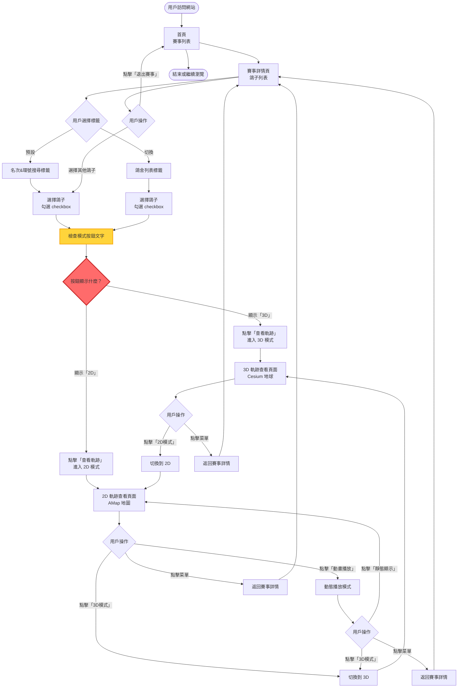
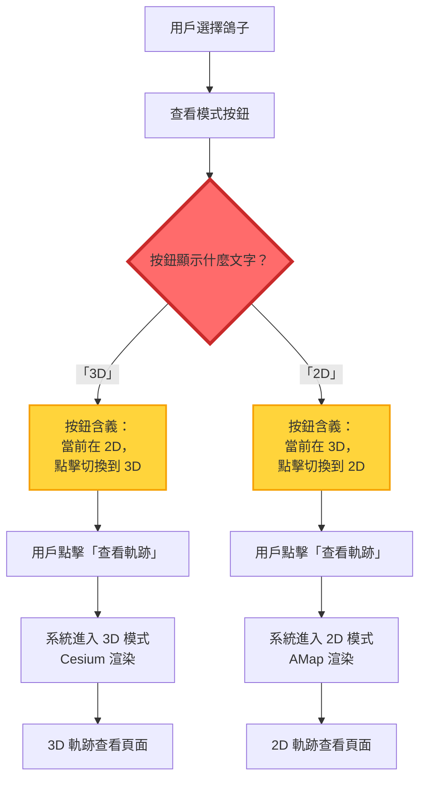
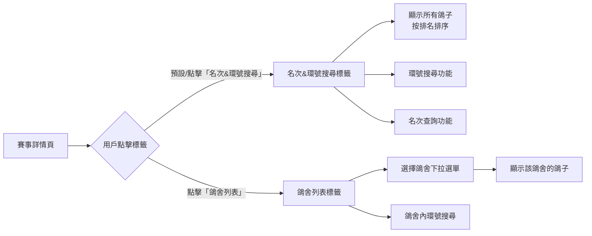
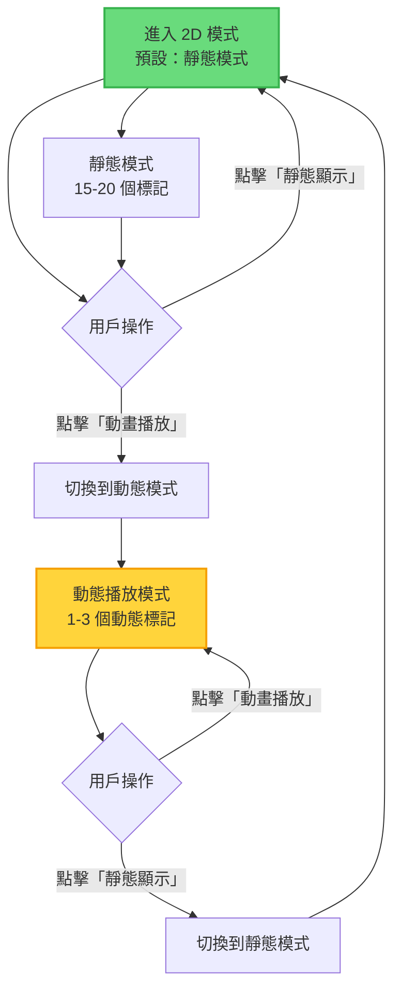
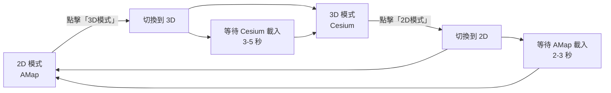
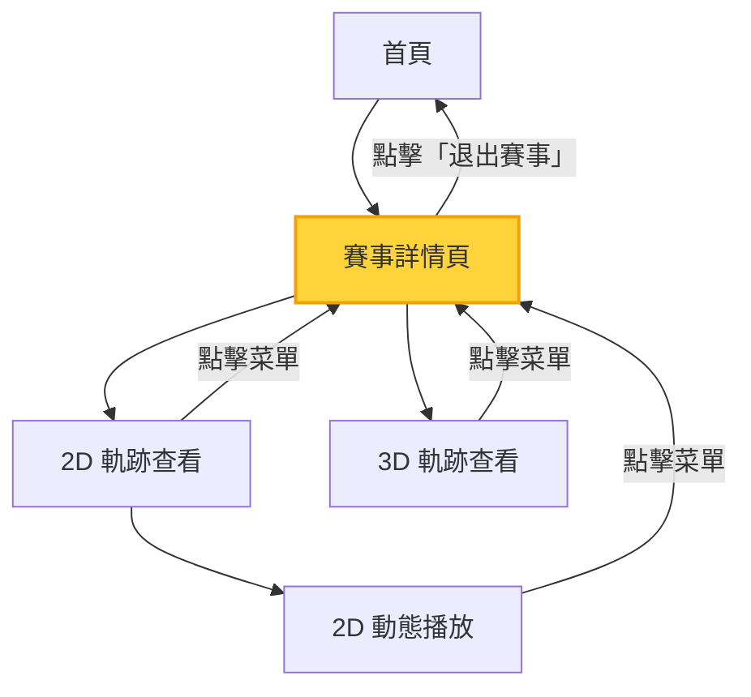
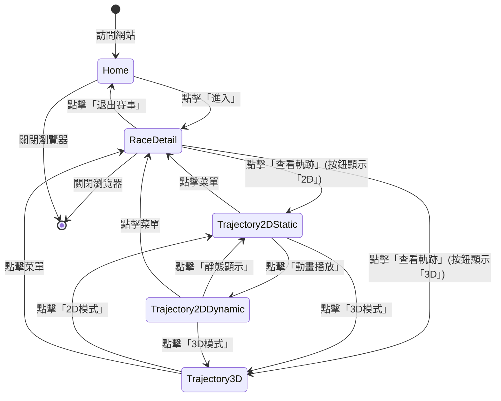
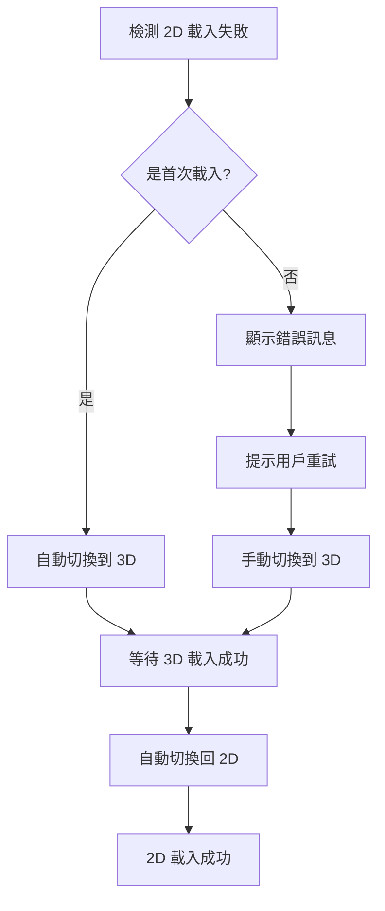
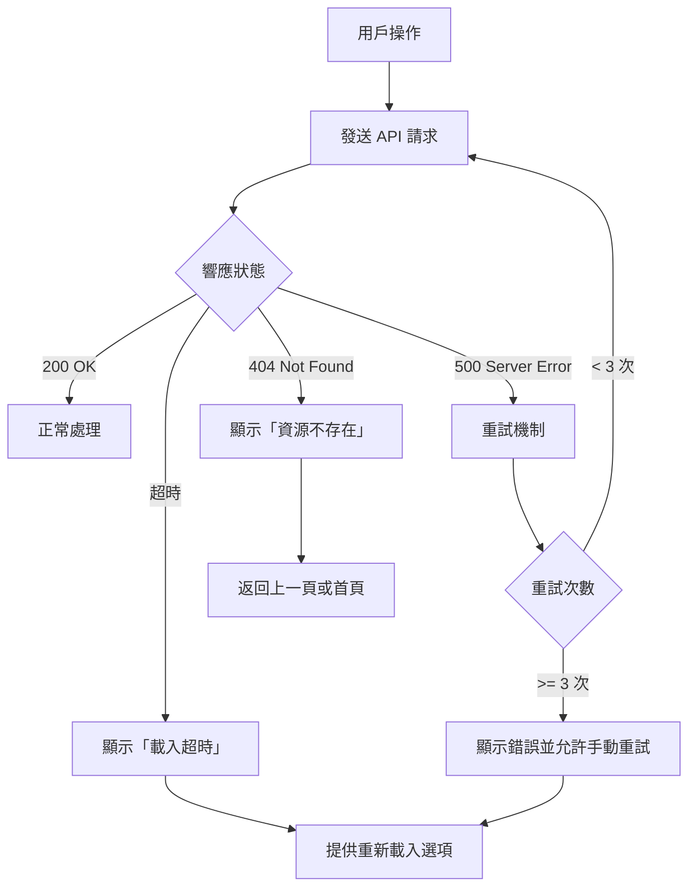

# 頁面導航流程

**專案**：鴿子競賽 GPS 追蹤系統
**最後更新**：2025-11-18
**版本**：1.0

---

## 📖 目的

本文檔描述鴿子競賽 GPS 追蹤系統的頁面間導航流程和狀態轉換，包括：
- 完整的頁面轉換流程圖
- 關鍵決策點和分支條件
- 頁面狀態管理
- 錯誤處理和回退流程
- 導航模式（前進/後退）

此文檔為：
- 測試自動化提供導航路徑
- 用戶體驗設計提供流程參考
- 開發團隊提供狀態管理指導
- 問題排查提供流程依據

---

## 🗺️ 整體頁面流程圖

### 主流程（Happy Path）



---

## 🚦 關鍵決策點

### 決策點 1：模式按鈕文字判斷（最關鍵）

**位置**：賽事詳情頁 → 軌跡查看頁面之間

**決策依據**：模式按鈕顯示的文字內容

**流程圖**：



**實作關鍵**：

```typescript
// ⚠️ 錯誤方法（常見錯誤）
const checkbox = page.getByRole('checkbox', { name: /2D|3D/ });
const isChecked = await checkbox.isChecked();  // ❌ 不可靠！

// ✓ 正確方法
const button = page.getByRole('button', { name: /2D|3D/ });
const buttonText = await button.textContent();  // ✓ 讀取文字

if (buttonText.includes('3D')) {
  // 按鈕顯示「3D」→ 將進入 3D 模式
  await page.getByRole('button', { name: '查看軌跡' }).click();
  // 等待 Cesium 初始化...
} else {
  // 按鈕顯示「2D」→ 將進入 2D 模式
  await page.getByRole('button', { name: '查看軌跡' }).click();
  // 等待 AMap 初始化...
}
```

**常見錯誤**：
- ❌ 使用 checkbox 狀態判斷
- ❌ 假設按鈕文字表示「當前」模式
- ❌ 未先讀取文字就點擊

**正確理解**：
- ✅ 按鈕文字指示「目標」模式（即將進入的模式）
- ✅ 先讀取文字，再決定後續操作
- ✅ 驗證進入的模式是否符合預期

📖 詳細指南：[Mode Switching Guide](../guides/mode-switching.md)

---

### 決策點 2：標籤頁選擇

**位置**：賽事詳情頁內部

**決策依據**：用戶點擊的標籤

**流程圖**：



**狀態管理**：
```typescript
interface RaceDetailState {
  currentTab: 'ranking' | 'loft';      // 當前標籤
  selectedPigeons: string[];           // 已選鴿子的環號列表
  selectedLoft?: string;               // 選中的鴿舍（僅鴿舍列表標籤）
}
```

---

### 決策點 3：2D 模式內部切換

**位置**：2D 軌跡查看頁面

**決策依據**：用戶點擊靜態/動態按鈕

**流程圖**：



**模式識別**：
```typescript
// 方法1: 通過標記點數量判斷
async function detect2DMode(page: Page): Promise<'static' | 'dynamic'> {
  const markerCount = await page.locator('.amap-marker').count();

  if (markerCount >= 15) {
    return 'static';   // 靜態模式：15-20 個標記
  } else {
    return 'dynamic';  // 動態模式：1-3 個標記
  }
}

// 方法2: 檢查播放控制按鈕狀態
async function detect2DMode(page: Page): Promise<'static' | 'dynamic'> {
  const hasPlayButton = await page.getByRole('button', { name: '播放' }).isVisible();

  if (hasPlayButton) {
    return 'dynamic';
  } else {
    return 'static';
  }
}
```

📖 詳細問題：[Known Issues #2](../test-plan/KNOWN_ISSUES_SOLUTIONS.md#問題-2-靜態動態模式混淆)

---

### 決策點 4：模式間切換（2D ↔ 3D）

**位置**：軌跡查看頁面

**決策依據**：用戶點擊模式切換按鈕

**流程圖**：



**等待策略**：
```typescript
async function switchTo3D(page: Page): Promise<void> {
  // 1. 點擊 3D 模式按鈕
  await page.getByRole('button', { name: /3D模式/ }).click();

  // 2. 等待 Cesium 初始化
  await page.waitForFunction(() => window.Cesium !== undefined);
  await page.waitForFunction(() => window.viewer !== undefined);

  // 3. 等待地球瓦片載入
  await page.waitForFunction(() => {
    return window.viewer?.scene.globe.tilesLoaded === true;
  }, { timeout: 15000 });

  // 4. 額外等待確保穩定
  await page.waitForTimeout(3000);

  console.log('✓ 已切換到 3D 模式');
}

async function switchTo2D(page: Page): Promise<void> {
  // 1. 點擊 2D 模式按鈕
  await page.getByRole('button', { name: /2D模式/ }).click();

  // 2. 等待 AMap 容器出現
  await page.waitForSelector('.amap-container', { state: 'visible' });

  // 3. 等待地圖瓦片載入
  await page.waitForFunction((minTiles) => {
    const tiles = document.querySelectorAll('.amap-container img');
    return tiles.length >= minTiles;
  }, 50);

  // 4. 額外等待確保穩定
  await page.waitForTimeout(2000);

  console.log('✓ 已切換到 2D 模式');
}
```

---

## 🔙 回退和返回流程

### 返回路徑總覽



### 返回機制

#### 方法 1：菜單按鈕返回

**觸發位置**：軌跡查看頁面（2D/3D）

**操作元素**：
- 左上角的 hamburger menu 按鈕
- 或明確的「返回」按鈕

**實作**：
```typescript
async function returnToRaceDetail(page: Page): Promise<void> {
  // 點擊菜單按鈕
  await page.getByRole('button', { name: 'menu' }).click();

  // 等待頁面轉換
  await page.waitForLoadState('networkidle');

  // 驗證返回到賽事詳情頁
  await expect(page.getByRole('button', { name: '查看軌跡' })).toBeVisible();
}
```

#### 方法 2：退出賽事按鈕

**觸發位置**：賽事詳情頁

**操作元素**：「退出賽事」按鈕

**實作**：
```typescript
async function returnToHomepage(page: Page): Promise<void> {
  // 點擊退出賽事按鈕
  await page.getByRole('button', { name: '退出賽事' }).click();

  // 等待頁面轉換
  await page.waitForLoadState('networkidle');

  // 驗證返回首頁
  await expect(page.locator('.race-card').first()).toBeVisible();
}
```

---

## 🌐 狀態管理

### 應用狀態結構

```typescript
interface ApplicationState {
  // 頁面狀態
  currentPage: 'home' | 'raceDetail' | 'trajectoryView';

  // 賽事狀態
  selectedRace: {
    raceID: string;
    raceName: string;
  } | null;

  // 鴿子選擇狀態
  selectedPigeons: {
    ringNumbers: string[];
    count: number;
  };

  // 軌跡查看狀態
  trajectoryView: {
    mode: '2D-static' | '2D-dynamic' | '3D';
    isPlaying: boolean;       // 僅動態模式
    currentTime: number;      // 播放時間點
  } | null;

  // UI 狀態
  ui: {
    currentTab: 'ranking' | 'loft';          // 賽事詳情頁標籤
    selectedLoft?: string;                   // 鴿舍列表中選中的鴿舍
    isRankingPanelVisible: boolean;          // 排名榜顯示狀態
    isSpeedometerVisible: boolean;           // 時速表顯示狀態
  };
}
```

### 狀態轉換圖



---

## ⚠️ 錯誤處理流程

### 錯誤場景 1：2D 軌跡初次載入失敗

**問題**：直接進入 2D 模式時，軌跡渲染失敗

**錯誤流程**：
```
用戶點擊「查看軌跡」(2D)
  → API 調用 /ugetPigeonAllJsonInfo
  → 返回 { gpx2d: undefined }
  → AMap 渲染失敗
  → 用戶看到空白地圖
```

**解決流程**：


**實作**：
```typescript
async function enter2DReliably(page: Page): Promise<void> {
  try {
    // 嘗試直接進入 2D
    await enter2DMode(page);
    await waitFor2DRender(page);

  } catch (error) {
    console.warn('2D 初次載入失敗，使用 3D→2D 序列');

    // 回退到 3D→2D 序列
    await enter3DMode(page);
    await waitFor3DRender(page);
    await switchTo2D(page);

    console.log('✓ 2D 載入成功（通過 3D→2D）');
  }
}
```

📖 詳細解決方案：[Known Issues #1](../test-plan/KNOWN_ISSUES_SOLUTIONS.md#問題-1-2d軌跡初次加載失敗)

### 錯誤場景 2：API 調用失敗

**錯誤流程**：


---

## 📊 導航模式統計

### 常見導航路徑

| 路徑 | 頻率 | 平均時間 | 步驟數 |
|------|------|----------|--------|
| 首頁 → 2D 查看 | 高 | 30-40秒 | 4 |
| 首頁 → 3D 查看 | 中 | 35-45秒 | 4 |
| 2D ↔ 3D 切換 | 中 | 5-8秒 | 1 |
| 2D 靜態 ↔ 動態 | 高 | 2-3秒 | 1 |
| 軌跡查看 → 首頁 | 中 | 2-3秒 | 2 |

### 導航步驟詳細時間

```mermaid
gantt
    title 首頁到2D軌跡查看完整時序
    dateFormat X
    axisFormat %Ls

    section 頁面載入
    首頁載入              :0, 2000

    section 用戶操作
    選擇賽事              :2000, 5000
    選擇鴿子              :7000, 3000
    點擊查看軌跡          :10000, 0

    section API&渲染
    賽事列表API           :1000, 1000
    排名資訊API           :5500, 800
    軌跡數據API           :10000, 2000
    地圖渲染              :12000, 3000

    section 完成
    可開始互動            :15000, 0
```



---

## 🧪 測試導航策略

### 順序測試

按用戶最可能的操作順序測試：

```typescript
describe('用戶導航流程測試', () => {
  test('完整的查看軌跡流程', async ({ page }) => {
    // 1. 訪問首頁
    await page.goto('https://skyracing.com.cn/');
    await expect(page.locator('.race-card').first()).toBeVisible();

    // 2. 進入賽事詳情
    await page.locator('.race-card').first().getByRole('button', { name: '進入' }).click();
    await expect(page.getByRole('button', { name: '查看軌跡' })).toBeVisible();

    // 3. 選擇鴿子
    await page.locator('input[type="checkbox"]').first().click();
    await expect(page.getByRole('button', { name: '查看軌跡' })).toBeEnabled();

    // 4. 檢查模式並進入
    const modeButton = page.getByRole('button', { name: /2D|3D/ });
    const buttonText = await modeButton.textContent();

    await page.getByRole('button', { name: '查看軌跡' }).click();

    // 5. 驗證進入的模式
    if (buttonText.includes('3D')) {
      await expect(page.getByRole('button', { name: '視角1' })).toBeVisible();
    } else {
      await expect(page.getByRole('button', { name: 'view_in_ar 3D模式' })).toBeVisible();
    }
  });
});
```

### 回退測試

確保所有返回路徑正常工作：

```typescript
test('軌跡查看返回流程', async ({ page }) => {
  // 1. 到達軌跡查看頁面
  // ... (省略前置步驟)

  // 2. 點擊返回
  await page.getByRole('button', { name: 'menu' }).click();

  // 3. 驗證返回到賽事詳情
  await expect(page.getByRole('button', { name: '查看軌跡' })).toBeVisible();
  await expect(page.getByRole('button', { name: '退出賽事' })).toBeVisible();

  // 4. 退出賽事
  await page.getByRole('button', { name: '退出賽事' }).click();

  // 5. 驗證返回首頁
  await expect(page.locator('.race-card').first()).toBeVisible();
});
```

---

## 🔗 相關文檔

### 架構相關
- [Site Map](SITE_MAP.md) - 完整頁面結構地圖
- [System Architecture](../technical-architecture/SYSTEM_ARCHITECTURE.md) - 系統架構總覽

### 用戶研究
- [User Journeys](../user-research/USER_JOURNEYS.md) - 用戶旅程地圖（含決策點分析）
- [User Personas](../user-research/USER_PERSONAS.md) - 用戶角色定義

### 測試相關
- [Test Cases](../test-plan/TEST_CASES.md) - 35+ 詳細測試案例（含導航測試）
- [User Journey Test Mapping](../test-coverage/USER_JOURNEY_TEST_MAPPING.md) - 旅程-測試映射

### 指南相關
- [Mode Switching Guide](../guides/mode-switching.md) - 2D/3D 模式切換深入指南
- [Troubleshooting Guide](../guides/troubleshooting.md) - 導航相關問題排解
- [Testing Strategies](../guides/testing-strategies.md) - 導航測試策略

---

## 📝 設計建議

基於導航流程分析，以下是改善建議：

### 1. 模式按鈕文字改善

**當前設計**：
- 按鈕顯示「3D」→ 點擊後進入 3D 模式
- 易造成混淆（用戶認為「3D」表示當前在 3D）

**建議改善**：
```
選項 A: 明確的動作文案
- 「切換到 3D 模式」
- 「切換到 2D 模式」

選項 B: 圖標 + 文字
- 🌍「3D 地球」
- 🗺️「平面地圖」

選項 C: 狀態指示器
- 當前模式：2D | 切換到：[3D]
```

### 2. 載入狀態反饋

**建議**：在頁面轉換時顯示載入指示器
- 進入軌跡查看時：顯示「正在載入軌跡數據...」
- 模式切換時：顯示「正在切換到 X 模式...」
- API 調用時：顯示進度條或旋轉圖標

### 3. 麵包屑導航

**建議**：添加麵包屑幫助用戶了解當前位置
```
首頁 > 2024秋季綜合賽 > 2D軌跡查看
```

---

**文檔維護者**：專案團隊
**審核狀態**：初版
**下次審核日期**：Phase 2 實作後
