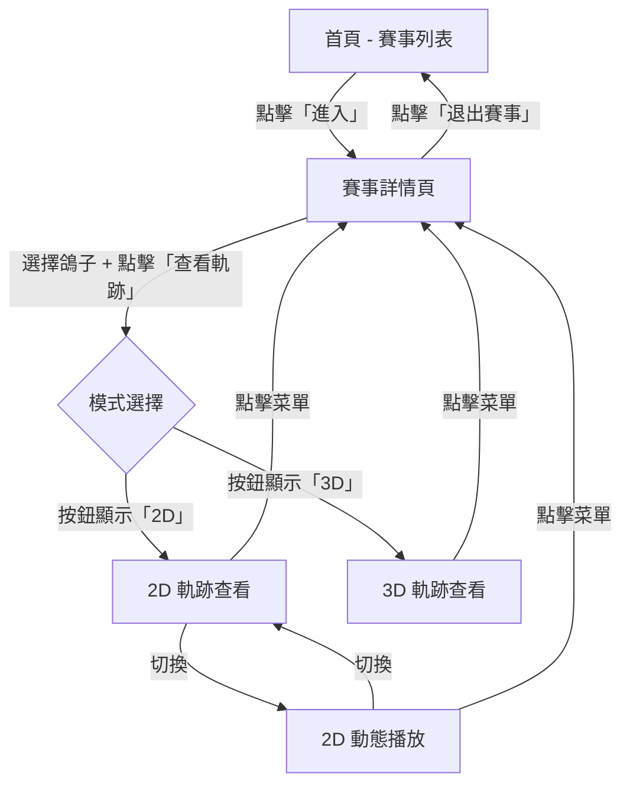

# 網站結構地圖

**專案**：鴿子競賽 GPS 追蹤系統
**最後更新**：2025-11-18
**版本**：1.0
**基於版本**：V2.11

---

## 📖 目的

本文檔描述鴿子競賽 GPS 追蹤系統的完整頁面結構，包括：
- 頁面層級關係
- 頁面間的導航路徑
- 每個頁面的核心元素和功能
- URL 結構（如適用）

---

## 🗺️ 網站結構樹狀圖

```
首頁 (/)
│
├── 賽事列表頁
│   │
│   ├── 賽事詳情頁 (點擊「進入」)
│   │   │
│   │   ├── 名次&環號搜尋標籤 (預設)
│   │   │   ├── 鴿子列表
│   │   │   ├── 環號搜尋框
│   │   │   ├── 名次查詢按鈕
│   │   │   └── 查看軌跡按鈕 (→ 軌跡查看頁面)
│   │   │
│   │   └── 鴿舍列表標籤
│   │       ├── 鴿舍下拉選單
│   │       ├── 鴿舍內環號搜尋框
│   │       └── 該鴿舍的鴿子列表
│   │
│   └── 軌跡查看頁面 (點擊「查看軌跡」)
│       │
│       ├── 2D 靜態模式
│       │   ├── AMap 2.0 地圖
│       │   ├── 軌跡線 (Polyline)
│       │   ├── 標記點 (Marker, 15-20 個)
│       │   └── 側邊欄（飛行數據、航點表格）
│       │
│       ├── 2D 動態模式
│       │   ├── AMap 2.0 地圖
│       │   ├── 動畫標記 (1-3 個)
│       │   ├── 播放控制按鈕
│       │   └── 側邊欄（飛行數據）
│       │
│       └── 3D 模式
│           ├── Cesium 3D 地球
│           ├── 3D 軌跡線
│           ├── 起點/終點標記
│           ├── 視角切換按鈕
│           └── 控制按鈕（顯示軌跡點、隱藏歸返軌跡等）
│
└── (其他頁面 - 未確認)
```

---

## 📄 頁面詳細資訊

### 1. 首頁 (Homepage)

#### 頁面資訊
- **URL**：`https://skyracing.com.cn/`
- **頁面標題**：Skyracing GPS pigeon tracker
- **主要功能**：展示所有可用的賽事，提供賽事搜尋和篩選
- **進入方式**：直接訪問根 URL
- **離開方式**：點擊賽事卡片的「進入」按鈕 → 賽事詳情頁

#### 頁面結構

##### 左側側邊欄
- **Logo** - 頁面頂部
- **搜尋賽事** - 文字輸入框（關鍵字搜尋）
- **年份選擇** - 下拉選單
  - 選項：2025, 2024, 2023, 2022, 2021, 2020
  - 預設：2025
- **賽事卡片列表** - 滾動列表
  - 每個卡片包含：
    - 賽事名稱（如「唐山春興國際賽鴿公棚（大棚）」）
    - 比賽階段（如「2025加站賽」）
    - 完整賽事名稱（如「2025唐山春興國際賽鴿公棚（大棚）秋季賽」）
    - 「進入」按鈕 + 圖標

##### 右側主要區域
- **地圖顯示區** - AMap 2.0 地圖
  - 初始視圖：中國地圖概覽
  - 可拖動、縮放
- **2D 模式按鈕** - 右上角
- **切換圖資按鈕** - 右上角
- **時間軸** - 底部（顯示時間刻度）

##### 底部
- 版權資訊：「版權所有：深圳勝皇科技有限公司」
- 備案號連結

#### 關鍵互動
| 互動元素 | 行為 | 結果 |
|----------|------|------|
| 搜尋框輸入 | 實時篩選賽事列表 | 顯示匹配的賽事 |
| 年份下拉選單 | 切換年份 | 載入該年份的賽事列表 |
| 賽事卡片「進入」 | 點擊按鈕 | 進入該賽事的詳情頁面 |

#### 截圖參考
- `screenshots/exploration/01-homepage.png`

---

### 2. 賽事詳情頁 (Race Detail Page)

#### 頁面資訊
- **URL**：`https://skyracing.com.cn/` (未改變，SPA 應用)
- **頁面標題**：Skyracing GPS pigeon tracker
- **主要功能**：顯示特定賽事的所有參賽鴿子，支援鴿子選擇和軌跡查看
- **進入方式**：首頁 → 點擊賽事「進入」按鈕
- **離開方式**：
  - 點擊「退出賽事」按鈕 → 返回首頁
  - 點擊「查看軌跡」按鈕 → 軌跡查看頁面

#### 頁面結構

##### 頂部標題區
- **賽事名稱** - H2 標題（如「唐山春興國際賽鴿公棚（大棚）」）
- **比賽階段** - H4 標題（如「2025加站賽」）

##### 操作按鈕區
- **退出賽事** - 返回首頁按鈕
- **查看軌跡** - 進入軌跡查看頁面
  - 初始狀態：禁用（disabled）
  - 選擇鴿子後：啟用
- **3D/2D 模式按鈕** - 帶 checkbox
  - 初始狀態：禁用（disabled）
  - **⚠️ 關鍵**：按鈕顯示的文字決定進入哪個模式
    - 顯示「3D」→ 點擊「查看軌跡」進入 **3D 模式**
    - 顯示「2D」→ 點擊「查看軌跡」進入 **2D 模式**
- **雷達模式** - 特殊模式按鈕
- **勾選清單** - 顯示已選擇的鴿子數量（如「勾選清單 0」）

##### 標籤頁區域

###### 標籤 1：名次&環號搜尋（預設）
- **搜尋工具區**
  - 環號輸入框（placeholder：「請輸入環號」）
  - 「查詢環號」按鈕
  - 「查詢名次」按鈕

- **鴿子列表表格**
  - 表頭：
    - 軌跡（checkbox 列）
    - 排名
    - 公環
  - 表格行：
    - Checkbox（選擇鴿子）
    - 排名數字（1, 2, 3...）
    - 環號（如「2025-10-0338239」）
  - 分頁控制：
    - 上一頁按鈕（«）
    - 頁碼下拉選單
    - 下一頁按鈕（»）

###### 標籤 2：鴿舍列表
- **鴿舍選擇區**
  - 鴿舍下拉選單
    - 選項：「請選擇鴿舍」（禁用）+ 鴿舍編號（1, 2, 3...2493）
    - 預設：鴿舍 1
  - 鴿舍內環號搜尋框（placeholder：「請輸入該鴿舍內的環號」）

- **該鴿舍的鴿子列表表格**
  - 結構同「名次&環號搜尋」標籤
  - 僅顯示該鴿舍的鴿子

##### 右側詳情面板
- **最終名次** - 空白或顯示排名
- **色號** - 空白
- **公環號** - 空白
- **分速 (m/min)** - 空白
- **海拔 (m)** - 空白
- （選擇鴿子後才顯示數據）

#### 關鍵互動
| 互動元素 | 行為 | 結果 |
|----------|------|------|
| Checkbox（鴿子） | 點擊選擇/取消 | 「查看軌跡」按鈕啟用/禁用，勾選清單計數更新 |
| 查看軌跡按鈕 | 點擊（鴿子已選） | 根據模式按鈕文字進入 2D 或 3D 軌跡查看頁面 |
| 3D/2D 模式 checkbox | 點擊切換 | 按鈕文字在「2D」和「3D」之間切換 |
| 標籤切換 | 點擊標籤 | 切換「名次&環號搜尋」和「鴿舍列表」視圖 |
| 鴿舍下拉選單 | 選擇鴿舍 | 載入該鴿舍的鴿子列表 |
| 環號搜尋 | 輸入 + 點擊查詢 | 定位到匹配的鴿子 |
| 名次查詢 | 輸入 + 點擊查詢 | 定位到該排名的鴿子 |

#### 截圖參考
- `screenshots/exploration/02-race-detail.png` - 未選擇鴿子
- `screenshots/exploration/03-pigeon-selected.png` - 已選擇鴿子
- `screenshots/exploration/05-loft-list.png` - 鴿舍列表標籤

---

### 3. 軌跡查看頁面 (Trajectory View Page)

#### 頁面資訊
- **URL**：`https://skyracing.com.cn/` (未改變，SPA 應用)
- **頁面標題**：Skyracing GPS pigeon tracker
- **主要功能**：顯示鴿子的飛行軌跡和詳細數據
- **進入方式**：賽事詳情頁 → 選擇鴿子 → 點擊「查看軌跡」
- **離開方式**：點擊左上角菜單按鈕 → 返回賽事詳情頁

#### 頁面結構（依模式不同）

---

#### 模式 A：2D 靜態軌跡模式

##### 左側側邊欄（可摺疊）
- **軌跡詳情面板**
  - 標題：「軌跡詳情」
  - **基本資訊**
    - 公環號（如「2025-10-0338239」）
    - 起點時間（如「2025-11-18 07:18:00」）
    - 終點時間（如「2025-11-18 13:07:28」）
    - 持續時間（如「05:49:28」）
  - **飛行數據**
    - 平均分速 (m/Min) / 最高分速 (m/Min)
    - 平均高度 (m) / 最大高度 (m)
    - 實際距離 (km) / 實際分速 (m/Min)
    - 直線距離 (km) / 直線分速 (m/Min)
  - **航點表格**
    - 表頭：航點、時間、累積時間、距離、海拔、速度
    - 表格行：詳細的每個軌跡點數據

##### 中央地圖區域
- **AMap 2.0 地圖**
- **軌跡線**（Polyline）- 白色線條
- **標記點**（Marker）- 15-20 個藍色標記
  - 起點標記（特殊樣式）
  - 終點標記（特殊樣式）
  - 中間軌跡點標記

##### 頂部資訊條
- 賽事名稱 + 比賽階段
- 飛行時間資訊

##### 底部控制條
- 時間軸（可拖動）
- 日期時間顯示（如「2025-11-18 07:18」）

##### 右上角按鈕
- 2D 模式按鈕
- 切換圖資按鈕

---

#### 模式 B：2D 動態播放模式

##### 差異點（相對於靜態模式）
- **標記點數量**：1-3 個動態標記（非 15-20 個）
- **播放控制按鈕**：
  - 快退按鈕（fast_rewind）
  - 播放/暫停按鈕（play_arrow/pause）
  - 快進按鈕（fast_forward）
- **動畫效果**：標記沿軌跡移動
- **時間軸互動**：拖動時間軸可跳轉到特定時間點

##### 其他元素同靜態模式

---

#### 模式 C：3D 軌跡模式

##### 左上角按鈕
- **菜單按鈕**（hamburger menu）- 返回賽事詳情
- **圖表按鈕**（bar_chart）- 功能待確認

##### 中央 3D 地球區域
- **Cesium 3D 地球渲染**
- **3D 軌跡線** - 白色立體線條
- **起點標記** - 紅圈圖標
- **終點標記** - 紅色帶文字標記
  - 顯示：名次、環號、鴿舍名稱
- **地形渲染** - 真實地形高度
- **地名標籤** - 黃色文字（地理位置名稱）

##### 底部控制欄
- **視角按鈕**
  - 視角1（visibility）
  - 視角2（visibility）
- **軌跡控制按鈕**
  - 顯示軌跡點（timeline）
  - 隱藏歸返軌跡（remove_done）
- **UI 顯示控制**
  - 隱藏排名榜（sort）
  - 隱藏時速表（speed）
- **播放控制**
  - 快退（fast_rewind）
  - 播放（play_arrow）
  - 快進（fast_forward）

##### 頂部資訊條
- 賽事名稱 + 比賽階段
- 飛行時間資訊（如「已飛行時間 00:00時分」）

##### 底部時間軸
- 時間刻度（30 分鐘間隔）
- 當前時間指示器

##### 右上角按鈕
- 可視圖層按鈕
- 2D 模式切換按鈕

---

#### 關鍵互動（按模式）

##### 2D 靜態模式
| 互動元素 | 行為 | 結果 |
|----------|------|------|
| 軌跡點點擊 | 點擊標記 | 顯示該點的詳細數據（彈窗或側邊欄更新） |
| 地圖拖動/縮放 | 滑鼠操作 | 移動和縮放地圖視圖 |
| 時間軸拖動 | 拖動滑塊 | （功能待確認） |
| 航點表格滾動 | 滾動查看 | 查看所有軌跡點數據 |

##### 2D 動態模式
| 互動元素 | 行為 | 結果 |
|----------|------|------|
| 播放按鈕 | 點擊播放/暫停 | 開始/暫停動畫播放 |
| 快進/快退 | 點擊按鈕 | 加速/減速播放或跳轉 |
| 時間軸拖動 | 拖動滑塊 | 跳轉到特定時間點，標記移動到該位置 |

##### 3D 模式
| 互動元素 | 行為 | 結果 |
|----------|------|------|
| 視角1/視角2 | 點擊按鈕 | 切換 3D 視角（俯視/側視等） |
| 顯示軌跡點 | 點擊切換 | 顯示/隱藏軌跡上的標記點 |
| 隱藏歸返軌跡 | 點擊切換 | 隱藏/顯示鴿子返回的路徑 |
| 隱藏排名榜 | 點擊切換 | 隱藏/顯示排名資訊面板 |
| 隱藏時速表 | 點擊切換 | 隱藏/顯示時速表 |
| 3D 地球旋轉 | 滑鼠拖動 | 旋轉 3D 地球視角 |
| 3D 地球縮放 | 滾輪/觸控板 | 放大/縮小視圖 |
| 播放控制 | 點擊按鈕 | 控制動畫播放（如有） |

#### 截圖參考
- `screenshots/exploration/04-3d-trajectory-view.png` - 3D 模式

---

## 🔄 頁面導航流程圖



---

## 📱 響應式設計觀察

### 桌面版本（主要支援）
- **左側邊欄寬度**：固定寬度（約 350px）
- **地圖區域**：自適應剩餘空間
- **側邊欄可摺疊**：支援展開/收起

### 移動版本（待確認）
- 具體的移動端適配情況未在本次探索中驗證
- 推測：側邊欄可能變為浮動面板或底部抽屜

---

## ⚠️ 關鍵發現和注意事項

### 1. SPA (Single Page Application) 架構
- **URL 不變**：所有頁面切換都在同一 URL 下進行
- **前端路由**：使用 JavaScript 管理頁面狀態
- **影響**：測試時需要依賴 DOM 狀態而非 URL 變化

### 2. 模式切換的關鍵邏輯
- **按鈕文字決定行為**：這是最容易混淆的設計
- **不是 checkbox 狀態決定**：checkbox 只是視覺反饋
- **測試重點**：必須先讀取按鈕文字再執行點擊

### 3. 動態載入特性
- **數據載入時機**：頁面切換後需等待 2-3 秒
- **地圖渲染等待**：
  - AMap 2.0：等待瓦片載入
  - Cesium：等待 `window.Cesium` 和 `viewer.scene.globe.tilesLoaded`

### 4. 已知問題
- **2D 模式初次載入**：可能失敗，需使用 3D→2D 切換順序
- **靜態/動態混淆**：通過標記點數量判斷（15-20 vs 1-3）
- **軌跡點點擊**：需使用 accessibility tree locator

---

## 🔗 相關文檔

- [Page Flows](PAGE_FLOWS.md) - 頁面轉換流程和決策點（待建立）
- [User Journeys](../user-research/USER_JOURNEYS.md) - 用戶旅程地圖（待建立）
- [Feature Catalog](../features/FEATURE_CATALOG.md) - 功能清單
- [Mode Switching Guide](../guides/mode-switching.md) - 2D/3D 模式切換詳解
- [Troubleshooting](../guides/troubleshooting.md) - 問題排解指南

---

**文檔維護者**：專案團隊
**審核狀態**：初版（基於 Playwright MCP 互動式探索）
**下次審核日期**：Phase 2 實作後

**探索截圖**：`screenshots/exploration/` 目錄下的 5 張截圖
