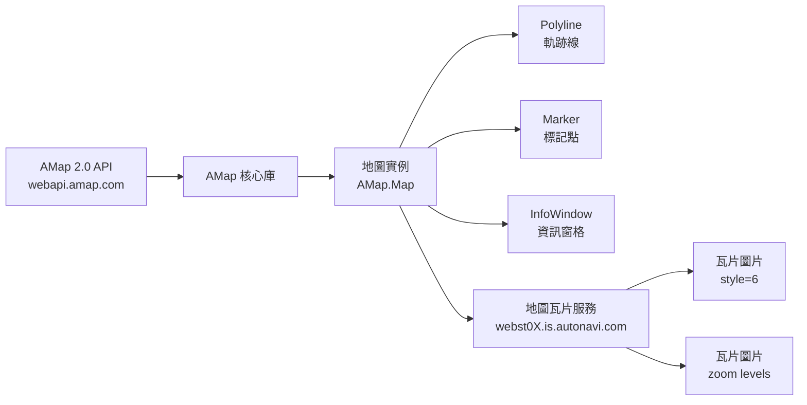
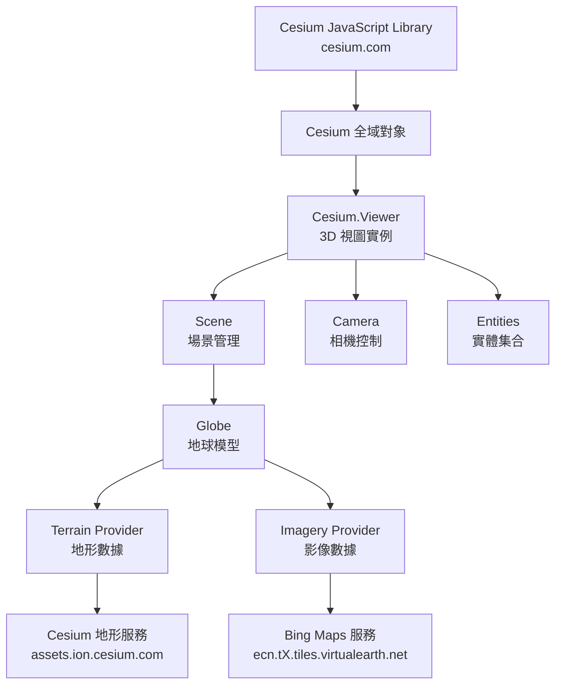
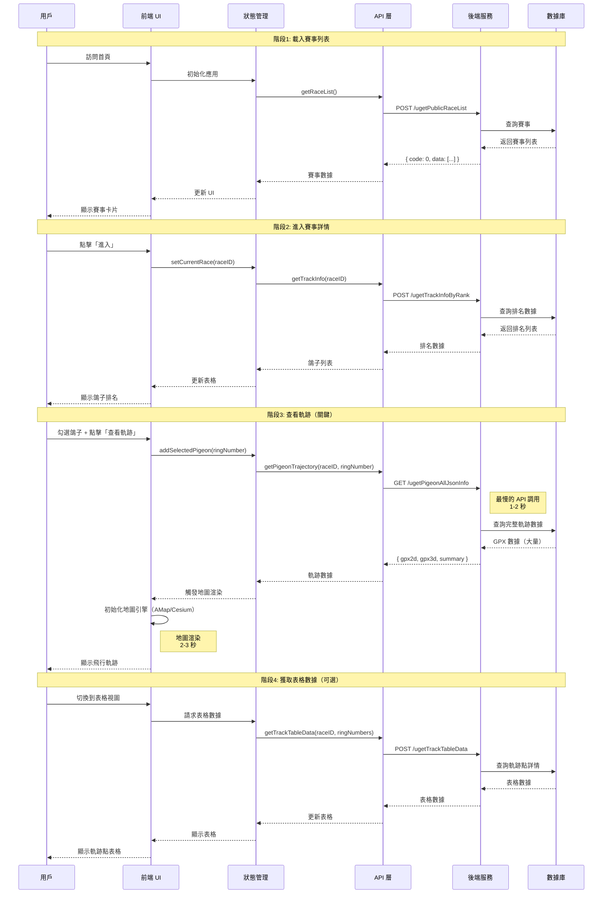
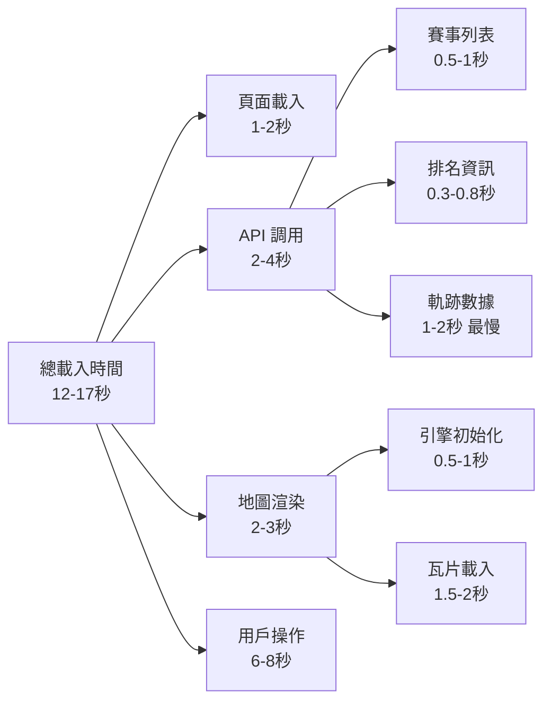

# 技術依賴圖

**專案**：鴿子競賽 GPS 追蹤系統
**最後更新**：2025-11-18
**版本**：1.0

---

## 📖 目的

本文檔展示鴿子競賽 GPS 追蹤系統的技術依賴關係，包括：
- 外部服務和庫的依賴關係
- API 調用依賴鏈
- 地圖引擎集成依賴
- 數據流依賴關係
- 等待策略和時序依賴

此文檔幫助：
- 理解系統組件間的依賴關係
- 設計正確的測試等待策略
- 診斷依賴相關的問題
- 優化系統性能

---

## 🔗 整體依賴關係圖

```mermaid
graph TB
    subgraph "前端應用"
        App[Web Application]
        UI[UI 組件]
        State[狀態管理]
    end

    subgraph "地圖引擎依賴"
        AMap[AMap 2.0 API]
        Cesium[Cesium Library]
    end

    subgraph "外部地圖服務"
        AmapTiles[高德地圖瓦片<br/>webst0X.is.autonavi.com]
        CesiumTerrain[Cesium 地形服務<br/>assets.ion.cesium.com]
        BingMaps[Bing 衛星圖<br/>ecn.tX.tiles.virtualearth.net]
    end

    subgraph "後端 API 服務"
        API1[/ugetPublicRaceList<br/>賽事列表]
        API2[/ugetTrackInfoByRank<br/>排名資訊]
        API3[/ugetPigeonAllJsonInfo<br/>軌跡數據]
        API4[/ugetTrackTableData<br/>表格數據]
        API5[/uorgRaceRingInfo<br/>環號資訊]
        API6[/serverDomainName<br/>域名服務]
    end

    subgraph "數據庫"
        DB[(Database<br/>賽事 & 軌跡數據)]
    end

    App --> UI
    App --> State
    UI --> AMap
    UI --> Cesium

    AMap --> AmapTiles
    Cesium --> CesiumTerrain
    Cesium --> BingMaps

    State --> API1
    State --> API2
    State --> API3
    State --> API4
    State --> API5
    State --> API6

    API1 --> DB
    API2 --> DB
    API3 --> DB
    API4 --> DB
    API5 --> DB
```

---

## 🗺️ AMap 2.0 依賴關係

### 依賴層次



### 關鍵 API 依賴

**核心對象**：
```typescript
// 依賴關係
window.AMap                          // 全域對象（必須先載入）
  └── AMap.Map()                     // 地圖實例
       ├── map.add(marker)           // 添加標記
       ├── map.add(polyline)         // 添加軌跡線
       └── map.setZoom()             // 設置縮放級別
```

**初始化依賴檢查**：
```typescript
// 檢查 AMap API 是否已載入
async function ensureAmapLoaded(page: Page): Promise<void> {
  await page.waitForFunction(() => {
    return typeof window.AMap !== 'undefined';
  });
}
```

### 瓦片服務依賴

**服務 URL 模式**：
```
https://webst{01-04}.is.autonavi.com/appmaptile?style=6&x={x}&y={y}&z={z}
```

**參數說明**：
- `style=6`：地圖樣式（衛星+路網混合）
- `x`, `y`：瓦片座標
- `z`：縮放級別 (0-18)

**負載均衡**：
- 使用 4 個子域名（webst01 ~ webst04）
- 自動輪替請求分散負載

**等待策略**：
```typescript
async function waitForAmapTiles(page: Page, minTiles: number = 50): Promise<void> {
  // 方法1: 等待瓦片圖片元素出現
  await page.waitForSelector('.amap-layer img', { state: 'visible' });

  // 方法2: 確保足夠的瓦片已載入
  await page.waitForFunction((min) => {
    const tiles = document.querySelectorAll('.amap-container img');
    return tiles.length >= min;
  }, minTiles);

  // 方法3: 等待瓦片完全載入（檢查 complete 狀態）
  await page.waitForFunction(() => {
    const tiles = document.querySelectorAll('.amap-container img');
    return Array.from(tiles).every(img => img.complete);
  });
}
```

**已知問題**：
- 初次加載可能較慢（2-3秒）
- 網路不穩定時瓦片加載失敗
- 快速縮放可能導致瓦片未及時加載

---

## 🌍 Cesium 依賴關係

### 依賴層次



### 關鍵 API 依賴

**核心對象依賴鏈**：
```typescript
window.Cesium                        // 全域對象（必須先載入）
  └── new Cesium.Viewer()            // 視圖實例
       ├── viewer.scene               // 場景
       │    ├── scene.globe           // 地球模型
       │    │    └── globe.tilesLoaded  // 瓦片加載狀態
       │    └── scene.camera          // 相機
       ├── viewer.entities            // 實體集合
       │    └── entities.add()        // 添加軌跡
       └── viewer.camera              // 相機控制
            ├── camera.flyTo()        // 飛行到位置
            └── camera.lookAt()       // 查看位置
```

**初始化依賴檢查**：
```typescript
async function ensureCesiumLoaded(page: Page): Promise<void> {
  // 步驟1: 確保 Cesium 庫已載入
  await page.waitForFunction(() => {
    return typeof window.Cesium !== 'undefined';
  });

  // 步驟2: 確保 Viewer 實例已創建
  await page.waitForFunction(() => {
    return window.viewer !== undefined;
  });

  // 步驟3: 確保場景已初始化
  await page.waitForFunction(() => {
    return window.viewer?.scene !== undefined;
  });
}
```

### Cesium 地形服務依賴

**服務提供者**：Cesium Ion

**URL 模式**：
```
https://assets.ion.cesium.com/...
```

**數據類型**：
- 全球地形數據 (Terrain Data)
- 高程數據 (Elevation Data)
- 解析度：根據縮放級別自動調整

**API Token**：
- 需要 Cesium Ion Access Token
- 配置於 Viewer 初始化時

**等待策略**：
```typescript
async function waitForCesiumTerrain(page: Page): Promise<void> {
  // 等待地形瓦片加載完成
  await page.waitForFunction(() => {
    return window.viewer?.scene.globe.tilesLoaded === true;
  }, { timeout: 10000 });
}
```

### Bing Maps 影像服務依賴

**服務提供者**：Microsoft Bing Maps

**URL 模式**：
```
https://ecn.t{0-3}.tiles.virtualearth.net/tiles/...
```

**影像類型**：
- 衛星影像 (Satellite Imagery)
- 混合影像 (Hybrid)
- 解析度：多級 LOD (Level of Detail)

**負載均衡**：
- 使用 4 個子域名（t0 ~ t3）
- 自動分散請求

**API Key**：
- 需要 Bing Maps API Key
- 配置於 ImageryProvider

**等待策略**：
```typescript
async function waitForBingMapsImagery(page: Page): Promise<void> {
  // 等待影像瓦片加載
  await page.waitForFunction(() => {
    const imageryLayers = window.viewer?.scene.imageryLayers;
    if (!imageryLayers) return false;

    // 檢查所有影像層是否就緒
    for (let i = 0; i < imageryLayers.length; i++) {
      const layer = imageryLayers.get(i);
      if (!layer.ready) return false;
    }

    return true;
  });
}
```

### Cesium 完整等待策略

結合所有依賴的完整等待流程：

```typescript
async function waitForCesium3DReady(page: Page): Promise<void> {
  console.log('步驟1: 等待 Cesium 庫載入...');
  await page.waitForFunction(() => {
    return window.Cesium !== undefined;
  });

  console.log('步驟2: 等待 Viewer 實例創建...');
  await page.waitForFunction(() => {
    return window.viewer !== undefined;
  });

  console.log('步驟3: 等待地球模型初始化...');
  await page.waitForFunction(() => {
    return window.viewer?.scene.globe !== undefined;
  });

  console.log('步驟4: 等待地形瓦片載入...');
  await page.waitForFunction(() => {
    return window.viewer?.scene.globe.tilesLoaded === true;
  }, { timeout: 15000 });

  console.log('步驟5: 額外等待時間確保穩定...');
  await page.waitForTimeout(3000);

  console.log('✓ Cesium 3D 已就緒');
}
```

**推薦等待時間**：
- 最小等待：3秒
- 推薦等待：5秒
- 最大超時：15秒

---

## 🔄 API 依賴鏈

### 端到端 API 調用順序



### API 依賴關係表

| API 端點 | 依賴於 | 被依賴於 | 調用時機 | 優先級 |
|---------|--------|---------|---------|--------|
| `/serverDomainName` | 無 | 所有 API | 應用初始化（可選） | P2 |
| `/ugetPublicRaceList` | 無 | `/ugetTrackInfoByRank` | 頁面載入 | P0 |
| `/ugetTrackInfoByRank` | `raceID` | `/ugetPigeonAllJsonInfo` | 進入賽事詳情 | P0 |
| `/uorgRaceRingInfo` | `raceID` | 搜尋功能 | 環號搜尋時 | P1 |
| `/ugetPigeonAllJsonInfo` | `raceID` + `ringNumber` | 地圖渲染 | 點擊「查看軌跡」 | P0 |
| `/ugetTrackTableData` | `raceID` + `ringNumbers` | 表格視圖 | 查看表格數據 | P1 |

### 關鍵依賴鏈

**最小功能流程**（查看單只鴿子軌跡）：
```
/ugetPublicRaceList
  ↓ (需要 raceID)
/ugetTrackInfoByRank
  ↓ (需要 ringNumber)
/ugetPigeonAllJsonInfo
  ↓ (提供 gpx2d 或 gpx3d)
地圖渲染
```

**完整功能流程**（包含搜尋和表格）：
```
/ugetPublicRaceList
  ↓
/ugetTrackInfoByRank
  ↓
/uorgRaceRingInfo (可選 - 環號搜尋)
  ↓
/ugetPigeonAllJsonInfo
  ↓
地圖渲染
  ↓
/ugetTrackTableData (可選 - 表格視圖)
```

---

## ⏱️ 時序依賴和等待策略

### 關鍵時序點

```mermaid
gantt
    title 用戶查看軌跡的完整時序
    dateFormat X
    axisFormat %Ls

    section 用戶操作
    訪問首頁           :0, 0
    等待頁面載入       :0, 2000
    選擇賽事           :2000, 5000
    選擇鴿子           :7000, 3000
    點擊查看軌跡       :10000, 0

    section API 調用
    賽事列表 API       :1000, 1000
    排名資訊 API       :5500, 800
    軌跡數據 API       :10000, 2000

    section 地圖渲染
    初始化引擎         :12000, 1000
    載入瓦片服務       :13000, 2000
    渲染完成           :15000, 500

    section 可互動
    用戶可開始互動     :15500, 0
```



### 各階段等待策略

#### 1. 頁面載入等待

```typescript
async function waitForPageLoad(page: Page): Promise<void> {
  // 等待網路閒置
  await page.waitForLoadState('networkidle');

  // 或等待特定元素出現
  await page.waitForSelector('.race-card', { state: 'visible' });

  // 推薦等待時間: 1-2秒
}
```

#### 2. 賽事列表 API 等待

```typescript
async function waitForRaceListAPI(page: Page): Promise<void> {
  // 監聽 API 響應
  const response = await page.waitForResponse(
    response => response.url().includes('ugetPublicRaceList') && response.status() === 200,
    { timeout: 5000 }
  );

  // 驗證響應
  const data = await response.json();
  expect(data.code).toBe(0);
  expect(data.data.list.length).toBeGreaterThan(0);
}
```

#### 3. 排名資訊 API 等待

```typescript
async function waitForTrackInfoAPI(page: Page): Promise<void> {
  const response = await page.waitForResponse(
    response => response.url().includes('ugetTrackInfoByRank'),
    { timeout: 5000 }
  );

  const data = await response.json();
  expect(data.code).toBe(0);
}
```

#### 4. 軌跡數據 API 等待（最關鍵）

```typescript
async function waitForTrajectoryDataAPI(page: Page): Promise<void> {
  console.log('等待軌跡數據 API...');

  const response = await page.waitForResponse(
    response => response.url().includes('ugetPigeonAllJsonInfo'),
    { timeout: 10000 }  // 較長的超時時間
  );

  const data = await response.json();
  expect(data.code).toBe(0);

  // 驗證關鍵數據存在
  expect(data.data.gpx2d || data.data.gpx3d).toBeDefined();

  console.log('軌跡數據已載入');
}
```

#### 5. 地圖渲染等待

**2D 模式（AMap）**：
```typescript
async function waitFor2DMapRender(page: Page): Promise<void> {
  // 步驟1: 等待 AMap API 載入
  await page.waitForFunction(() => window.AMap !== undefined);

  // 步驟2: 等待地圖容器出現
  await page.waitForSelector('.amap-container', { state: 'visible' });

  // 步驟3: 等待瓦片載入
  await page.waitForFunction((minTiles) => {
    const tiles = document.querySelectorAll('.amap-container img');
    return tiles.length >= minTiles;
  }, 50);

  // 步驟4: 額外等待確保穩定
  await page.waitForTimeout(2000);
}
```

**3D 模式（Cesium）**：
```typescript
async function waitFor3DMapRender(page: Page): Promise<void> {
  // 步驟1: 等待 Cesium 庫載入
  await page.waitForFunction(() => window.Cesium !== undefined);

  // 步驟2: 等待 Viewer 實例
  await page.waitForFunction(() => window.viewer !== undefined);

  // 步驟3: 等待地球瓦片載入
  await page.waitForFunction(() => {
    return window.viewer?.scene.globe.tilesLoaded === true;
  }, { timeout: 15000 });

  // 步驟4: 額外等待確保穩定
  await page.waitForTimeout(3000);
}
```

#### 6. 模式切換後等待

```typescript
async function waitAfterModeSwitch(page: Page): Promise<void> {
  // 切換模式後需要等待數據重新加載
  console.log('模式切換後等待...');

  // 方法1: 固定等待（簡單可靠）
  await page.waitForTimeout(2000);

  // 方法2: 等待 API 重新調用（更精確）
  await page.waitForResponse(
    response => response.url().includes('ugetPigeonAllJsonInfo'),
    { timeout: 5000 }
  );

  console.log('模式切換完成');
}
```

### 推薦等待時間總結

| 階段 | 等待類型 | 推薦時間 | 最大超時 |
|------|---------|---------|----------|
| 頁面載入 | `networkidle` | 1-2秒 | 5秒 |
| 賽事列表 API | `waitForResponse` | 0.5-1秒 | 5秒 |
| 排名資訊 API | `waitForResponse` | 0.3-0.8秒 | 5秒 |
| 軌跡數據 API | `waitForResponse` | 1-2秒 | 10秒 |
| AMap 渲染 | `waitForFunction` + 固定 | 2秒 | 10秒 |
| Cesium 渲染 | `waitForFunction` + 固定 | 3-5秒 | 15秒 |
| 模式切換 | 固定等待 | 2-3秒 | - |

---

## 🐛 依賴相關的已知問題

### 問題 #1：2D 軌跡數據依賴問題

**問題**：首次查看軌跡時 `gpx2d` 數據加載未等候響應即渲染地圖

**依賴鏈問題**：
```
用戶點擊「查看軌跡」(2D)
  → API: /ugetPigeonAllJsonInfo
  → 後端查詢數據庫
  → 前端過早嘗試渲染（未等候 API 響應）
  → gpx2d 數據尚未準備好
  → AMap 渲染失敗 (gpx2d undefined 錯誤)  ❌
```

**根本原因**：
- 前端在 API 響應完成前就嘗試渲染
- 數據加載與 UI 渲染存在競態條件
- 缺少充分的數據就緒檢查

**解決方案 1 (推薦)**：重新加載軌跡數據
```
返回鴿子列表
  → 取消之前的選擇
  → 重新選擇鴿子
  → 點擊「查看軌跡」
  → 等待 networkidle + 3秒緩衝
  → 驗證地圖瓦片 (>50 個) 和 Canvas 存在
  → 2D 渲染成功（最多重試 3 次）  ✓
```

**解決方案 2 (備選)**：使用 3D→2D 切換序列
```
用戶點擊「查看軌跡」(3D先)
  → API: /ugetPigeonAllJsonInfo
  → 返回完整數據並緩存
  → 3D 渲染成功（使用 gpx3d）
  → 用戶切換到 2D
  → 使用已緩存的 gpx2d  ✓
  → 2D 渲染成功
```

📖 詳細解決方案：[Known Issues #1](../test-plan/KNOWN_ISSUES_SOLUTIONS.md#問題-1-2d軌跡初次加載失敗)

### 問題 #4：數據加載時序不明確

**問題**：模式切換後不知道何時可以安全互動

**依賴流程**：
```
點擊模式切換按鈕
  → 狀態更新
  → API 重新調用（可能）
  → 地圖引擎初始化
  → 瓦片服務載入
  → ??? 何時完成？
```

**解決方案**：組合等待策略
```typescript
async function waitForModeSwitchComplete(page: Page, targetMode: '2D' | '3D'): Promise<void> {
  // 1. 等待 API 響應（如果有重新調用）
  try {
    await page.waitForResponse(
      response => response.url().includes('ugetPigeonAllJsonInfo'),
      { timeout: 3000 }
    );
  } catch {
    // 如果沒有 API 調用，使用緩存數據，繼續
  }

  // 2. 根據目標模式等待渲染
  if (targetMode === '2D') {
    await waitFor2DMapRender(page);
  } else {
    await waitFor3DMapRender(page);
  }

  // 3. 額外固定等待確保穩定
  await page.waitForTimeout(2000);
}
```

📖 詳細解決方案：[Known Issues #4](../test-plan/KNOWN_ISSUES_SOLUTIONS.md#問題-4-數據加載時機不明確)

---

## 📊 依賴性能分析

### 瓶頸分析



**性能瓶頸排序**：
1. **軌跡數據 API** (`/ugetPigeonAllJsonInfo`): 1-2秒 ⭐ 最大瓶頸
2. **地圖瓦片載入** (AMap/Cesium 瓦片): 1.5-2秒
3. **賽事列表 API** (`/ugetPublicRaceList`): 0.5-1秒
4. **排名資訊 API** (`/ugetTrackInfoByRank`): 0.3-0.8秒

### 優化建議

#### 1. API 層面優化

**緩存策略**：
```typescript
// 實施 Redis 緩存
const cacheKey = `trajectory:${raceID}:${ringNumber}`;
const cached = await redis.get(cacheKey);

if (cached) {
  return cached;  // 直接返回緩存（<10ms）
}

const data = await database.query(...);  // 1-2秒
await redis.setex(cacheKey, 3600, data);  // 緩存1小時
return data;
```

**數據壓縮**：
```typescript
// 壓縮 GPX 數據傳輸
const compressed = gzip(gpxData);
response.setHeader('Content-Encoding', 'gzip');
response.send(compressed);
```

#### 2. 前端層面優化

**預加載策略**：
```typescript
// 當用戶選擇鴿子時，立即預載入數據
async function onPigeonSelected(ringNumber: string) {
  // 不等待響應，後台預載入
  preloadTrajectoryData(raceID, ringNumber);
}

async function preloadTrajectoryData(raceID: string, ringNumber: string) {
  const response = await fetch(`/ugetPigeonAllJsonInfo?raceID=${raceID}&ringNumber=${ringNumber}`);
  const data = await response.json();

  // 存入本地緩存
  trajectoryCache.set(`${raceID}:${ringNumber}`, data);
}
```

**漸進式渲染**：
```typescript
// 先渲染低解析度軌跡，再載入詳細數據
async function renderTrajectoryProgressively() {
  // 步驟1: 渲染簡化軌跡（使用摘要數據）
  renderSimplifiedTrajectory(summary);

  // 步驟2: 載入完整數據
  const fullData = await loadFullTrajectoryData();

  // 步驟3: 更新為完整軌跡
  updateToFullTrajectory(fullData);
}
```

---

## 🔗 相關文檔

### 架構相關
- [System Architecture](SYSTEM_ARCHITECTURE.md) - 系統架構總覽
- [Test Framework](../architecture/test-framework.md) - 測試框架架構
- [Entity Relationship](../data-model/ENTITY_RELATIONSHIP.md) - 數據模型ER圖

### API 相關
- [API Endpoints](../api-reference/API_ENDPOINTS.md) - 6個核心API端點詳細文檔

### 測試相關
- [Testing Strategies](../guides/testing-strategies.md) - 測試策略和等待模式
- [Known Issues Solutions](../test-plan/KNOWN_ISSUES_SOLUTIONS.md) - 依賴相關的已知問題

### 指南相關
- [Troubleshooting Guide](../guides/troubleshooting.md) - 依賴問題排查

---

**文檔維護者**：專案團隊
**審核狀態**：初版
**下次審核日期**：Phase 2 實作後
