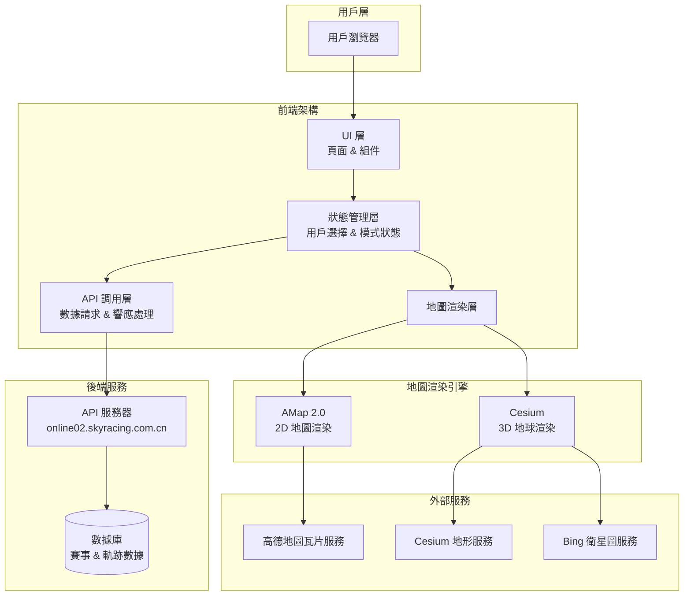
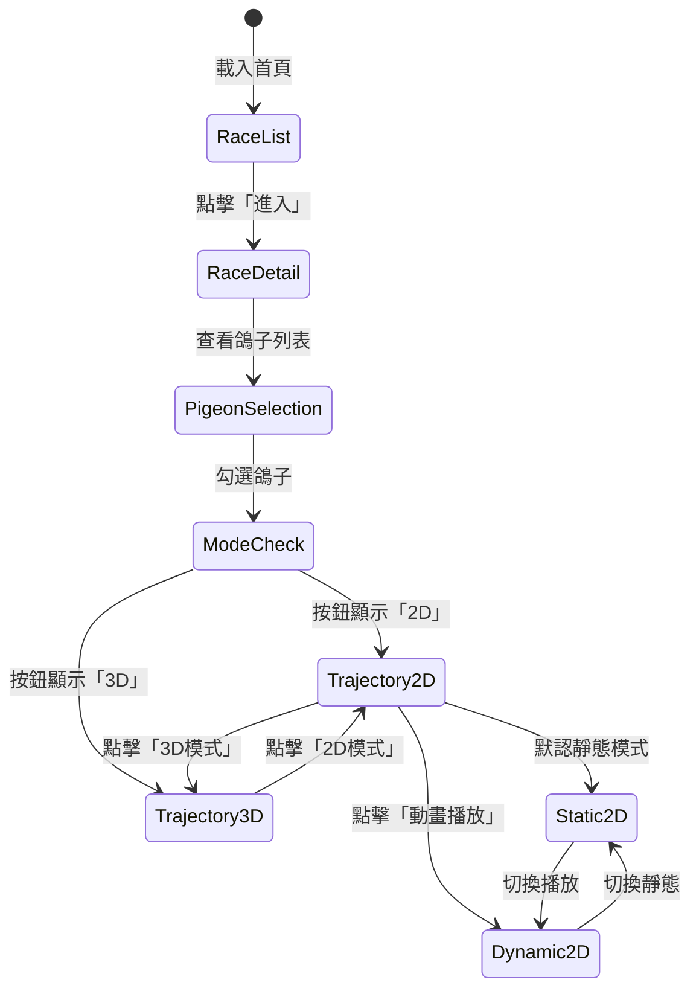
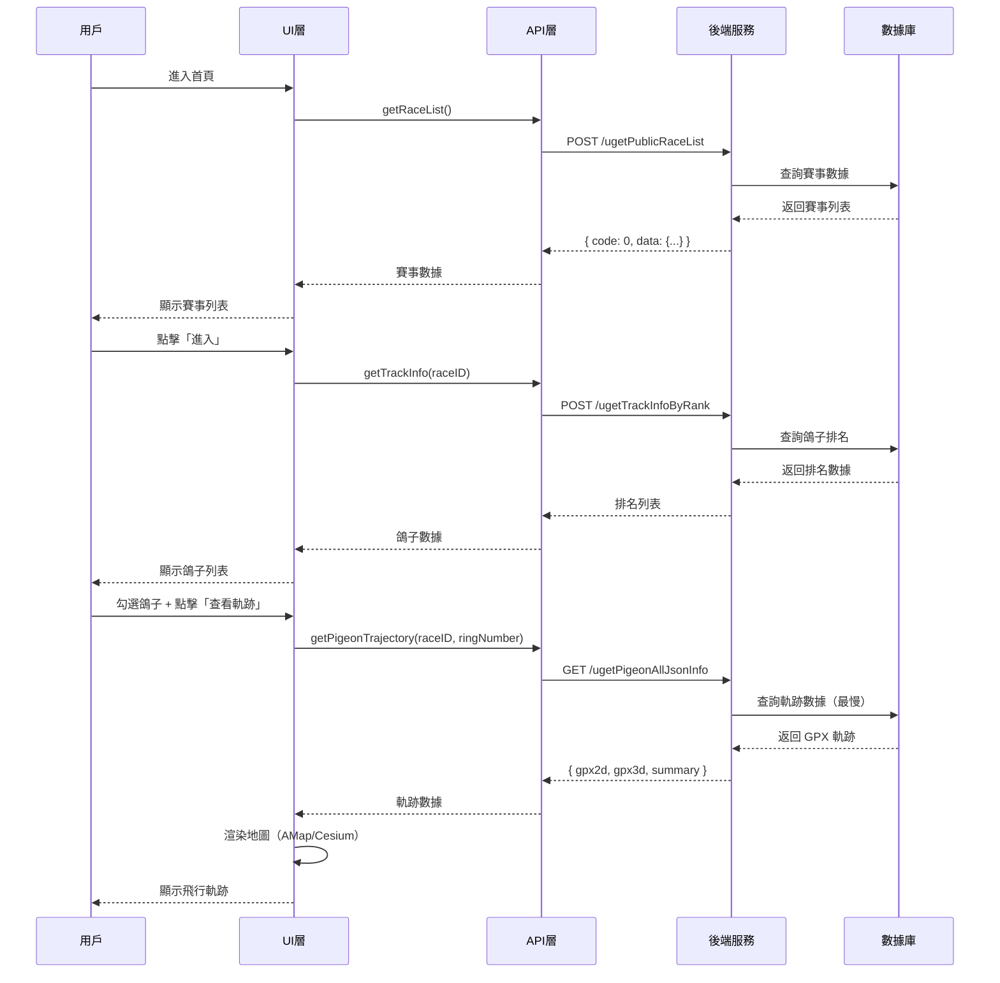
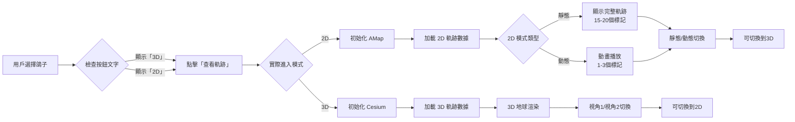
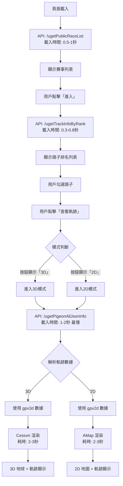
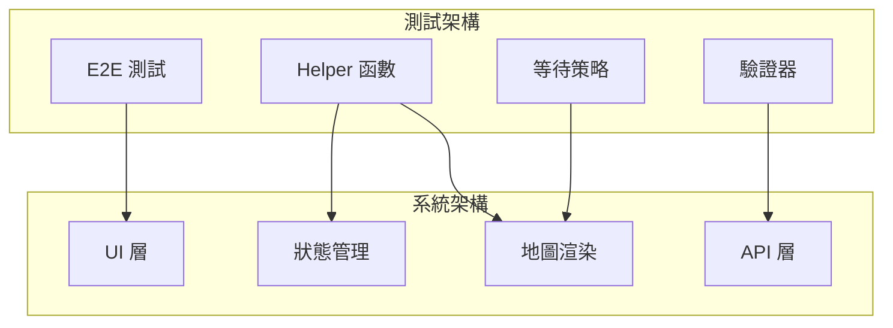

# 系統架構總覽

**專案**：鴿子競賽 GPS 追蹤系統
**最後更新**：2025-11-18
**版本**：1.0

---

## 📖 目的

本文檔描述鴿子競賽 GPS 追蹤系統的整體技術架構，包括：
- 前端技術棧和架構層次
- 後端 API 服務架構
- 地圖渲染引擎集成
- 數據流和狀態管理
- 系統組件間的互動關係

此文檔為測試自動化提供技術基礎，幫助理解系統行為和測試策略設計。

---

## 🏗️ 整體架構

### 系統架構圖



---

## 🎨 前端架構

### 技術棧

- **核心框架**：原生 JavaScript (無框架)
- **地圖引擎**：
  - AMap 2.0 - 2D 地圖渲染
  - Cesium - 3D 地球渲染
- **HTTP 客戶端**：Fetch API / XMLHttpRequest
- **UI 模式**：傳統多頁應用 (MPA) 風格

### 架構層次

#### 1. UI 層（Presentation Layer）

**職責**：頁面渲染和用戶互動

**主要頁面**：
```
首頁 (/)
├── 賽事列表頁
│   ├── 賽事卡片 (Race Cards)
│   ├── 年份篩選器 (Year Filter)
│   └── 搜尋框 (Search Box)
│
├── 賽事詳情頁
│   ├── 排名標籤 (Ranking Tab)
│   │   ├── 鴿子列表表格 (Pigeon List Table)
│   │   ├── 搜尋框 (Ring Number Search)
│   │   └── 查看軌跡按鈕 (View Trajectory Button)
│   │
│   └── 鴿舍列表標籤 (Loft Tab)
│       ├── 鴿舍下拉選單 (Loft Selector)
│       └── 鴿舍內鴿子列表
│
└── 軌跡查看頁
    ├── 2D 模式界面
    │   ├── 地圖容器 (.amap-container)
    │   ├── 控制面板 (靜態/動態切換)
    │   ├── 數據面板 (飛行數據顯示)
    │   └── UI 控制 (排名榜、時速表)
    │
    └── 3D 模式界面
        ├── Cesium 容器 (#cesiumContainer)
        ├── 視角控制 (視角1/視角2)
        ├── 數據面板
        └── UI 控制 (顯示/隱藏軌跡點)
```

**關鍵 DOM 結構**：
```html
<!-- 2D 地圖容器 -->
<div class="amap-container">
  <canvas class="amap-layer"></canvas>
   <!-- 地圖瓦片 -->
</div>

<!-- 3D 地球容器 -->
<div id="cesiumContainer">
  <canvas></canvas>
</div>

<!-- 鴿子列表表格 -->
<table class="pigeon-rank-table">
  <tr>
    <td><input type="checkbox"></td>
    <td>排名</td>
    <td>環號</td>
    <td>鴿舍</td>
    <td>分速</td>
  </tr>
</table>
```

#### 2. 狀態管理層（State Management）

**職責**：管理應用狀態和用戶選擇

**關鍵狀態**：
```typescript
interface ApplicationState {
  // 賽事狀態
  currentRace: {
    raceID: string;
    raceName: string;
    selectedYear: number;
  };

  // 鴿子選擇
  selectedPigeons: {
    ringNumbers: string[];
    count: number;
  };

  // 模式狀態（最關鍵）
  viewMode: {
    currentMode: '2D' | '3D';
    buttonDisplayText: '2D' | '3D';  // ⚠️ 決定下次進入的模式
    playbackMode?: 'static' | 'dynamic';  // 僅 2D 模式
  };

  // UI 狀態
  uiState: {
    currentTab: 'ranking' | 'loft';
    isRankingVisible: boolean;
    isSpeedometerVisible: boolean;
  };
}
```

**關鍵狀態轉換**：


#### 3. 地圖渲染層（Map Rendering Layer）

**職責**：管理 AMap 和 Cesium 渲染引擎

**AMap 2.0 集成**：
```typescript
// AMap 初始化
const map = new AMap.Map('mapContainer', {
  zoom: 11,
  center: [lng, lat],
  viewMode: '2D'
});

// 軌跡線渲染
const polyline = new AMap.Polyline({
  path: trajectoryPoints,
  strokeColor: '#FF0000',  // 紅色軌跡線
  strokeWeight: 3,
  strokeStyle: 'dashed'
});

// 軌跡點標記
trajectoryPoints.forEach(point => {
  const marker = new AMap.Marker({
    position: [point.lon, point.lat],
    title: point.ringNumber
  });
  map.add(marker);
});
```

**Cesium 集成**：
```typescript
// Cesium 初始化
const viewer = new Cesium.Viewer('cesiumContainer', {
  terrainProvider: Cesium.createWorldTerrain(),
  imageryProvider: new Cesium.BingMapsImageryProvider({
    url: 'https://dev.virtualearth.net'
  })
});

// 等待 Cesium 就緒
await waitForFunction(() => {
  return window.Cesium !== undefined &&
         viewer.scene.globe.tilesLoaded;
});

// 3D 軌跡渲染
const entity = viewer.entities.add({
  polyline: {
    positions: Cesium.Cartesian3.fromDegreesArray(positions),
    width: 5,
    material: Cesium.Color.RED
  }
});
```

**模式切換關鍵邏輯**：
```typescript
function determineModeToEnter(page: Page): '2D' | '3D' {
  // ⚠️ 關鍵：按鈕顯示的文字決定進入的模式
  const buttonText = await page.getByRole('button', { name: /2D|3D/ }).textContent();

  if (buttonText.includes('3D')) {
    return '3D';  // 按鈕顯示「3D」→ 進入 3D 模式
  } else {
    return '2D';  // 按鈕顯示「2D」→ 進入 2D 模式
  }
}
```

#### 4. API 調用層（API Client Layer）

**職責**：與後端服務通信，處理數據請求和響應

**API 調用流程**：
```typescript
class APIClient {
  private baseURL = 'https://online02.skyracing.com.cn';

  // 獲取賽事列表
  async getRaceList(params: RaceListRequest): Promise<RaceListResponse> {
    return await this.post('/ugetPublicRaceList', params);
  }

  // 獲取鴿子排名資訊
  async getTrackInfo(raceID: string): Promise<TrackInfoResponse> {
    return await this.post('/ugetTrackInfoByRank', { raceID });
  }

  // 獲取完整軌跡數據（最關鍵）
  async getPigeonTrajectory(raceID: string, ringNumber: string): Promise<TrajectoryResponse> {
    return await this.get('/ugetPigeonAllJsonInfo', { raceID, ringNumber });
  }
}
```

**錯誤處理機制**：
```typescript
async function handleAPICall<T>(apiCall: () => Promise<T>): Promise<T> {
  try {
    const response = await apiCall();

    if (response.code !== 0) {
      throw new APIError(response.message, response.code);
    }

    return response.data;

  } catch (error) {
    if (error.status === 404) {
      // 資源不存在
      throw new ResourceNotFoundError();
    } else if (error.status >= 500) {
      // 服務器錯誤 - 重試
      return await retryWithBackoff(apiCall, 3);
    }
    throw error;
  }
}
```

---

## 🖥️ 後端服務架構

### API 服務器

**域名**：
- 主服務器：`online01.skyracing.com.cn`
- 次服務器：`online02.skyracing.com.cn`（當前使用）

**協議**：HTTPS

**請求方法**：主要使用 POST，部分使用 GET

### 核心 API 端點

| 端點 | 方法 | 用途 | 優先級 | 平均響應時間 |
|------|------|------|--------|--------------|
| `/ugetPublicRaceList` | POST | 獲取公開賽事列表 | P0 | 0.5-1秒 |
| `/ugetTrackInfoByRank` | POST | 獲取鴿子排名資訊 | P0 | 0.3-0.8秒 |
| `/ugetPigeonAllJsonInfo` | GET | 獲取完整軌跡數據 | P0 | 1-2秒（最慢）|
| `/uorgRaceRingInfo` | POST | 獲取賽事環號列表 | P1 | 0.5-1秒 |
| `/ugetTrackTableData` | POST | 獲取軌跡表格數據 | P1 | 0.3-0.5秒 |
| `/serverDomainName` | POST | 獲取服務器域名 | P2 | 0.1-0.3秒 |

📖 詳細 API 文檔：[API Endpoints](../api-reference/API_ENDPOINTS.md)

### 請求/響應流程



### 數據庫架構（推測）

基於 API 響應推測的數據表結構：

```sql
-- 賽事表
CREATE TABLE races (
  race_id VARCHAR(20) PRIMARY KEY,
  race_name VARCHAR(255),
  race_date DATE,
  race_status VARCHAR(50),
  pigeon_count INT,
  distance DECIMAL(10,2),
  release_point VARCHAR(255)
);

-- 鴿舍表
CREATE TABLE lofts (
  loft_id VARCHAR(20) PRIMARY KEY,
  loft_name VARCHAR(255),
  owner_name VARCHAR(100)
);

-- 鴿子表
CREATE TABLE pigeons (
  ring_number VARCHAR(20) PRIMARY KEY,
  loft_id VARCHAR(20),
  race_id VARCHAR(20),
  rank INT,
  arrival_time TIMESTAMP,
  avg_speed DECIMAL(10,2),
  FOREIGN KEY (loft_id) REFERENCES lofts(loft_id),
  FOREIGN KEY (race_id) REFERENCES races(race_id)
);

-- 軌跡數據表
CREATE TABLE trajectories (
  id BIGINT PRIMARY KEY AUTO_INCREMENT,
  ring_number VARCHAR(20),
  race_id VARCHAR(20),
  gpx_2d TEXT,           -- 2D 軌跡數據
  gpx_3d TEXT,           -- 3D 軌跡數據
  actual_distance DECIMAL(10,2),
  straight_distance DECIMAL(10,2),
  FOREIGN KEY (ring_number) REFERENCES pigeons(ring_number)
);

-- 軌跡點表
CREATE TABLE track_points (
  id BIGINT PRIMARY KEY AUTO_INCREMENT,
  ring_number VARCHAR(20),
  race_id VARCHAR(20),
  timestamp TIMESTAMP,
  latitude DECIMAL(10,7),
  longitude DECIMAL(10,7),
  altitude DECIMAL(10,2),
  speed DECIMAL(10,2),
  direction VARCHAR(10),
  current_rank INT,
  INDEX idx_ring_race (ring_number, race_id)
);
```

---

## 🗺️ 地圖服務集成

### AMap 2.0（高德地圖）

**用途**：2D 平面地圖渲染（靜態/動態模式）

**集成方式**：
```html
<!-- AMap JavaScript API -->
<script src="https://webapi.amap.com/maps?v=2.0&key=YOUR_KEY"></script>
```

**關鍵 API**：
- `AMap.Map` - 地圖實例
- `AMap.Polyline` - 軌跡線
- `AMap.Marker` - 軌跡點標記
- `AMap.InfoWindow` - 資訊彈窗

**瓦片服務**：
```
https://webst01.is.autonavi.com/appmaptile?style=6&x={x}&y={y}&z={z}
https://webst02.is.autonavi.com/appmaptile?style=6&x={x}&y={y}&z={z}
https://webst03.is.autonavi.com/appmaptile?style=6&x={x}&y={y}&z={z}
https://webst04.is.autonavi.com/appmaptile?style=6&x={x}&y={y}&z={z}
```

**等待策略**：
```typescript
// 等待地圖瓦片加載完成
async function waitForAMapReady(page: Page): Promise<void> {
  // 方法1: 等待瓦片圖片加載
  await page.waitForSelector('.amap-layer img', { state: 'visible' });

  // 方法2: 計數瓦片數量（應 >= 1 個 Canvas）
  // ⚠️ 已棄用: .amap-container img (AMap v2.0+ 改用 Canvas 渲染)
  const tileCount = await page.locator('canvas.amap-layer').count();
  expect(tileCount).toBeGreaterThan(0);

  // 方法3: 等待固定時間（2-3秒）
  await page.waitForTimeout(2000);
}
```

### Cesium（3D 地球引擎）

**用途**：3D 地球和立體軌跡渲染

**集成方式**：
```html
<!-- Cesium JavaScript Library -->
<script src="https://cesium.com/downloads/cesiumjs/releases/1.xx/Build/Cesium/Cesium.js"></script>
```

**關鍵 API**：
- `Cesium.Viewer` - 3D 視圖實例
- `Cesium.Cartesian3` - 3D 座標系統
- `Cesium.PolylineGraphics` - 3D 軌跡線
- `viewer.scene.globe` - 地球模型
- `viewer.camera` - 相機控制

**地形服務**：
```
https://assets.ion.cesium.com/...
```

**衛星圖服務**（Bing Maps）：
```
https://ecn.t0.tiles.virtualearth.net/tiles/...
https://ecn.t1.tiles.virtualearth.net/tiles/...
```

**等待策略**：
```typescript
// 等待 Cesium 引擎就緒
async function waitForCesiumReady(page: Page): Promise<void> {
  // 方法1: 等待 Cesium 對象和 viewer 初始化
  await page.waitForFunction(() => {
    return window.Cesium !== undefined && window.viewer !== undefined;
  });

  // 方法2: 等待地球瓦片加載完成
  await page.waitForFunction(() => {
    return window.viewer?.scene.globe.tilesLoaded === true;
  });

  // 方法3: 等待固定時間（3-5秒）
  await page.waitForTimeout(3000);
}
```

### 模式切換架構



---

## 🔄 數據流架構

### 端到端數據流



### 關鍵時序分析

| 階段 | 操作 | 時間 | 累計時間 | 瓶頸 |
|------|------|------|----------|------|
| 1 | 頁面載入 | 1-2秒 | 1-2秒 | 網路速度 |
| 2 | 賽事列表 API | 0.5-1秒 | 1.5-3秒 | API 響應 |
| 3 | 用戶選擇賽事 | ~5秒 | 6.5-8秒 | 用戶操作 |
| 4 | 排名列表 API | 0.3-0.8秒 | 6.8-8.8秒 | API 響應 |
| 5 | 用戶選擇鴿子 | ~3秒 | 9.8-11.8秒 | 用戶操作 |
| 6 | **軌跡數據 API** | **1-2秒** | **10.8-13.8秒** | **最大瓶頸** |
| 7 | 地圖渲染 | 2-3秒 | 12.8-16.8秒 | 渲染引擎 |
| 8 | 軌跡互動就緒 | <100ms | ~13-17秒 | - |

**瓶頸分析**：
- **最慢步驟**：`/ugetPigeonAllJsonInfo` API 調用（1-2秒）
- **原因**：需要從數據庫查詢完整的 GPX 軌跡數據
- **優化建議**：
  - 實施數據緩存（Redis）
  - 壓縮 GPX 數據傳輸
  - 實作增量加載（先顯示概覽，再加載詳細點）

---

## ⚠️ 已知架構問題

### 問題 #1：2D 軌跡初次加載失敗

**問題描述**：首次查看軌跡時，`gpx2d` 數據加載未等候響應即渲染地圖

**根本原因**：API 數據加載時序問題 - 前端在數據完全加載前就嘗試渲染

**架構影響**：
```typescript
// 失敗流程
用戶點擊「查看軌跡」(2D)
  → API 調用 /ugetPigeonAllJsonInfo
  → 前端嘗試渲染（過早）
  → gpx2d 尚未準備好
  → AMap 渲染失敗 (gpx2d undefined 錯誤)
```

**解決方案 1 (推薦)**：重新加載軌跡數據
```typescript
// 成功流程 - 重新選擇鴿子
返回鴿子列表
  → 取消之前的選擇
  → 重新選擇鴿子
  → 點擊「查看軌跡」
  → 等待數據完全加載 (networkidle + 3秒)
  → 驗證地圖瓦片和 Canvas 存在
  → 渲染成功（最多重試 3 次）
```

**解決方案 2 (備選)**：使用 3D→2D 切換序列
```typescript
// 成功流程 - 3D 先行
用戶點擊「查看軌跡」(3D先)
  → API 調用完成並緩存
  → 3D 渲染成功
  → 切換到 2D
  → 使用已緩存的 gpx2d
  → 2D 渲染成功
```

📖 詳細解決方案：[Known Issues #1](../test-plan/KNOWN_ISSUES_SOLUTIONS.md#問題-1-2d軌跡初次加載失敗)

### 問題 #2：靜態/動態模式判斷困難

**問題描述**：2D 模式中無明確 DOM 狀態區分靜態/動態

**架構影響**：測試無法直接判斷當前是哪種模式

**解決方案**：通過軌跡點標記數量判斷
```typescript
const markerCount = await page.locator('.amap-marker').count();

if (markerCount >= 15) {
  // 靜態模式：15-20 個標記點
} else if (markerCount <= 3) {
  // 動態模式：1-3 個動態標記
}
```

📖 詳細解決方案：[Known Issues #2](../test-plan/KNOWN_ISSUES_SOLUTIONS.md#問題-2-靜態動態模式混淆)

### 問題 #3：軌跡點點擊響應問題

**問題描述**：Canvas 渲染的軌跡點無法直接點擊

**根本原因**：Canvas 元素本身不支持標準 DOM 事件

**解決方案**：使用 accessibility tree 定位器
```typescript
// 使用 accessibility 屬性定位
const point = page.getByRole('button', { name: /環號.*時間/ });
await point.click();
```

📖 詳細解決方案：[Known Issues #3](../test-plan/KNOWN_ISSUES_SOLUTIONS.md#問題-3-軌跡點點擊無響應)

---

## 🧪 測試架構整合

### 測試框架與系統架構的對應



### 三重驗證策略

基於系統架構的三層驗證：

1. **DOM 層驗證**（UI 層）
   ```typescript
   // 驗證按鈕存在
   await expect(page.getByRole('button', { name: '查看軌跡' })).toBeVisible();
   ```

2. **Canvas 層驗證**（渲染層）
   ```typescript
   // 驗證地圖渲染
   const canvas = page.locator('canvas.amap-layer');
   await expect(canvas).toHaveScreenshot('expected-map.png');
   ```

3. **Network 層驗證**（API 層）
   ```typescript
   // 驗證 API 響應
   const response = await page.waitForResponse(/ugetPigeonAllJsonInfo/);
   const data = await response.json();
   expect(data.code).toBe(0);
   expect(data.data.gpx2d).toBeDefined();
   ```

📖 詳細測試策略：[Testing Strategies](../guides/testing-strategies.md)

---

## 🔗 相關文檔

### 架構相關
- [Test Framework](test-framework.md) - 測試框架架構設計
- [Dependency Graph](DEPENDENCY_GRAPH.md) - 技術依賴關係圖
- [Entity Relationship](../data-model/ENTITY_RELATIONSHIP.md) - 數據模型ER圖

### 功能相關
- [Feature Catalog](../features/FEATURE_CATALOG.md) - 33個功能點清單
- [Site Map](../information-architecture/SITE_MAP.md) - 網站結構地圖
- [Page Flows](../information-architecture/PAGE_FLOWS.md) - 頁面導航流程

### 測試相關
- [Test Plan Overview](../test-plan/TEST_PLAN_OVERVIEW.md) - 測試計劃總覽
- [Test Cases](../test-plan/TEST_CASES.md) - 35+ 詳細測試案例
- [Known Issues Solutions](../test-plan/KNOWN_ISSUES_SOLUTIONS.md) - 已知問題解決方案

### API 相關
- [API Endpoints](../api-reference/API_ENDPOINTS.md) - 6個核心API端點文檔

### 指南相關
- [Mode Switching Guide](../guides/mode-switching.md) - 2D/3D 模式切換深入指南
- [Troubleshooting Guide](../guides/troubleshooting.md) - 問題排解指南
- [Testing Strategies](../guides/testing-strategies.md) - 測試策略指南

---

## 📋 架構決策記錄

### ADR-001: 使用 AMap 2.0 作為 2D 地圖引擎

**決策日期**：項目初期
**決策者**：開發團隊

**背景**：需要選擇 2D 地圖渲染引擎

**選項**：
1. Google Maps API
2. 高德地圖 (AMap) 2.0
3. Leaflet + OpenStreetMap

**決策**：選擇 AMap 2.0

**理由**：
- 中國境內服務穩定
- API 文檔完善
- 支援豐富的自定義功能
- 無需翻牆訪問

### ADR-002: 使用 Cesium 作為 3D 地球引擎

**決策日期**：項目初期
**決策者**：開發團隊

**背景**：需要 3D 地球和立體軌跡展示

**選項**：
1. Cesium
2. Mapbox GL JS
3. Three.js + 自建地球

**決策**：選擇 Cesium

**理由**：
- 專業的 3D 地理空間可視化庫
- 內建地形和衛星圖支援
- 社群活躍，文檔豐富
- 性能優異

### ADR-003: 按鈕文字決定模式選擇

**決策日期**：不明（系統既有設計）
**影響**：這是系統最容易混淆的設計點

**設計**：
- 按鈕顯示「3D」→ 點擊後進入 3D 模式
- 按鈕顯示「2D」→ 點擊後進入 2D 模式

**問題**：
- 違反用戶直覺（用戶認為「3D」表示「當前在3D」）
- 導致模式選擇混亂

**建議**：
- 改為更明確的文案：「切換到 3D 模式」
- 或使用圖標 + 文字：「🌍 3D 地球」vs「🗺️ 平面地圖」

---

**文檔維護者**：專案團隊
**審核狀態**：初版
**下次審核日期**：Phase 2 實作後
